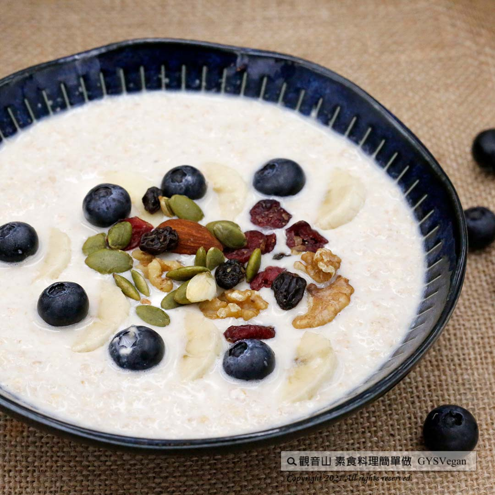

# 經典蜂蜜燕麥粥

## 📋 基本資訊 / Recipe Overview
- **料理名稱**：經典蜂蜜燕麥粥
- **原始標題**：經典蜂蜜燕麥粥｜奶素
- **素食流派 / Diet**：奶素 Lacto-Vegetarian
- **料理分類 / Category**：輕食點心
- **來源平台 / Source**：[觀音山 · 素食料理簡單做](https://vegan.gys.org.tw/oat20211015/)

## 📖 食譜圖文詳情 (中英雙語對照)

高營養價值的燕麥，經過一晚的浸泡，充分吸收豆漿的風味與營養，濃稠、綿密的口感，搭配優格以及喜愛的水果，浪漫早餐輕鬆學！前一天就能幫家人準備好，讓你在家優雅吃早餐，快跟著觀音山主廚，一起素食料理簡單做吧！​
​
◎食材及佐料〔Ingredients〕：(3人份)​
▪️牛奶或豆漿 ​ 250cc​
▪️大燕麥片(即沖即食) ​ 70克​
▪️蜂蜜 ​ 適量​
◎烹飪步驟：​
【調理作法】​
1.取一乾淨無水容器，倒入大燕麥片、牛奶或豆漿、蜂蜜攪拌均勻​
2.冷藏一個晚上，隔日即可食用​
3.可以依個人喜好加入水果、優格一起享用​
​
【特別說明】​
1.全素者可用豆漿替代牛奶。​
​
本食譜提供：台中觀音山蔬食館 ​
​
✨慈悲的龍德上師 成立「觀音山蔬食館」提倡健康素食、慈悲護生，以”觀音山素食料理簡單做”的理念，提供多款素食食譜，讓您一學就會！​
​
​
★10月7日~12月4日 ​ 佛陀天降月：善惡業增長10億倍​
​
✨殊勝功德增長日✨​
觀音山邀請您於10月7日~12月4日，響應素食、廣修供養、戒殺護生、誦經修法、行持諸種善行，獲福無量。​
​
【recipe】​
​
The oatmeal is high nutritional value. In this recipe, it is soaked in soy milk overnight to absorb the flavor and nutrition. It has a thick and rich taste, adding yogurt or any of your favorite fruits to make it more interesting. It’s incredibly easy as well as tasty! Fetch it out from the fridge, and breakfast is ready. Tired of rushing around to get breakfast done? Let’s start with this elegant breakfast at home. Quickly follow the chef of Guanyinshan and make vegetarian dishes together! ​
​
◎Ingredients : （For 3 people）​
▪️Milk or soy milk ​ 250cc​
▪️Oatmeal ​ 70g​
▪️Honey ​ , adequate amount​
​
◎Instructions: ​
【Cutting/PREP-Ahead】​
1. In a dry container, pour in a large amount of oatmeal, milk or soy milk, honey and stir evenly. ​
2. Refrigerate overnight and eat it the next morning.​
3. You can add fruits or yogurt if you wish. Then, it’s time to enjoy!​
​
[Special notes] ​
1. For vegans, milk can be replaced by soy milk. ​ ​
​
This recipe is provided by Guanyinshan Green Restaurant, Taichung.​
​
​
☆ 觀音山 素食料理簡單做 ☆
Facebook ｜好文按讚
http://www.facebook.com/GYSVegan​
Instagram ｜料理追蹤
http://www.instagram.com/gysvegan/​
Youtube ｜加入訂閱
https://reurl.cc/q8VEqy​
Telegram ｜頻道推薦
https://t.me/GYSVegan​
​
​
—​
歡迎轉載，請註明出處： 觀音山 素食料理簡單做 GYSVegan 素食環保愛地球，健康營養無負擔，慈悲護生一起來~

---
*食譜歸檔時間：2026-08-20 · 來源：觀音山素食料理簡單做 (vegan.gys.org.tw)*