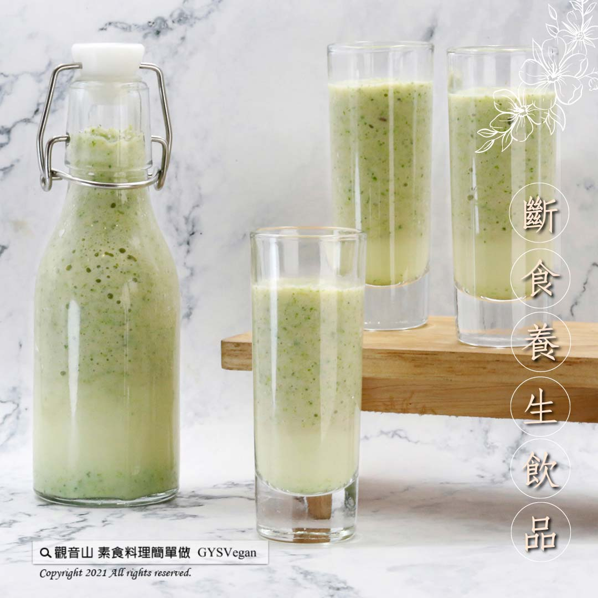

# 綠花椰拿鐵

## 📋 基本資訊 / Recipe Overview
- **料理名稱**：綠花椰拿鐵
- **原始標題**：綠花椰拿鐵｜奶素
- **素食流派 / Diet**：奶素 Lacto-Vegetarian
- **料理分類 / Category**：輕食點心
- **來源平台 / Source**：[觀音山 · 素食料理簡單做](https://vegan.gys.org.tw/latte20210922/)

## 📖 食譜圖文詳情 (中英雙語對照)

早晨一杯綠花椰拿鐵，口感細緻綿密滿足感滿分，非常適合忙碌的上班族快速補充健康活力，低碳飲食 不僅環保健康，配合斷食養生 ，更能體會健康的訴求不須以動物生命為代價，快跟著觀音山主廚，一起素食料理簡單做吧！​
​
◎食材及佐料〔Ingredients〕：(1人份)​
▪️綠花椰菜 ​ 150克​
▪️蘋果 ​ 1/2顆​
▪️西洋芹 ​ 20克​
▪️蜂蜜 ​ 適量​
▪️牛奶 ​ 150cc​
​
◎烹飪步驟：​
【刀工/前處理】​
1.花椰菜去除粗纖維，燙熟冰鎮備用。​
2.西洋芹洗淨切段。​
3.蘋果洗淨去皮切片。​
​
【調理作法】​
1.將食材放入果汁機中攪打均勻，即可享用。​
​
【特別說明】​
1.全素者可用植物奶或豆漿替代牛奶。​
2.甜度可以依個人喜好調整，亦可以少許檸檬汁提味。​
​
​
本食譜提供：台中觀音山蔬食館 主廚 樂敏​
​
​
✨慈悲的龍德上師 成立「觀音山蔬食館」提倡健康素食、慈悲護生，以”觀音山素食料理簡單做”的理念，提供多款素食食譜，讓您一學就會！
​
​
★9月23日 觀世音菩薩節日：善惡業增長千萬倍​
​
✨殊勝功德增長日✨​
觀音山邀請您於9月23日響應素食、廣修供養、戒殺護生、誦經修法、行持諸種善行，獲福無量。​
​
​
☆ 觀音山 素食料理簡單做 ☆​
Facebook ｜好文按讚
http://www.facebook.com/GYSVegan
​
Instagram ｜料理追蹤
http://www.instagram.com/gysvegan/​
Youtube ｜加入訂閱
https://reurl.cc/q8VEqy​
Telegram ｜頻道推薦
https://t.me/GYSVegan​
​
​
—​
歡迎轉載，請註明出處： 觀音山 素食料理簡單做 GYSVegan 素食環保愛地球，健康營養無負擔，慈悲護生一起來~

---
*食譜歸檔時間：2026-08-20 · 來源：觀音山素食料理簡單做 (vegan.gys.org.tw)*