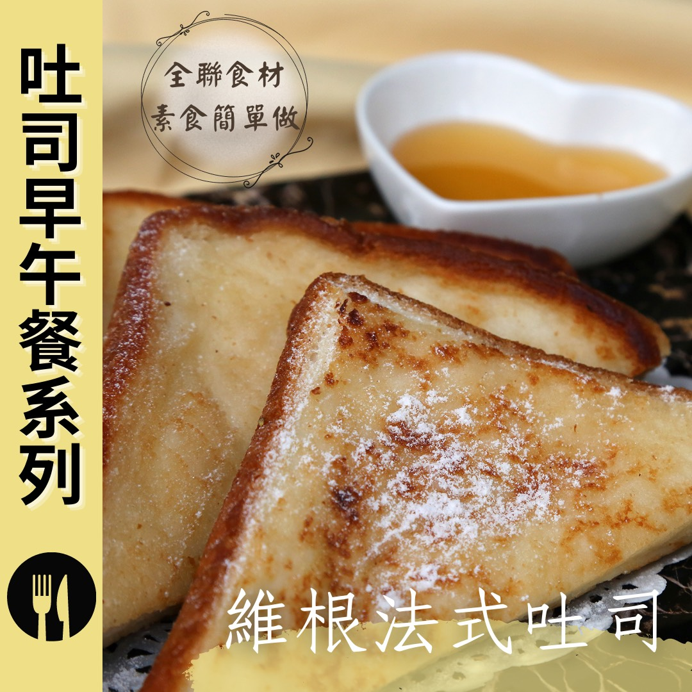

# 維根法式吐司 無奶蛋料理

## 📋 基本資訊 / Recipe Overview
- **料理名稱**：維根法式吐司 無奶蛋料理
- **原始標題**：維根法式吐司｜無奶蛋料理
- **素食流派 / Diet**：全素 Vegan
- **來源平台 / Source**：[觀音山 · 素食料理簡單做](https://vegan.gys.org.tw/wigan20210910/)

## 📖 食譜圖文詳情 (中英雙語對照)

微焦的吐司裡包覆著清爽的椰子香氣，再淋上蜂蜜，簡單易上手的輕食料理，絕對是小朋友的最愛，跟上潮流成為時尚的維根素食主義者，快跟著觀音山主廚，用全聯食材 創意料理素食簡單做！​
​
◎食材及佐料〔Ingredients〕：(3人份)​
▪️椰奶 ​ 1罐​
▪️蜂蜜、椰子油或橄欖油 ​ 適量​
▪️糖粉或椰子粉 ​ 適量​
▪️吐司 ​ 3片​
​
❖以上食材皆可在全聯福利中心 購入​
​
◎烹飪步驟：​
1.將吐司兩面沾附椰奶(喜歡濕潤口感，可以浸泡久一點)。​
2.平底鍋加油、熱鍋，將做法1的吐司放入鍋中，小火慢煎上色。​
3.將煎好的吐司盛盤，淋上蜂蜜或喜歡的水果，撒上糖粉即可享用！​
​
本食譜提供：台中觀音山蔬食館 主廚 淨雅​
​
​
✨慈悲的龍德上師 成立「觀音山蔬食館」提倡健康素食、慈悲護生，以”觀音山素食料理簡單做”的理念，提供多款素食食譜，讓您一學就會！
​
​
【recipe】​
​
Slightly burnt toast covered with a refreshing coconut aroma and topped with honey is incredibly a simple and light dish. This will definitely become one of children’s favorite. Keep up with the trends and get a fashionable idea of being a vegan. Quickly follow the chef of Guanyinshan. Let’s use ingredients from #PX Mart and make creative vegetarian dishes together!​
​
❖All the above ingredients can be purchased at # PX Mart​
​
◎Ingredients : （For 3 people）​
▪️A can of coconut milk ​
▪️Honey、Coconut oil or olive oil ​ , adequate amount​
▪️Powdered sugar or coconut powder ​ , adequate amount​
▪️Three slices of toast ​
​
◎ Instructions:​
1. Dip coconut milk on both sides of the toast (if you like a moist taste, you can let it soak for a longer time).​
2. Add oil to the pan, heat the pan, put in the toast from step 1 and fry it over low heat until turned golden browl.​
3. Put the fried toast on a serving plate, drizzle with honey or your favorite fruit, shifting powdered sugar and enjoy!​
​
This recipe is provided by chef Jing Ya, Taichung #Guanyinshan Green Restaurant
☆ 觀音山 素食料理簡單做 ☆
Facebook ｜好文按讚
http://www.facebook.com/GYSVegan​
Instagram ｜料理追蹤
http://www.instagram.com/gysvegan/​
Youtube ｜加入訂閱
https://reurl.cc/q8VEqy​
Telegram ｜頻道推薦
https://t.me/GYSVegan​
​
​
—​
歡迎轉載，請註明出處： 觀音山 素食料理簡單做 GYSVegan 素食環保愛地球，健康營養無負擔，慈悲護生一起來~[/vc_column_text]
[/vc_column][/vc_row]

---
*食譜歸檔時間：2026-08-20 · 來源：觀音山素食料理簡單做 (vegan.gys.org.tw)*