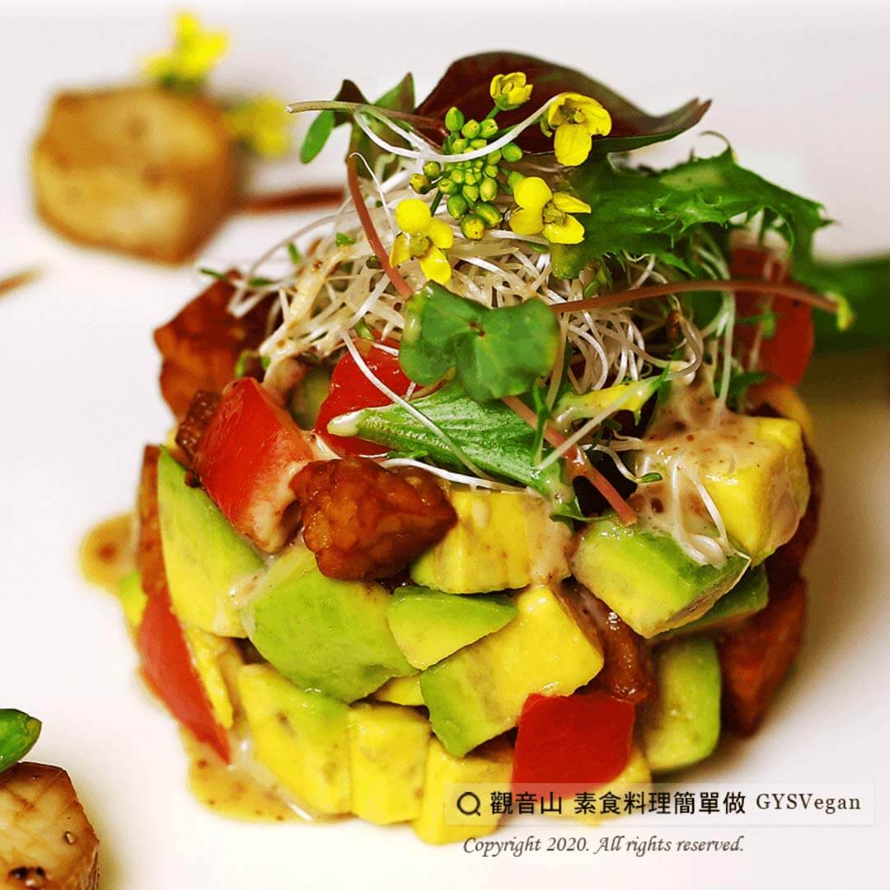

# 胡麻天貝酪梨沙拉

## 📋 基本資訊 / Recipe Overview
- **料理名稱**：胡麻天貝酪梨沙拉
- **原始標題**：胡麻天貝酪梨沙拉｜全素
- **素食流派 / Diet**：全素 Vegan
- **料理分類 / Category**：輕食點心
- **來源平台 / Source**：[觀音山 · 素食料理簡單做](https://vegan.gys.org.tw/avocado20210115/)

## 📖 食譜圖文詳情 (中英雙語對照)

酪梨營養成分高，不但高纖又低糖，還可增加飽足感，搭配天貝料理，一道美味滿分的胡麻天貝酪梨沙拉就出爐啦！
不管是單身族、上班族、小家庭，都不能不學會的一道易上手輕食料理。
今天想來點輕食嗎？
別猶豫～快動手跟著觀音山主廚，一起素食料理簡單做吧！
?食材及佐料〔Ingredients〕：(4人份)
▪天貝 150克
▪酪梨 70克
▪番茄 70克
▪綜合生菜 100克
▪胡麻醬 適量
▪橄欖油 少許
?烹飪步驟：
1.天貝切1公分丁
2.酪梨切1公分丁
3.番茄去籽，切1公分丁
4.天貝油炸至金黃色備用
5.天貝、番茄、酪梨，淋上少許橄欖油，輕輕拌勻。
6.擺盤，放上天貝酪梨沙拉、綜合生菜、胡麻醬即可享用。
??本食譜提供：台中 觀音山蔬食館 主廚 淨雅
✨慈悲的 龍德上師成立「觀音山蔬食館」提倡健康素食、慈悲護生，以”觀音山素食料理簡單做”的理念，提供多款素食食譜，讓您一學就會！?
【recipe】
?  Avocado is rather nutritious. It not only contains high fiber and low sugar, but also provides satiety. Paired with tempeh and seasoned with flax, a delicious avocado salad is ready! This simple light dish is suitable for singles, office workers, or small families. Would you like a light meal today? Don’t hesitate~ follow the chef of Guanyinshan and cook simple vegetarian dishes together
?Ingredients : (For 4 people)
▪Tempeh 150g
▪Avocado 70g
▪Tomato 70g
▪Mesclum(Mixed salad) 100g
▪Sesame dressing , adequate amount
▪Olive oil , a little
?Cooking steps:
1. Dice Tempe into 1 cm wide.
2. Dice avocado into 1 cm wide.
3. Remove the tomato seeds and dice it into 1 cm wide.
4. Fried tempe.h until golden brown for later use
5. Tempe, tomato, avocado, drizzle a little olive oil, and mix gently.
6. Put tempe avocado salad, lettuce, and add flax sauce in a plate.
??This Recipe is Provided by: Taichung Guanyinshan Green Restaurant Chef: Jingya
? 觀音山 素食料理簡單做 ?
Facebook ｜好文按讚
http://www.facebook.com/GYSVegan
​
Instagram ｜料理追蹤
http://www.instagram.com/gysvegan/
​
Youtube ｜加入訂閱
https://reurl.cc/q8VEqy
​
Telegram ｜頻道推薦
https://t.me/GYSVegan
—
? 歡迎轉載，請註明出處： 觀音山 素食料理簡單做 GYSVegan 素食環保愛地球，健康營養無負擔，慈悲護生一起來~?

---
*食譜歸檔時間：2026-08-20 · 來源：觀音山素食料理簡單做 (vegan.gys.org.tw)*