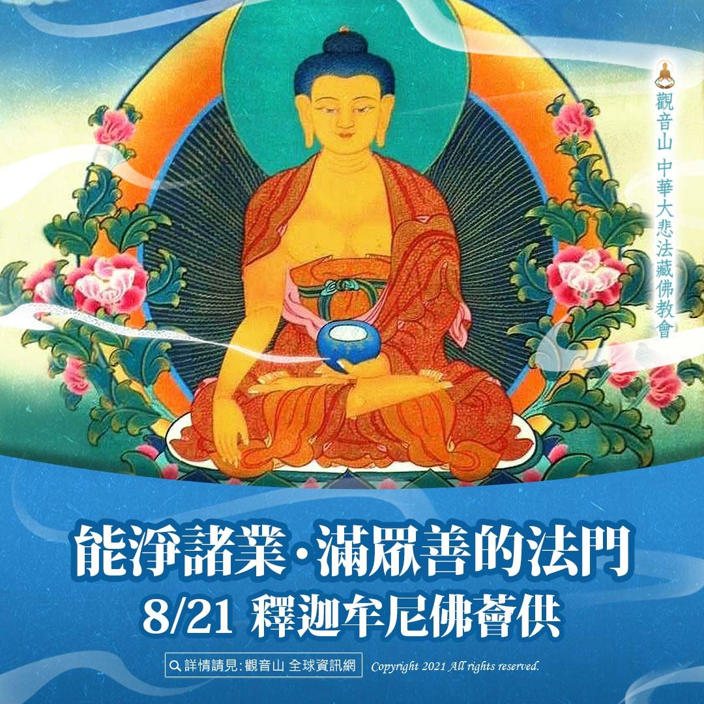

# 能淨諸業‧滿眾善的法門──釋迦牟尼佛薈供 ​

## 📋 基本資訊 / Recipe Overview
- **料理名稱**：能淨諸業‧滿眾善的法門──釋迦牟尼佛薈供 ​
- **原始標題**：【能淨諸業‧滿眾善的法門──釋迦牟尼佛薈供】​
- **素食流派 / Diet**：全素 Vegan
- **來源平台 / Source**：[觀音山 · 素食料理簡單做](https://vegan.gys.org.tw/confession20210820/)

## 📖 食譜圖文詳情 (中英雙語對照)

【能淨諸業‧滿眾善的法門──釋迦牟尼佛薈供】​
​
釋迦牟尼佛是娑婆世界一切佛法之總持者，為一切佛法之根本傳承者，本師 釋迦牟尼佛即是娑婆世界一切眾生之根本上師。修持釋尊心咒者即得釋尊加被，可令修習諸教法者急速增長成就，智慧顯發。​
​
全知麥彭仁波切曾言：「凡是一切共同世間的行境當中，其餘沒有能和密咒所賜的悉地相同。」釋迦牟尼佛本尊心咒是人生旅途的甘露，諸佛心咒祕密不可思議，以持咒就能蒙佛攝受加持，為我們召來佛力，清淨諸業，圓滿眾善。​
​
念誦一遍此陀羅尼咒，可清淨俱胝八萬劫當中所造的一切業障等，具無量功德利益，此乃釋迦如來之殊勝心咒。​
​
況且是在主法上師帶領如法舉行的薈供法會，海內外數千眾共同修持儀軌、持誦本師心咒，所累積的善業功德非常地不可思議。​
​
觀音山所舉辦的本師薈供法會特別恭請慈悲 龍德上師主法；僧團與海內外七眾弟子和十方善信大德共同參與修法；海內外數千人以上僧俗七眾共同修法、持咒；海內外數百處如法設供養的壇城。如果今生有幸參加這樣的法會，一次的功德，就遠遠超過自己獨修三十年了。​
​
✨人天導師ー本師 釋迦牟尼佛薈供大法會​
▌法會日期：8月21日(六)​
▌法會時間：晚上7:30 (GMT+8)​
▌觀音山法藏YouTube與官方Facebook同步直播：
https://bit.ly/2BB175Z
​
​
◕登記「祈福迴向卡」積聚廣大福慧資糧​
https://bit.ly/36R6JoY​
◕護持「薈供供品」響應素食推廣計劃 廣結善緣​
https://bit.ly/3wRkG0x​
​
更多請見「觀音山 全球資訊網」
http://www.fazang.org/index.php?ID=92​
—————————————​
? 歡迎轉載，請註明出處： 觀音山 法藏吉祥洲-好文分享 按讚設定搶先看，天天看，天天分享，心轉變好吉祥! (Be free to use with remarks for developing Buddhism. Amitabha.)​
—————————————​
◎吉祥洲TG 立即訂閱文章​
https://t.me/gysfazang

---
*食譜歸檔時間：2026-08-20 · 來源：觀音山素食料理簡單做 (vegan.gys.org.tw)*