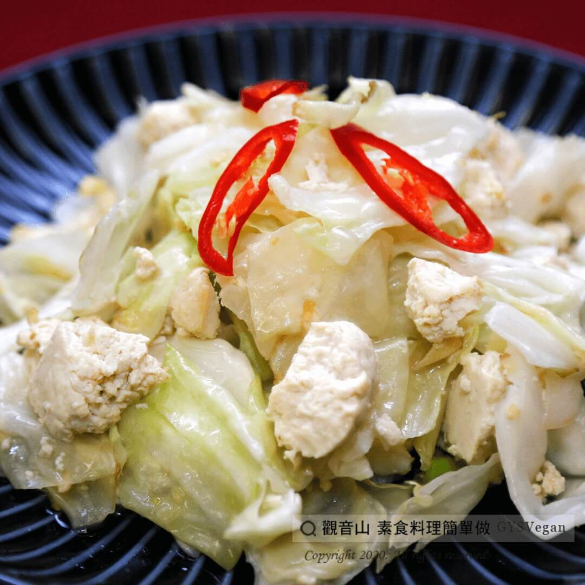

# 臭腐乳炒高麗

## 📋 基本資訊 / Recipe Overview
- **料理名稱**：臭腐乳炒高麗
- **原始標題**：臭腐乳炒高麗｜全素
- **素食流派 / Diet**：全素 Vegan
- **來源平台 / Source**：[觀音山 · 素食料理簡單做](https://vegan.gys.org.tw/korea20201203/)

## 📖 食譜圖文詳情 (中英雙語對照)

高麗菜營養價值豐富，富含膳食纖維、維生素C、E、葉酸及礦物質，並含有多種抗癌物質。與碎豆腐一起料理，吃得到豆腐鬆軟口感，搭配脆甜的高麗菜，熱炒上桌肯定一掃而空!​
快跟著觀音山主廚，一起素食料理簡單做吧！​
​
?食材及佐料〔Ingredients〕：(5人份)​
▪臭豆腐 2塊​
▪高麗菜 300克​
▪薑末 30克​
▪辣椒 少許​
▪鹽 適量​
▪胡椒粉 適量​
▪香油 適量​
▪水 適量​
​
?烹飪步驟：​
1.將臭豆腐捏碎，高麗菜切塊。​
2.熱油後放入薑末爆香，加入臭豆腐略炒。​
3.加入高麗菜及少許水。​
4.放入鹽、胡椒粉調味，拌炒至高麗菜熟，起鍋前淋少許香油，放上辣椒點綴完成。​
​
??本食譜提供：台中 #觀音山蔬食館 主廚 樂卿​
​
✨慈悲的 龍德上師成立「觀音山蔬食館」提倡健康素食、慈悲護生，以”觀音山素食料理簡單做”的理念，提供多款素食食譜，讓您一學就會！?​
​
​
【recipe】​
?Cabbage is very nutritious. It provides dietary fiber, vitamin , E, folic acid and minerals, and contains a variety of anti-cancer substances. Cooking with smashed tofu, you can get a soft texture of tofu, and the crispy sweetness of cabbage. The hot stir-fried dish will definitely be polished off! Follow the chef of Guanyinshan, let’s make vegetarian dishes together! ​
​
?Ingredients : (For 5 people)​
▪Stinky tofu 2​
▪Cabbage 300g​
▪Ginger 30g​
▪Chili, a little​
▪Salt, adequate amount​
▪Pepper, adequate amount​
▪Sesame oil, adequate amount​
▪Water, ​ adequate amount​
​
?Cooking Steps:​
1.Crush the stinky tofu and cut the cabbage into pieces. ​
2.Heat oil, add ginger powder and saute, add stinky tofu and stir-fry. ​
3.Add cabbage and a little water. ​
4.Season with salt and pepper; stir-fry until the cabbage is cooked; pour a little sesame oil and add chili to garnish before dish up.​
​
??This recipe is provided by: Taichung Guanyinshan Vegetarian Restaurant, Chef: Le Qing​
​
​
?觀音山 素食料理簡單做 ​ Follow us?​
Facebook ｜好文按讚
http://www.facebook.com/GYSVegan​
Instagram ｜料理追蹤
http://www.instagram.com/gysvegan/​
Youtube ​ ​ ​ ｜加入訂閱
https://reurl.cc/q8VEqy​
Telegram ​ ｜頻道推薦
https://t.me/GYSVegan​
​
​
? 歡迎轉載，請註明出處： ​ ​ 觀音山 素食料理簡單做 GYSVegan 素食環保愛地球，健康營養無負擔，慈悲護生一起來~?

---
*食譜歸檔時間：2026-08-20 · 來源：觀音山素食料理簡單做 (vegan.gys.org.tw)*