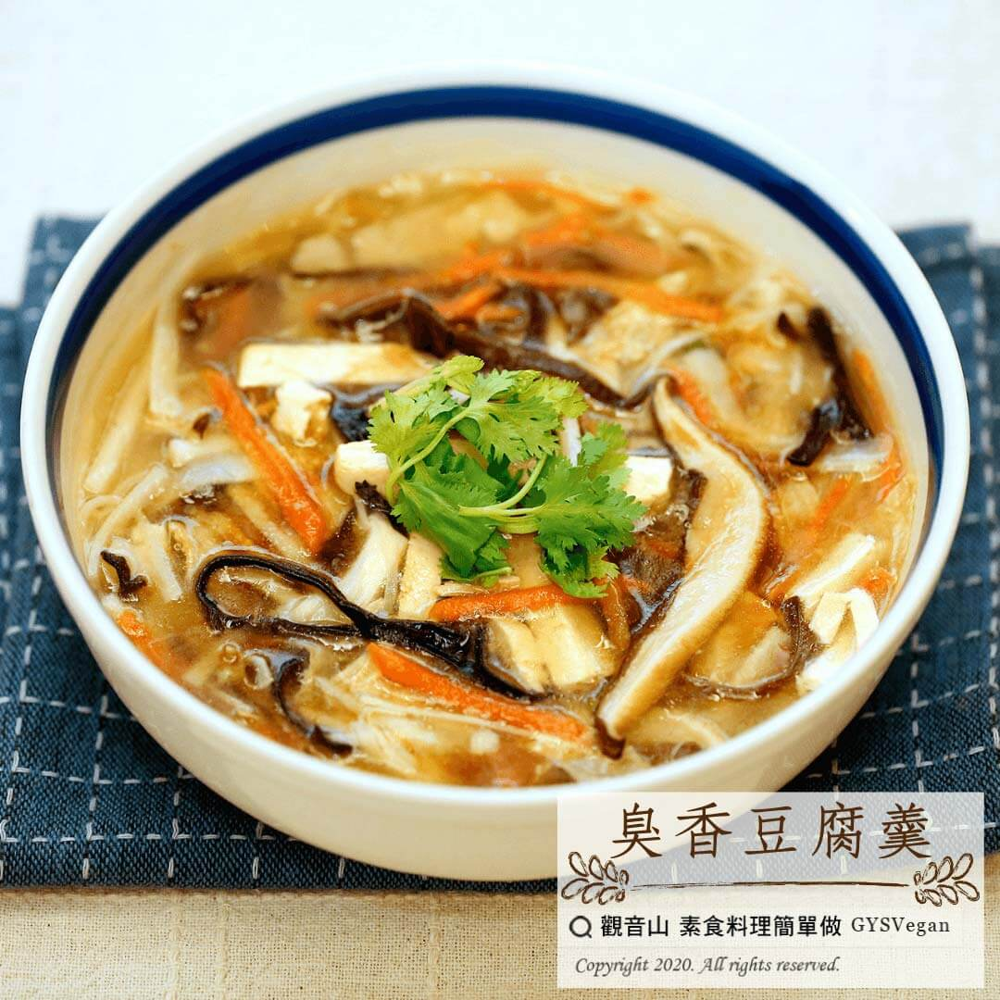

# 臭香豆腐羹

## 📋 基本資訊 / Recipe Overview
- **料理名稱**：臭香豆腐羹
- **原始標題**：臭香豆腐羹｜全素
- **素食流派 / Diet**：全素 Vegan
- **料理分類 / Category**：湯品系列
- **來源平台 / Source**：[觀音山 · 素食料理簡單做](https://vegan.gys.org.tw/stinky-tofu20201212/)

## 📖 食譜圖文詳情 (中英雙語對照)

天冷時最適合來碗熱湯享用，觀音山主廚特準備這一道臭香豆腐羹，教大家在家如何快速料理出一道營養羹湯。​
豆腐富含膳食纖維、熱量低、低GI，加上豐富配料，冬天來上一碗暖呼呼的羹湯，手腳都溫暖了起來!​
快跟著觀音山主廚，一起素食料理簡單做吧！​
​
?食材及佐料〔Ingredients〕：(5人份)​
▪臭豆腐 4塊​
▪木耳絲 40克 ​
▪竹筍 50克 ​
▪豆皮 1條 ​
▪紅蘿蔔 50克 ​
▪乾香菇 30克 ​
▪香菜 適量​
▪太白粉 適量​
▪烏醋 適量 ​
▪糖 適量 ​
▪鹽 適量​
▪香油 適量​
​
?烹飪步驟：​
1.所有食材切絲。​
2.香菜切末。​
3.乾香菇爆香後加適量的水。​
4.加入所有食材。​
5.滾後調味，再加入太白粉水勾芡，最後撒上香菜、淋上香油即可。​
​
??‍?本食譜提供：台中觀音山蔬食館 主廚 樂卿​
​
✨慈悲的 龍德上師成立「觀音山蔬食館」提倡健康素食、慈悲護生，以”觀音山素食料理簡單做”的理念，提供多款素食食譜，讓您一學就會！?​
​
​
【recipe】​
? It’s most joyful to have a bowl of hot soup in a chilling day. This time our chef is going to teach you how to prepare a nutritious thick stinky tofu soup at home. Tofu is rich in dietary fiber, low in calories, and low in GI. To cook it with abundant of other ingredients, this bowl of warm soup not only warms you up but provide all the nutritions you might need.Follow us, let’s make vegetarian dishes together!​
​
?Ingredients : (For 5 people)​
▪Stinky tofu 4​
▪Sliced agaric 40g​
▪Bamboo shoots 50g ​
▪Bean curd 1piece ​
▪Carrot 50g ​
▪Dried mushroom 30g ​
▪Coriander, ​ adequate amount​
▪Cassava starch, ​ adequate amount​
▪Black vinegar, ​ adequate amount​
▪Sugar, ​ adequate amount ​
▪Salt, ​ adequate amount​
▪Sesame oil , ​ adequate amount​
​
?Cooking Steps:​
1.Shred all the ingredients. ​
2.Mince coriander. ​
3.Add appropriate amount of water after sauteing dried mushrooms. ​
4.Add the rest of ingredients. ​
5.Season after the water boiling in the wok; then add cassava starch to thicken. Finally, sprinkle with coriander and top with sesame oil. ​
​
??‍?This recipe is provided by: Taichung #Guanyinshan Green Restaurant. Chef: Le Qing​
​
​
?觀音山 素食料理簡單做 ? ​
Facebook ｜好文按讚
http://www.facebook.com/GYSVegan
​
Instagram ｜料理追蹤
http://www.instagram.com/gysvegan/​
Youtube ​ ​ ​ ｜加入訂閱
https://reurl.cc/q8VEqy​
Telegram ​ ｜頻道推薦
https://t.me/GYSVegan​
​
​
–​
? 歡迎轉載，請註明出處： ​ ​ 觀音山 素食料理簡單做 GYSVegan 素食環保愛地球，健康營養無負擔，慈悲護生一起來~?​

---
*食譜歸檔時間：2026-08-20 · 來源：觀音山素食料理簡單做 (vegan.gys.org.tw)*