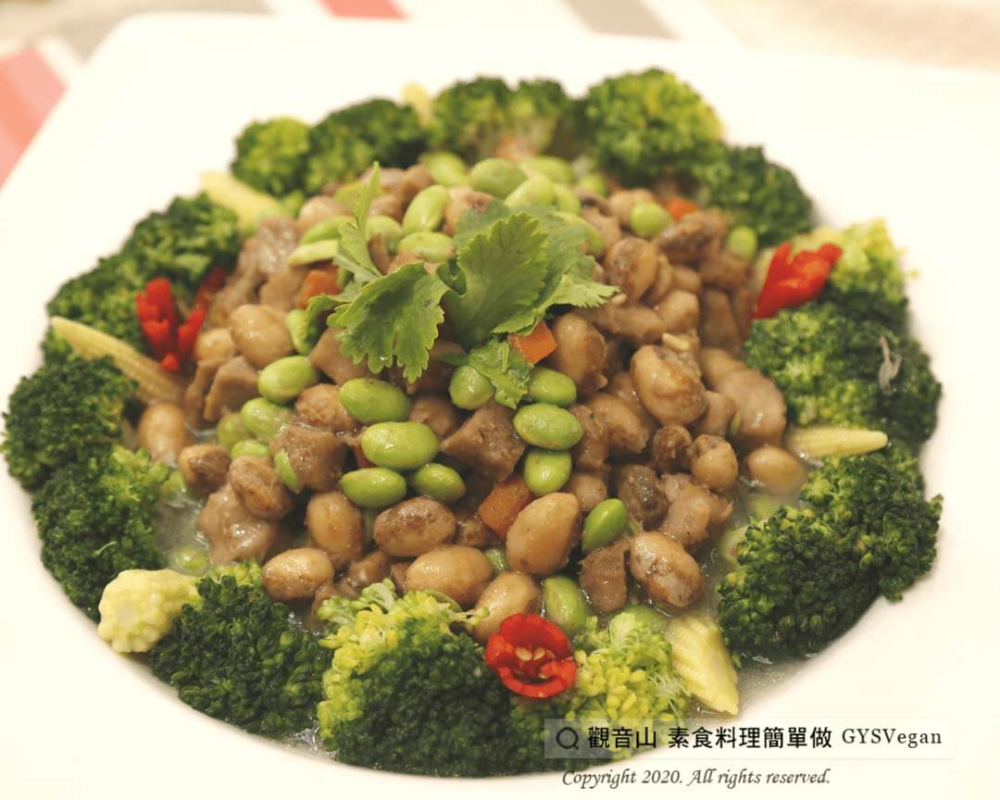

# 芋頭素三鮮

## 📋 基本資訊 / Recipe Overview
- **料理名稱**：芋頭素三鮮
- **原始標題**：芋頭素三鮮｜全素
- **素食流派 / Diet**：全素 Vegan
- **來源平台 / Source**：[觀音山 · 素食料理簡單做](https://vegan.gys.org.tw/%e8%8a%8b%e9%a0%ad%e7%b4%a0%e4%b8%89%e9%ae%ae%ef%bd%9c%e5%85%a8%e7%b4%a0/)

## 📖 食譜圖文詳情 (中英雙語對照)

綿甜香糯的芋頭，搭配燜煮鬆軟的虎豆，入口即化的滋味令人難忘❤️，再配上清脆的花椰菜和多種時蔬，口感層次豐富，每一口都是營養的好味道！?​
​
?食材與佐料：(6人份)​
芋頭200g、虎豆300g、毛豆100g、綠花椰菜1顆、玉米筍6支、紅蘿蔔50g、香油少許、糖適量、鹽適量、胡椒粉適量、玉米粉適量、水200ml。​
​
? 烹煮步驟：​
1. 芋頭削皮切丁，入油鍋炸至酥脆，起鍋備用。​
2. 花椰菜切小朵、紅蘿蔔切丁與虎豆、毛豆、玉米筍用鹽水汆燙瀝乾。​
3. 起油鍋，將虎豆、毛豆、芋頭、紅蘿蔔拌炒，燜至熟透。​
4. 續入鹽、糖、胡椒粉調味，起鍋盛盤。​
5. 將玉米粉和水調勻，小火煮稠，加入鹽、糖、香油調味，製成醬汁。​
6. 擺盤後，淋上醬汁，放上香菜、辣椒點綴，即可上桌。​
​
這道簡單又美味的料理就完成了~?​
​
☘️特別說明：​
虎豆也可以用鷹嘴豆、玉米粒或是馬鈴薯丁替代，可依照個人喜好做變化。​
​
??本食譜提供：埔里 #觀音山蔬食團 主廚 樂偵、慧鈴​
​
✨慈悲的 龍德上師成立「觀音山蔬食館」提倡健康素食、慈悲護生，以”觀音山素食料理簡單做”的理念，提供多款素食食譜，讓您一學就會！?​
​
​
?觀音山 素食料理簡單做 ​ Follow us?​
Facebook ｜好文按讚
http://www.facebook.com/GYSVegan​
Instagram ｜料理追蹤
http://www.instagram.com/gysvegan/​
Youtube ​ ​ ​ ｜加入訂閱
https://reurl.cc/q8VEqy​
Telegram ​ ｜頻道推薦
https://t.me/GYSVegan​
​
​
? 歡迎轉載，請註明出處： ​ ​ 觀音山 素食料理簡單做GYSVegan按讚、留言設定搶先看! 素食環保愛地球，健康營養無負擔，慈悲護生一起來~?

---
*食譜歸檔時間：2026-08-20 · 來源：觀音山素食料理簡單做 (vegan.gys.org.tw)*