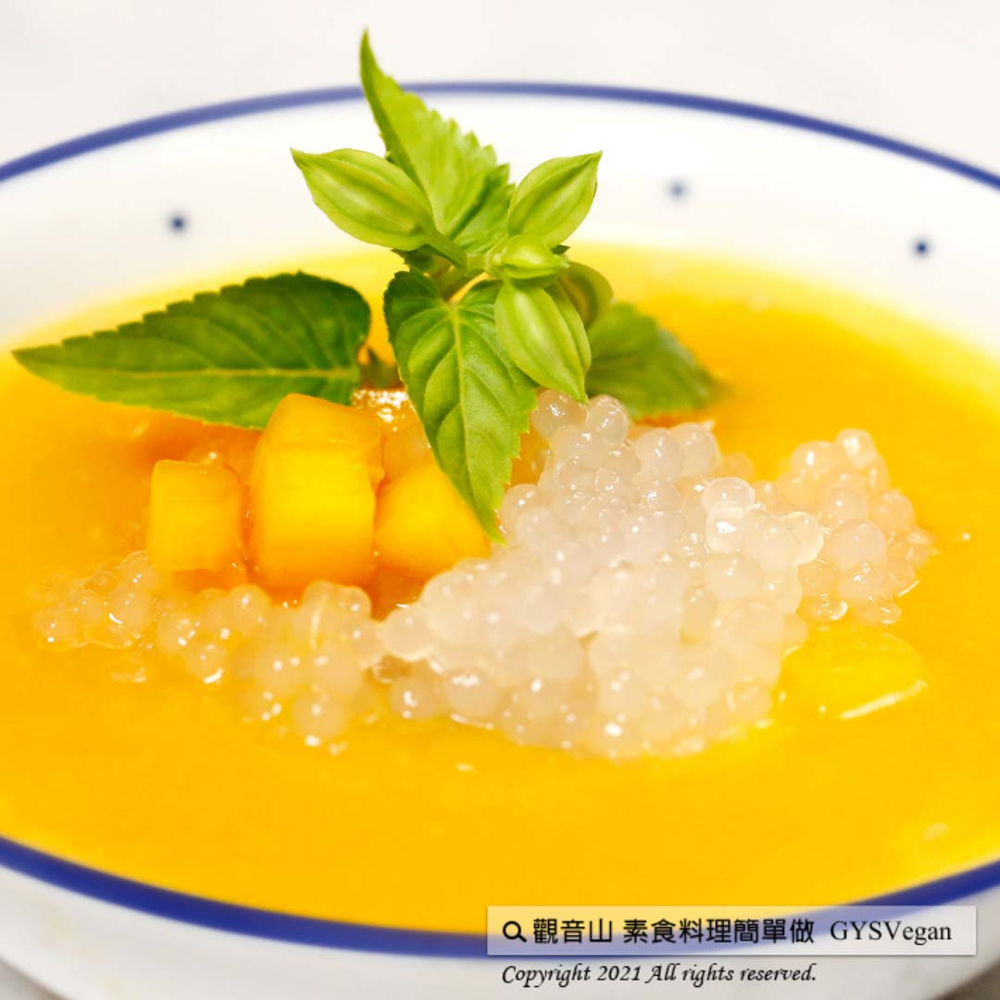

# 芒果西米露

## 📋 基本資訊 / Recipe Overview
- **料理名稱**：芒果西米露
- **原始標題**：芒果西米露｜全素
- **素食流派 / Diet**：全素 Vegan
- **來源平台 / Source**：[觀音山 · 素食料理簡單做](https://vegan.gys.org.tw/sago20210619/)

## 📖 食譜圖文詳情 (中英雙語對照)

夏天來臨了，台灣盛夏盛產各式芒果，除了直接吃也可做成甜品！甜芒果搭配低熱量西米露，混著椰奶香氣在舌尖化開，炎熱的天氣就來碗芒果西米露消暑一夏吧！​
​
?食材及佐料〔Ingredients〕：(5人份)​
▪芒果 ​ 300克​
▪西米露、椰奶、水 ​ 適量​
▪糖 ​ 2大匙​
​
?烹飪步驟：​
【刀工/前處理】​
1.水滾後放入西米露，攪拌煮5分鐘，關火，蓋上鍋蓋悶20分鐘後，將熱水倒掉，再用飲用冷水沖洗一次。​
​
【調理作法】​
1.芒果去皮切塊，加水打成稠狀。​
2.依喜好調入糖水、椰奶。​
3.搭配西米露一起享用，完成！​
​
​
??本食譜提供：台中 觀音山蔬食館 主廚 淨雅​
✨慈悲的 龍德上師成立「觀音山蔬食館」提倡健康素食、慈悲護生，以”觀音山素食料理簡單做”的理念，提供多款素食食譜，讓您一學就會！?​
​​
​
​
【recipe】​
?  As mango turns red and spreads a tempting fragrance, you know summer is here. Taiwan produces several mango varieties. Mango’s weetness and fragrance make it the perfect ingredient for dessert. Mango Sago made with mangoes, sago, and coconut milk. This sweet, tangy and creamy mango sago tantalizes your summer taste buds.
?Cooking steps:​
【Cutting/PRE Ahead】
1. Bring water to a boil and add the sago. Stir regularly and cook for 5 minutes. Turn off the heat and keep the pot covered for 20 minutes. When sago is translucent, drain and rinse it under cold water.
【Instructions】
1. Peel the mango; remove the center pit and blend the rest until smooth.
2. Add syrup and coconut milk as you like.
3. Drain the cooked tapioca, and add to the mango puree. Then it’s ready to be served.
??This recipe is provided by Chef Le Min, Taichung. # Guanyinshan Green Restaurant
? 觀音山 素食料理簡單做 Follow us?​
◎Facebook ｜好文按讚
https://www.facebook.com/GYSVegan​
◎Instagram ｜料理追蹤
https://www.instagram.com/gysvegan/​
◎Youtube ​ ​ ​ ｜加入訂閱
https://reurl.cc/q8VEqy​
◎Telegram ​ ｜頻道推薦
https://t.me/GYSVegan
—​
? 歡迎轉載，請註明出處：觀音山 素食料理簡單做 GYSVegan 素食環保愛地球，健康營養無負擔，慈悲護生一起來~?

---
*食譜歸檔時間：2026-08-20 · 來源：觀音山素食料理簡單做 (vegan.gys.org.tw)*