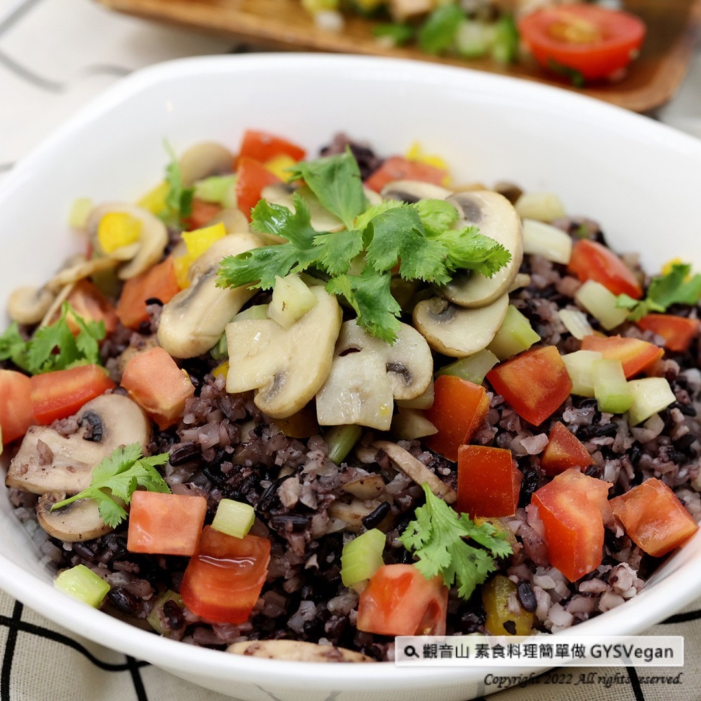

# 花椰菜米溫沙拉

## 📋 基本資訊 / Recipe Overview
- **料理名稱**：花椰菜米溫沙拉
- **原始標題**：花椰菜米料理｜花椰菜米溫沙拉｜全素
- **素食流派 / Diet**：全素 Vegan
- **來源平台 / Source**：[觀音山 · 素食料理簡單做](https://vegan.gys.org.tw/warm-riced-cauliflower-salad20220603/)

## 📖 食譜圖文詳情 (中英雙語對照)

端午安康！端午節吃太多糯米類的粽子，容易消化不良，來道花椰菜米溫沙拉，高纖解膩助消化。花椰菜米富含纖維素與維生素Ｃ，配上新鮮蔬菜、淋上少許檸檬汁，快速完成一道健康滿分的溫沙拉，不但有主食的飽足感，檸檬汁讓蔬菜酸溜爽口，更是夏季炎熱的開胃料理，各種新鮮食材的配色，讓人食指大動，跟著觀音山主廚，一起素食料理簡單做吧！​
​
◎食材及佐料〔Ingredients〕：(3人份)​
▪️冷凍花椰菜米 ​ 450克 ​ ​ ​ ​ ​
▪️紫米飯(熟) ​ 100克 ​ ​ ​ ​
▪️西洋芹 ​ 50克​
▪️蘑菇 ​ 10朵​
▪️黃甜椒、牛番茄 ​ 各50克​
▪️香菜、沙拉油、糖、鹽、黑胡椒粒 ​ 適量​
▪️檸檬汁 ​ 少許 ​
​
◎烹飪步驟：​
【刀工/前處理】​
1..西洋芹、黃甜椒切o.5公分丁。​
2.牛番茄去籽切0.8公分丁。​
3.蘑菇切片、香菜切末。​
​
【調理作法】​
1.冷凍花椰菜米充分加熱。(可以用電鍋蒸或炒熱)​
2.炒鍋加熱放入沙拉油，放入蘑菇炒至金黃色，再依序放入西洋芹、黃甜椒炒香，備用。​
3.取一個乾淨的碗盤，放入花椰菜米、紫米飯、作法2炒好的料、番茄丁、香菜末、適當的調味料（糖、鹽、檸檬汁、黑胡椒粒少許），輕輕的充分拌勻即可享用！​
​
◎本食譜提供：台中 觀音山蔬食館​
​
✨慈悲的龍德上師 成立「觀音山蔬食館」提倡健康素食、慈悲護生，以”觀音山素食料理簡單做”的理念，提供多款素食食譜，讓您一學就會！🥰​
​
​
★5/31-6/29億倍功德．薩嘎達瓦月 ​
✨殊勝功德增長日✨​
觀音山邀請您於5/31-6/29響應素食、廣修供養、戒殺護生、誦經修法、行持諸種善行，獲福無量。​
​
「觀音山 社群」一鍵快速前往觀音山 官方相關連結！​
➠
https://www.fazang.org/link/​
​
▌觀音山近期活動 ▌​
5月31日~6月29日 億倍功德—薩嘎達瓦月​
「萬燈、萬水、萬花、萬果 天天薈供法會」​
前往登記護持►
https://bit.ly/3eGZ5lS​
​
​
【recipe】​
​
📖Happy Dragon Boat Festival! Eating too many glutinous rice dumplings during the Festival? Feeling greasy and indigestion? Must have this warm riced cauliflower salad which is high in fiber, vitamin C and helps digestion. It is served with fresh vegetables and drizzled with a little lemon juice that tastes fresh and healthy. Not only this salad provides satiety but tastes delicious. The lemon juice makes the vegetables sour and refreshing, and couldn’t be better for this hot summer. Moreover, the various color in the ingredients make this salad even more appetizing. Follow the chef of Guanyinshan, and let’s cook simple vegetarian dishes together! ​ ​
​
◎Ingredients : （For 3 people）​
▪️Riced cauliflower ​ 450g ​ ​ ​ ​ ​
▪️Purple rice(cooked) ​ 100g ​ ​ ​ ​
▪️Celery ​ 50g​
▪️Ten mushroom ​
▪️Yellow bell pepper、Beef tomato ​ 50g​
▪️Coriander、Oil、Sugar、Salt、Black pepper ​ , adequate amount​
▪️Lemon juice ​ , a little ​
​
◎ Instructions:​
【Cutting/ PREP-Ahead】​
1. Cut celery and yellow bell pepper into 0.5 cm cubes.​
2. Deseed the beef tomato and cut into 0.8 cm cubes. ​
3. Slice the mushrooms and mince the coriander. ​
​
【Cooking Steps】 ​
1. Heat the frozen cauliflower rice well. (Steam with a rice cooker or stir-fry in a pan) ​
2. Heat the wok, add oil and mushrooms to stir fry until golden brown. Then, add celery and yellow bell pepper to fry until fragrant, and set aside. ​
3. Take a clean bowl, put cauliflower rice, cooked purple rice, the fried ingredients in step 2, diced tomatoes, minced coriander, appropriate seasonings (sugar, salt, lemon juice, a little black pepper), gently mix it well and enjoy! ​ ​
​
◎This recipe is provided by Taichung # Guanyinshan Vegetable Restaurant​
​
​
🌱觀音山 素食料理簡單做🌱
◎Facebook ｜好文按讚​
https://www.facebook.com/GYSVegan​
​
◎Instagram ｜料理追蹤​
https://www.instagram.com/gysvegan/​
​
◎Youtube ​ ​ ​ ｜加入訂閱​
https://reurl.cc/q8VEqy​
◎官方Blog ​ ​ ｜網站推薦​
​https://t.me/GYSVegan
​
—​
👑歡迎轉載，請註明出處： 觀音山 素食料理簡單做 GYSVegan 素食環保愛地球，健康營養無負擔，慈悲護生一起來~😊​[/vc_column_text]
[/vc_column][/vc_row]

---
*食譜歸檔時間：2026-08-20 · 來源：觀音山素食料理簡單做 (vegan.gys.org.tw)*