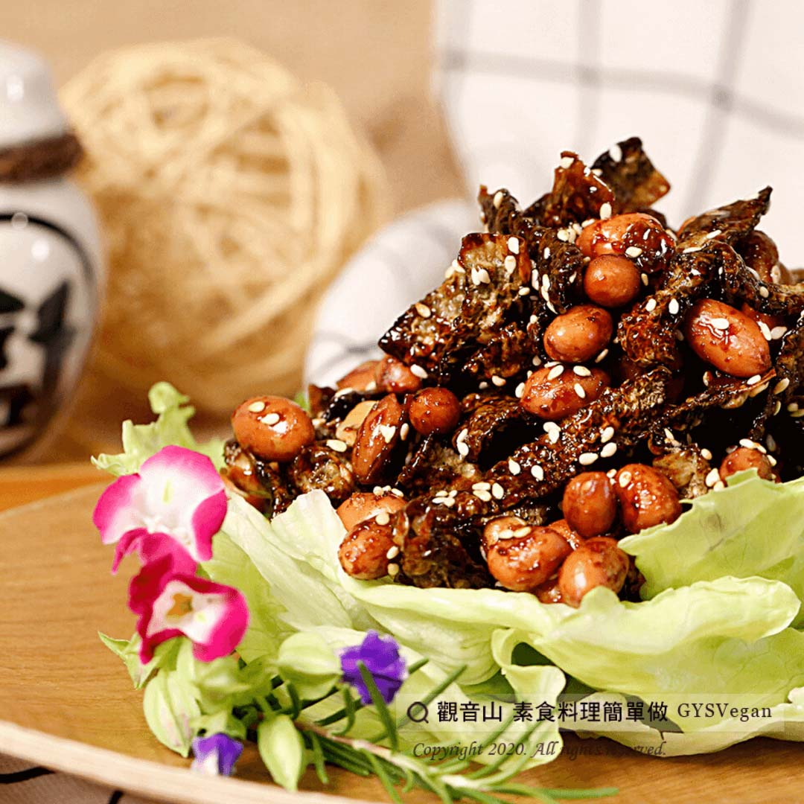

# 花生芝麻素小魚乾

## 📋 基本資訊 / Recipe Overview
- **料理名稱**：花生芝麻素小魚乾
- **原始標題**：花生芝麻素小魚乾｜全素
- **素食流派 / Diet**：全素 Vegan
- **來源平台 / Source**：[觀音山 · 素食料理簡單做](https://vegan.gys.org.tw/%e8%8a%b1%e7%94%9f%e8%8a%9d%e9%ba%bb%e7%b4%a0%e5%b0%8f%e9%ad%9a%e4%b9%be%ef%bd%9c%e5%85%a8%e7%b4%a0/)

## 📖 食譜圖文詳情 (中英雙語對照)

酥脆爽口的素小魚乾，鹹甜脆片搭配花生粒，卡滋卡滋一口接著一口，可以作為小菜配飯吃，也可以泡茶當零嘴，絕對是您招待客人的第一選擇！​
​
?食材及佐料〔Ingredients〕：(4人份)​
▪️素小魚乾 300g​
▪️炒花生粒 150g​
▪️芝麻粒 30g​
​
?調味料〔Seasoning 〕：​
▪️素蠔油 60ml​
▪️糖 15g​
▪️沙拉油 30ml​
​
?烹飪步驟：​
1. 熱鍋，倒入油、素蠔油、糖炒勻。​
2. 續入小魚乾、花生鍋內拌炒。​
3. 灑上芝麻粒，起鍋盛盤，完成!!!✅​
​
??本食譜提供：台中 #觀音山蔬食館 主廚 樂敏​
​
✨慈悲的 龍德上師成立「觀音山蔬食館」提倡健康素食、慈悲護生，以”觀音山素食料理簡單做”的理念，提供多款素食食譜，讓您一學就會！?​
​
​
?觀音山 素食料理簡單做 ​ Follow us?​
Facebook ｜好文按讚
http://www.facebook.com/GYSVegan​
Instagram ｜料理追蹤
http://www.instagram.com/gysvegan/​
Youtube ​ ​ ​ ｜加入訂閱
https://reurl.cc/q8VEqy​
Telegram ​ ｜頻道推薦
https://t.me/GYSVegan​
​
​
? 歡迎轉載，請註明出處： ​ ​ 觀音山 素食料理簡單做GYSVegan按讚、留言設定搶先看! 素食環保愛地球，健康營養無負擔，慈悲護生一起來~?

---
*食譜歸檔時間：2026-08-20 · 來源：觀音山素食料理簡單做 (vegan.gys.org.tw)*