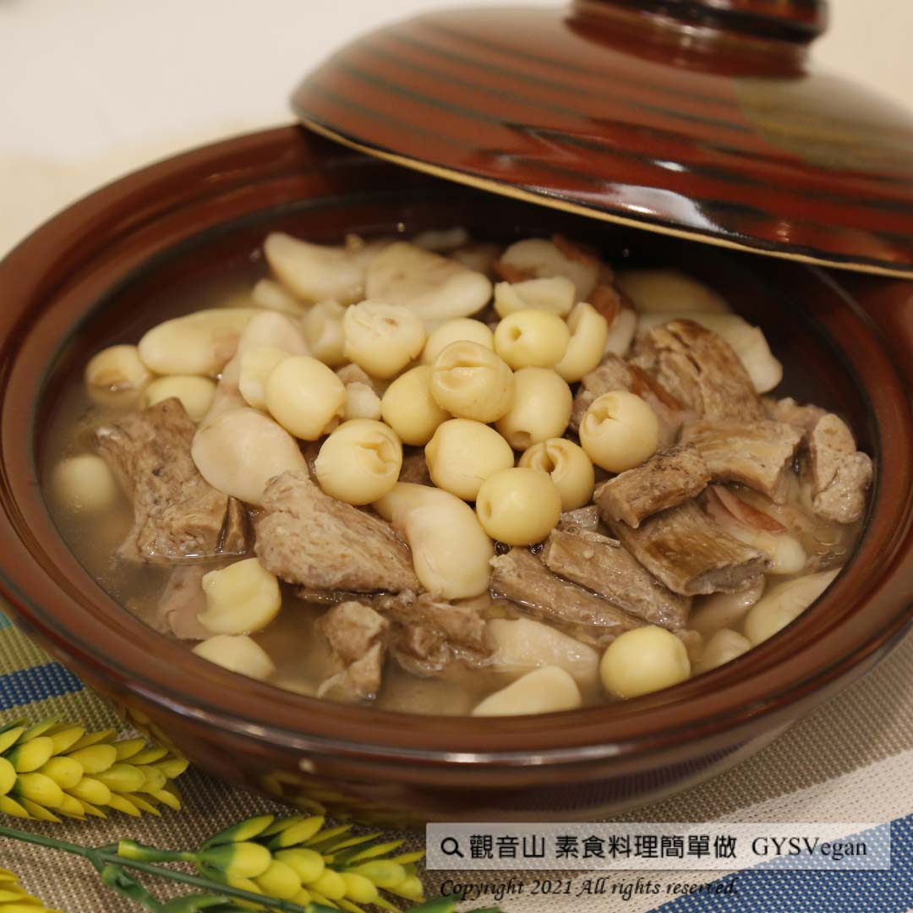

# 菱角蓮子當歸湯

## 📋 基本資訊 / Recipe Overview
- **料理名稱**：菱角蓮子當歸湯
- **原始標題**：菱角蓮子當歸湯｜全素
- **素食流派 / Diet**：全素 Vegan
- **來源平台 / Source**：[觀音山 · 素食料理簡單做](https://vegan.gys.org.tw/water-chestnut-lotus-seeds20201018/)

## 📖 食譜圖文詳情 (中英雙語對照)

近來天氣早晚轉涼，已進入秋季。​
秋季的養生飲食，適合選用健脾養胃的食材。​
蓮子有助於防癌抗癌，能促進氣血循環、降血壓 ; 菱角含豐富澱粉、蛋白質及多種礦物質，亦能抗癌，是秋天的健康美食。​
搭配以上兩種食材，烹調出這道養身補氣的秋天料理，您不能不學會！​
快跟著觀音山主廚，一起素食料理簡單做吧！​
​
食材及佐料〔Ingredients〕：(10人份)​
▪素羊肉 1200克​
▪菱角仁 1200克​
▪新鮮蓮子 1200克​
▪當歸片 適量​
​
烹飪步驟：​
1.將菱角仁、蓮子、素羊肉，用清水洗過。​
2.燒一鍋水，放入菱角仁、蓮子滾沸10分鐘。​
3.菱角仁、蓮子大約7、8分熟後，放入素羊肉、當歸片。​
4.再煮5-10分鐘，試吃菱角、蓮子若有熟及入味即可關火，完成！​
​
【特別說明】​
1.素羊肉有分全素或蛋素。​
2.菱角仁、蓮子建議不要買冷凍品，冷凍煮過吃起來不扎實。​
3.當歸片可於中藥行購入，數量可依個人喜好調整。​
4.鹽、糖可按個人口味添加。​
​
本食譜提供：台南 #觀音山蔬食館 主廚 樂湄​
​
慈悲的 龍德上師成立「觀音山蔬食館」提倡健康素食、慈悲護生，以”觀音山素食料理簡單做”的理念，提供多款素食食譜，讓您一學就會！
1. Water chestnut, lotus seeds and angelica soup | Vegan
The weather has turned cooler in the morning and evening recently, and it has entered autumn.
A healthy diet in autumn is suitable for choosing ingredients that strengthen the spleen and stomach.
Lotus seeds help prevent and fight cancer, promote blood circulation, and lower blood pressure; water chestnuts are rich in starch, protein, and various supplements and can also fight cancer. They are a healthy food in autumn.
Combining the above two ingredients to cook this healthy and nourishing autumn dish is something you must learn!
Come and follow the chef of Guanyinshan and make simple vegetarian ingredients!
​
◎Ingredients and condiments [Materials]: (10 servings)
▪ 1200g vegetarian mutton
▪ Water chestnut 1200g
▪ 1200g fresh lotus seeds
▪ Angelica tablets remote
​
◎Cooking steps:
1. Wash water chestnuts, lotus seeds, and vegetarian mutton with water.
2. Boil a pot of water, add chestnuts and lotus seeds, and boil for 10 minutes.
3. After the water chestnuts and lotus seeds are about 7 to 8 minutes cooked, add the vegetarian mutton and angelica slices.
4. Cook for another 5-10 minutes. If the water chestnuts and lotus seeds are cooked and fragrant, turn off the heat, and you are done!
​
【Special Note】
1. Vegetarian mutton can be divided into vegan or egg-vegetarian.
2. It is recommended not to buy frozen products of water chestnuts and lotus seeds, as they will not shock when eaten after being frozen and cooked.
3. Angelica tablets can be purchased at Chinese medicine stores, and the quantity can be adjusted according to personal preference.
4. Salt and sugar can be added according to personal taste.
觀音山 素食料理簡單做 ​ Follow us
Facebook ｜好文按讚
http://www.facebook.com/GYSVegan​
Instagram ｜料理追蹤
http://www.instagram.com/gysvegan/​
Youtube ​ ​ ​ ｜加入訂閱
https://reurl.cc/q8VEqy​
​
​
歡迎轉載，請註明出處： ​ ​ 觀音山 素食料理簡單做GYSVegan按讚、留言設定搶先看! 素食環保愛地球，健康營養無負擔，慈悲護生一起來~?

---
*食譜歸檔時間：2026-08-20 · 來源：觀音山素食料理簡單做 (vegan.gys.org.tw)*