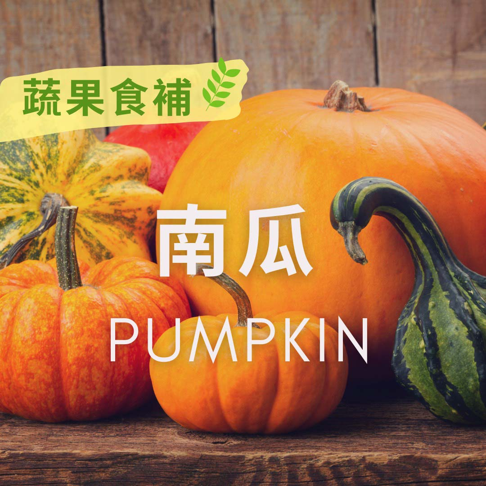

# 蔬果食補  南瓜 (Pumpkin)​

## 📋 基本資訊 / Recipe Overview
- **料理名稱**：蔬果食補  南瓜 (Pumpkin)​
- **原始標題**：【蔬果食補】 南瓜 (Pumpkin)​
- **素食流派 / Diet**：全素 Vegan
- **來源平台 / Source**：[觀音山 · 素食料理簡單做](https://vegan.gys.org.tw/pumpkin20210530%e2%80%8b/)

## 📖 食譜圖文詳情 (中英雙語對照)

南瓜是葫蘆科的植物✨，台灣話又稱為金瓜，台灣一年四季都可以買得到，每年的盛產期集中在3月到10月，既能夠入菜也能替換主食，當成點心也非常適合。
南瓜富含膳食纖維和水分?，在相同的份量之下，熱量只有白飯的三分之一，在營養方面，南瓜有豐富的維生素A、維生素B1、β-胡蘿蔔素，具有抗氧化以及防癌的功能，是營養價值極高的食材。
?選購和保存方式：
以形狀整齊、果蒂完整，沒有蟲害為主☺，表皮乾燥堅實，拿起時有沉重感，表示果實成熟品質量好。保存方式只要將整顆南瓜放置在陰涼、通風的環境下即可，一般而言可以存放2-3個月。
本文授權自  觀音山營養師團隊
​
✨慈悲的 龍德上師成立「觀音山蔬食館」提倡健康素食、慈悲護生，以”觀音山素食料理簡單做”的理念，提供多款素食食譜，讓您一學就會！?​
?  觀音山 素食料理簡單做 Follow us​ ?
◎Facebook ｜好文按讚
https://www.facebook.com/GYSVegan
​
◎Instagram ｜料理追蹤
https://www.instagram.com/gysvegan/​
◎Youtube ​ ​ ​ ｜加入訂閱
https://reurl.cc/q8VEqy​
◎官方Blog ​ ​ ｜網站推薦
https://vegan.gys.org.tw/​
​
​
—​
? 歡迎轉載，請註明出處：觀音山 素食料理簡單做 GYSVegan 素食環保愛地球，健康營養無負擔，慈悲護生一起來~?

---
*食譜歸檔時間：2026-08-20 · 來源：觀音山素食料理簡單做 (vegan.gys.org.tw)*