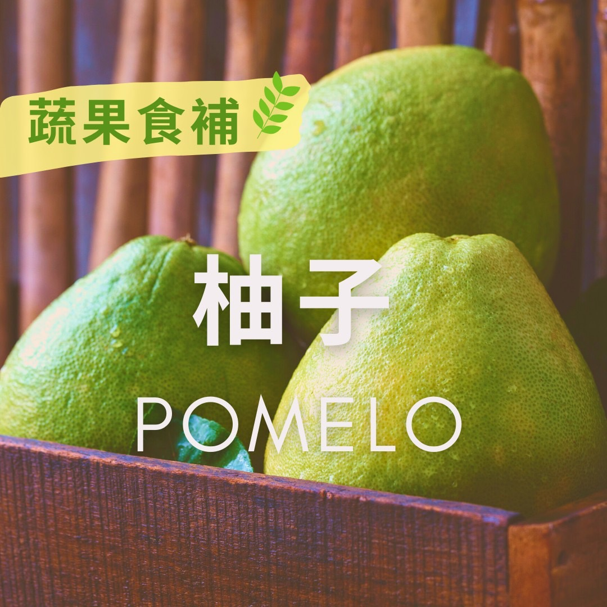

# 蔬果食補  柚子(Pomelo)​

## 📋 基本資訊 / Recipe Overview
- **料理名稱**：蔬果食補  柚子(Pomelo)​
- **原始標題**：【蔬果食補 】柚子(Pomelo)​
- **素食流派 / Diet**：全素 Vegan
- **來源平台 / Source**：[觀音山 · 素食料理簡單做](https://vegan.gys.org.tw/pomelo%e2%80%8b20210913/)

## 📖 食譜圖文詳情 (中英雙語對照)

中秋節前夕是「柚子」採收的季節，《呂氏春秋》中提到：「果之美味，江浦之橘，雲夢之柚」，其清甜自古流傳，加上「柚」與「祐」諧音，故傳統習俗在中秋吃柚子有其寓意在。​
​
柚子果肉含有豐富的蛋白質、維生素、礦物質、有機酸，有秋季最佳水果之稱，其中豐富的抗氧化劑「維生素C」，榮登百果之冠，高於檸檬3倍、蘋果7倍！另所含的天然抗發炎營養「生物類黃酮素」，可以預防心血管相關的疾病、提升免疫力、促進身體的微循環♻️，是醫學界公認最具食療效益的水果。​
​
?選購和保存方式：​
外型如不倒翁形狀者(底部寬、上尖者)，拿起來有份量感，果皮油胞細緻、光滑，顏色呈現黃綠色者為佳，買回家後置於陰涼通風處即可，約可保存一個月，可待表皮出現乾扁、皺縮(消水)之後食用，香氣更濃郁。​
​
⚠小叮嚀：食藥署提醒民眾，柚子、葡萄柚與某些藥物併用（降血壓、降血脂、抗心律不整等）可能增加藥物不良反應之機率，如有疑問可諮詢藥師，避免產生交互作用。​
​
本文授權自觀音山營養師團隊​
​
​
✨慈悲的龍德上師 成立「觀音山蔬食館」提倡健康素食、慈悲護生，以”觀音山素食料理簡單做”的理念，提供多款素食食譜，讓您一學就會！?​
​
​
? 觀音山 素食料理簡單做 Follow us ?
◎Facebook ｜好文按讚
https://www.facebook.com/GYSVegan​
◎Instagram ｜料理追蹤
https://www.instagram.com/gysvegan/​
◎Youtube ​ ​ ​ ｜加入訂閱
https://reurl.cc/q8VEqy
​
◎官方Blog ​ ​ ｜網站推薦
https://vegan.gys.org.tw/​
​
​
—​
? 歡迎轉載，請註明出處：觀音山 素食料理簡單做 GYSVegan 素食環保愛地球，健康營養無負擔，慈悲護生一起來~?

---
*食譜歸檔時間：2026-08-20 · 來源：觀音山素食料理簡單做 (vegan.gys.org.tw)*