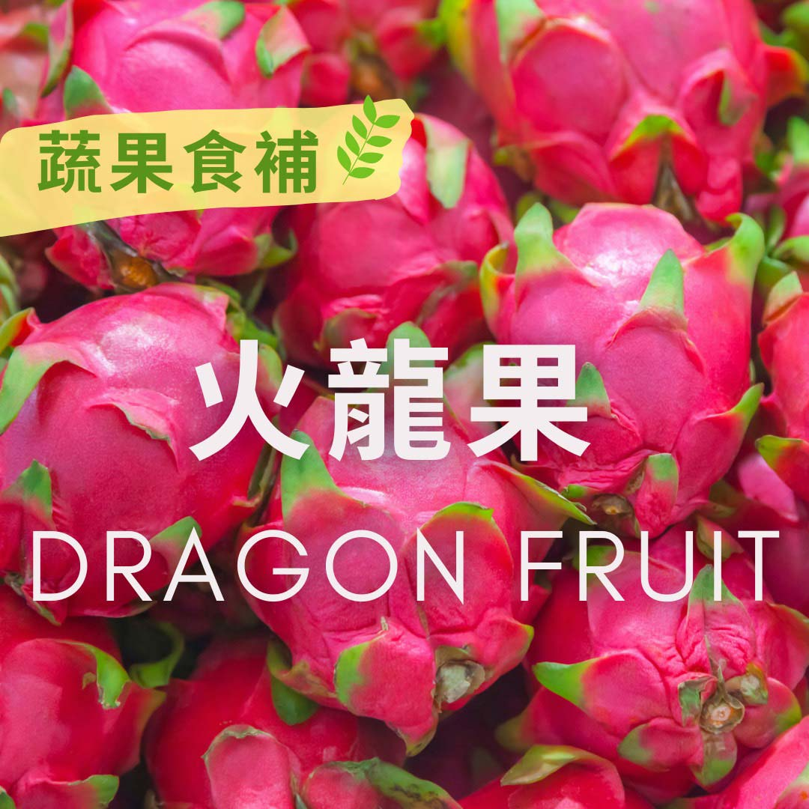

# 蔬果食補  火龍果(Dragon fruit)​

## 📋 基本資訊 / Recipe Overview
- **料理名稱**：蔬果食補  火龍果(Dragon fruit)​
- **原始標題**：【蔬果食補】 火龍果(Dragon fruit)​
- **素食流派 / Diet**：全素 Vegan
- **來源平台 / Source**：[觀音山 · 素食料理簡單做](https://vegan.gys.org.tw/dragon-fruit20210712/)

## 📖 食譜圖文詳情 (中英雙語對照)

火龍果又稱為紅龍果，一般常見的可分為兩種，分別是紅肉、白肉火龍果，兩種皆具多種營養成分，如水溶性膳食纖維、豐富胡蘿蔔素?、抗氧化花青素，以及維生素B1、B2、B3、B12、C、鉀等礦物質，對於預防血管老化以及視力保健都有幫助。​
​
「紅肉」火龍果又被稱為補鐵水果之王，含有豐富「甜菜紅素」，根據研究發現，此種植物性的色素可調解生理機能及具備抗氧化、抗發炎效果、抗腫瘤細胞生長效果。其中粉紅色內皮，是甜菜紅素含量最高的地方，可以將果皮內層刮下來吃，千萬不要浪費了。​
​
「白肉」火龍果的膳食纖維相當高，可促進腸胃蠕動，幫助排便，而且葉酸含量相對較高，對於孕婦而言，是十分理想的水果選項。​
​
※如何從外觀分辨紅肉、白肉火龍果呢​
紅肉火龍果，外觀看起來較圓，葉萼之間的距離較短而密集；而白肉多為長橢圓形，葉萼之間距離較遠且疏鬆。​
​
?選購和保存方式：​
以表面均勻光滑、果肉飽滿，重量越重為佳，葉萼也要越青綠越好，如果已經枯黃或軟爛，表示不新鮮；買回家後，可以放冰箱冷藏保存2周。​
​
⭐貼心叮嚀：雖然火龍果屬於低熱量、高纖維，但是由於果肉糖分以天然葡萄糖為主，人體容易吸收，建議體質虛寒、糖尿病患族群，適量食用。​
​
​
本文授權自 觀音山營養師團隊​
​
​
★7月10日-8月8日 明淨月：善惡業一千萬倍增長​
​
✨殊勝功德增長日✨​
觀音山邀請您於7月10日-8月8日期間響應素食、廣修供養、戒殺護生、誦經修法、行持諸種善行，獲福無量。​
​
​
✨慈悲的 龍德上師成立「觀音山蔬食館」提倡健康素食、慈悲護生，以”觀音山素食料理簡單做”的理念，提供多款素食食譜，讓您一學就會！?​
​
​
?  觀音山 素食料理簡單做 Follow us ?
◎Facebook ｜好文按讚
https://www.facebook.com/GYSVegan​
◎Instagram ｜料理追蹤
https://www.instagram.com/gysvegan/​
◎Youtube ​ ​ ​ ｜加入訂閱
https://reurl.cc/q8VEqy​
◎官方Blog ​ ​ ｜網站推薦
https://vegan.gys.org.tw/​
​
​
—​
? 歡迎轉載，請註明出處：觀音山 素食料理簡單做 GYSVegan 素食環保愛地球，健康營養無負擔，慈悲護生一起來~?

---
*食譜歸檔時間：2026-08-20 · 來源：觀音山素食料理簡單做 (vegan.gys.org.tw)*