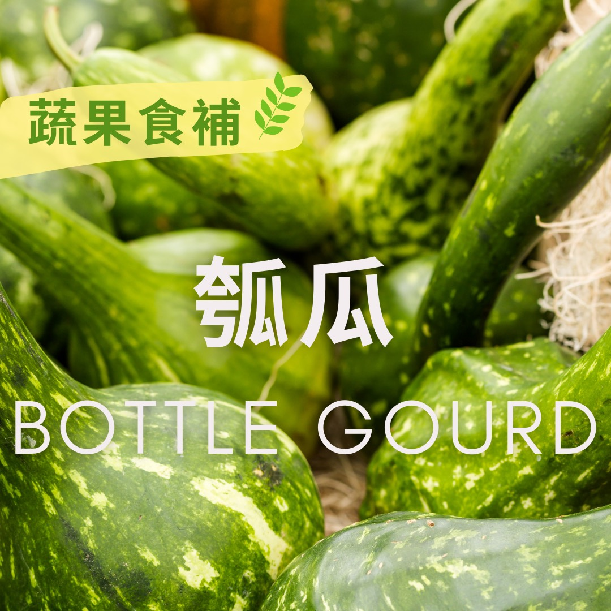

# 蔬果食補  瓠瓜 (Bottle gourd)​

## 📋 基本資訊 / Recipe Overview
- **料理名稱**：蔬果食補  瓠瓜 (Bottle gourd)​
- **原始標題**：【蔬果食補】 瓠瓜 (Bottle gourd)​
- **素食流派 / Diet**：全素 Vegan
- **來源平台 / Source**：[觀音山 · 素食料理簡單做](https://vegan.gys.org.tw/bottle-gourd20210614/)

## 📖 食譜圖文詳情 (中英雙語對照)

瓠瓜又稱為扁蒲(台語蒲仔)，在端午節前後是盛產季節，農曆五月炎熱潮溼，易邪毒入侵，健康端午應以素食健康養生粽為主，搭配應節蔬果「瓠瓜」，讓你消暑解熱、營養滿分，吃粽不吃重。​
​ 瓠瓜水分含量高、熱量低、膳食纖維高，營養方面富含β-胡蘿蔔素、維生素C、B群以及多種礦物質，能健強骨骼及牙齒、潤肺止咳、清熱解毒，是營養均衡的好食材。​
​
?選購和保存方式：​
以蒂梗翠綠，外表青綠光滑，拿起有重量感，表皮帶有絨毛且分布均勻為佳 ；保存時須保持乾燥，放進冷藏，約可存放兩週，若只使用部分，先不削皮，以保鮮膜包好冷藏即可。
本文授權自  觀音山營養師團隊
✨慈悲的 龍德上師成立「觀音山蔬食館」提倡健康素食、慈悲護生，以”觀音山素食料理簡單做”的理念，提供多款素食食譜，讓您一學就會！?​
?  觀音山 素食料理簡單做 Follow us​ ?
◎Facebook ｜好文按讚
https://www.facebook.com/GYSVegan
​
◎Instagram ｜料理追蹤
https://www.instagram.com/gysvegan/​
◎Youtube ​ ​ ​ ｜加入訂閱
https://reurl.cc/q8VEqy​
◎官方Blog ​ ​ ｜網站推薦
https://vegan.gys.org.tw/​
​
​
—​
? 歡迎轉載，請註明出處：觀音山 素食料理簡單做 GYSVegan 素食環保愛地球，健康營養無負擔，慈悲護生一起來~?

---
*食譜歸檔時間：2026-08-20 · 來源：觀音山素食料理簡單做 (vegan.gys.org.tw)*