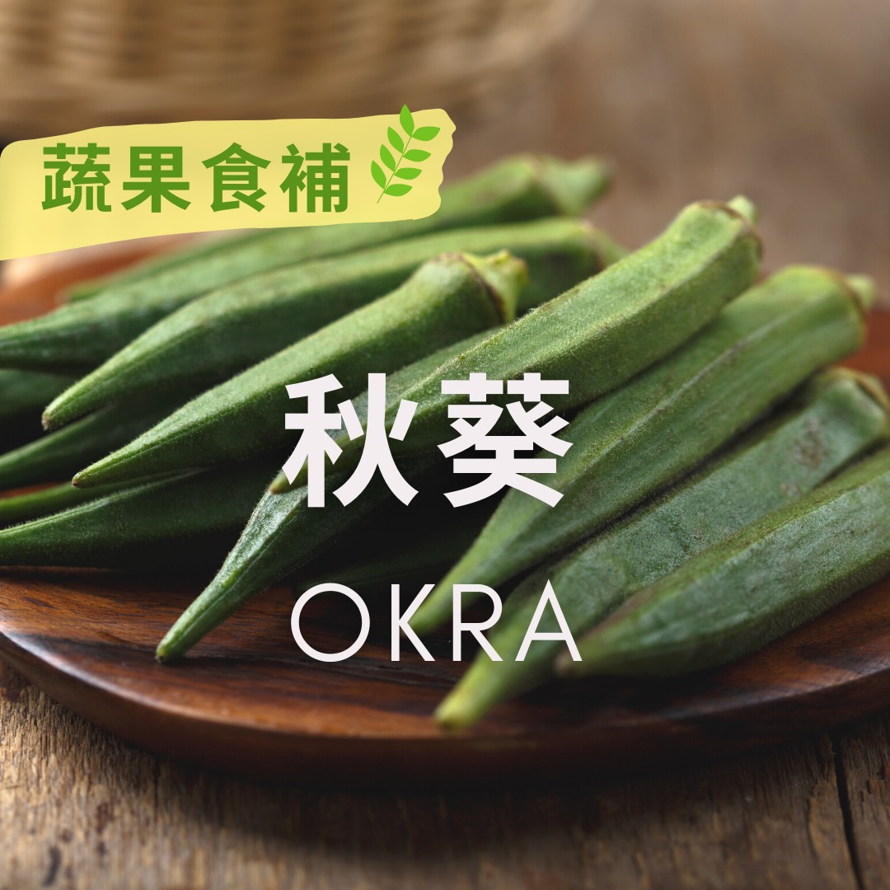

# 蔬果食補  秋葵(Okra)​

## 📋 基本資訊 / Recipe Overview
- **料理名稱**：蔬果食補  秋葵(Okra)​
- **原始標題**：【蔬果食補】 秋葵(Okra)​
- **素食流派 / Diet**：全素 Vegan
- **來源平台 / Source**：[觀音山 · 素食料理簡單做](https://vegan.gys.org.tw/okra%e2%80%8b20210726/)

## 📖 食譜圖文詳情 (中英雙語對照)

「秋葵」又叫羊角豆、黃秋葵，盛產於夏、秋兩季，是營養價值高又普遍的蔬菜?。早在明朝「本草綱目」就記載，秋葵用在食療方面，主要藉由它的黏液，來保護胃壁、改善消化不良等，是顧胃的養生蔬菜。
​
秋葵的黏液中含有黏蛋白、水溶性纖維、多醣體、果膠，對於血壓的調節、保護腸胃道、控制體重都有幫助；秋葵有豐富的維生素A、β-胡蘿蔔素對視力有保健的作用；富含抗氧化成分，如維生素C、鋅，則能提升⬆免疫力、預防感染。此外，鈣質含量與牛奶?相比毫不遜色，且更好吸收，對於素食者及發育中的孩童，是補鈣的好食材。
​
秋葵屬性寒涼，若是容易腹瀉或軟便者，食用時不妨加些薑辣椒等來平衡其涼性。​
​
?選購和保存方式：​
以表面的絨毛越明顯越新鮮，建議選擇5到10公分的秋葵最佳；以冷藏妥善存放約可保存4到5天。​
​
​
本文授權自  觀音山營養師團隊
​
✨慈悲的 龍德上師成立「觀音山蔬食館」提倡健康素食、慈悲護生，以”觀音山素食料理簡單做”的理念，提供多款素食食譜，讓您一學就會！?
​
​
★7月26日 「明淨月．觀世音菩薩節日」：善惡業增長1000萬x1000萬倍​
​
✨殊勝功德增長日✨​
觀音山邀請您於今日響應素食、廣修供養、戒殺護生、誦經修法、行持諸種善行，獲福無量。
? 觀音山 素食料理簡單做 Follow us​ ?
◎Facebook ｜好文按讚
https://www.facebook.com/GYSVegan
​
◎Instagram ｜料理追蹤
https://www.instagram.com/gysvegan/​
◎Youtube ​ ​ ​ ｜加入訂閱
https://reurl.cc/q8VEqy​
◎官方Blog ​ ​ ｜網站推薦
https://vegan.gys.org.tw/​
​
​
—​
? 歡迎轉載，請註明出處：觀音山 素食料理簡單做 GYSVegan 素食環保愛地球，健康營養無負擔，慈悲護生一起來~?

---
*食譜歸檔時間：2026-08-20 · 來源：觀音山素食料理簡單做 (vegan.gys.org.tw)*