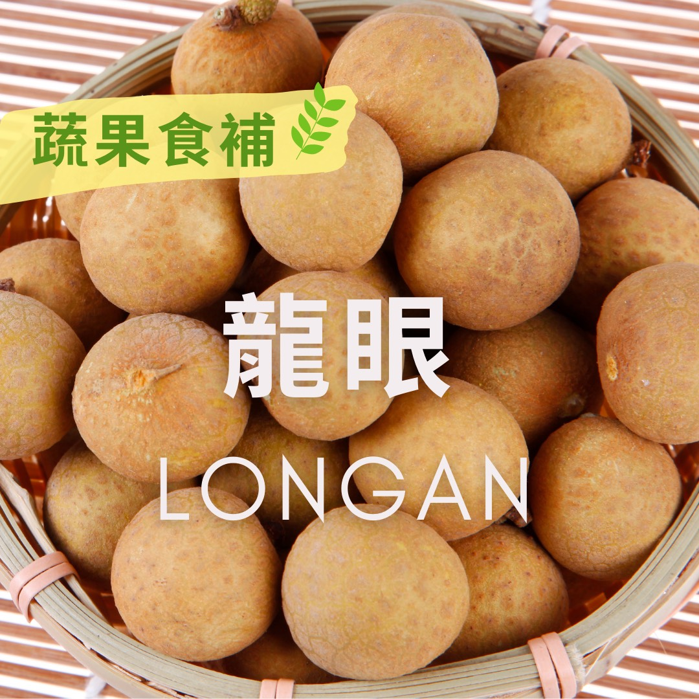

# 蔬果食補  龍眼(Longan)​

## 📋 基本資訊 / Recipe Overview
- **料理名稱**：蔬果食補  龍眼(Longan)​
- **原始標題**：【蔬果食補】 龍眼(Longan)​
- **素食流派 / Diet**：全素 Vegan
- **來源平台 / Source**：[觀音山 · 素食料理簡單做](https://vegan.gys.org.tw/longan20210816/)

## 📖 食譜圖文詳情 (中英雙語對照)

「龍眼」又稱為「桂圓」，是台灣夏季盛產的水果。明朝《本草綱目》作者李時珍：「食品以荔枝為貴，而資益則龍眼為良」，認為龍眼有補心脾、健脾胃、益氣血等功效，所以自古以來被視為食補的好食材?。​
​
龍眼營養豐富，富含維生素C和維生素K，幾乎人體所需的營養素都具備，特別對腦細胞有益，可增強⬆記憶、消除疲勞，亦有研究顯示，龍眼對於抗衰老及癌細胞有抑制作用。烤乾的「龍眼肉」也方便保存，隨時都能補充，常用在冬季氣血活絡之用，可改善手腳冰冷的狀況。​
​
?選購和保存方式：​
外觀枝幹相連的優先挑選，果皮略帶果粉、果實完整飽滿，沒有裂果的狀況為佳；在保存方面，先在龍眼外殼噴灑少許水分?，用紙袋包好後套上塑膠袋，再放進冰箱冷藏，約可存放一個星期。​
​
本文授權自  觀音山營養師團隊 ​
​
​
✨慈悲的 龍德上師成立「觀音山蔬食館」提倡健康素食、慈悲護生，以”觀音山素食料理簡單做”的理念，提供多款素食食譜，讓您一學就會！?​
​
​
★8月16日 藥師佛節日：善惡業增長1千倍​
​
✨殊勝功德增長日✨​
觀音山邀請您於今日響應素食、廣修供養、戒殺護生、誦經修法、行持諸種善行，獲福無量。​
​
? 觀音山 素食料理簡單做 Follow us​ ?
◎Facebook ｜好文按讚
https://www.facebook.com/GYSVegan
​
◎Instagram ｜料理追蹤
https://www.instagram.com/gysvegan/​
◎Youtube ​ ​ ​ ｜加入訂閱
https://reurl.cc/q8VEqy​
◎官方Blog ​ ​ ｜網站推薦
https://vegan.gys.org.tw/​
​
​
—​
? 歡迎轉載，請註明出處：觀音山 素食料理簡單做 GYSVegan 素食環保愛地球，健康營養無負擔，慈悲護生一起來~?

---
*食譜歸檔時間：2026-08-20 · 來源：觀音山素食料理簡單做 (vegan.gys.org.tw)*