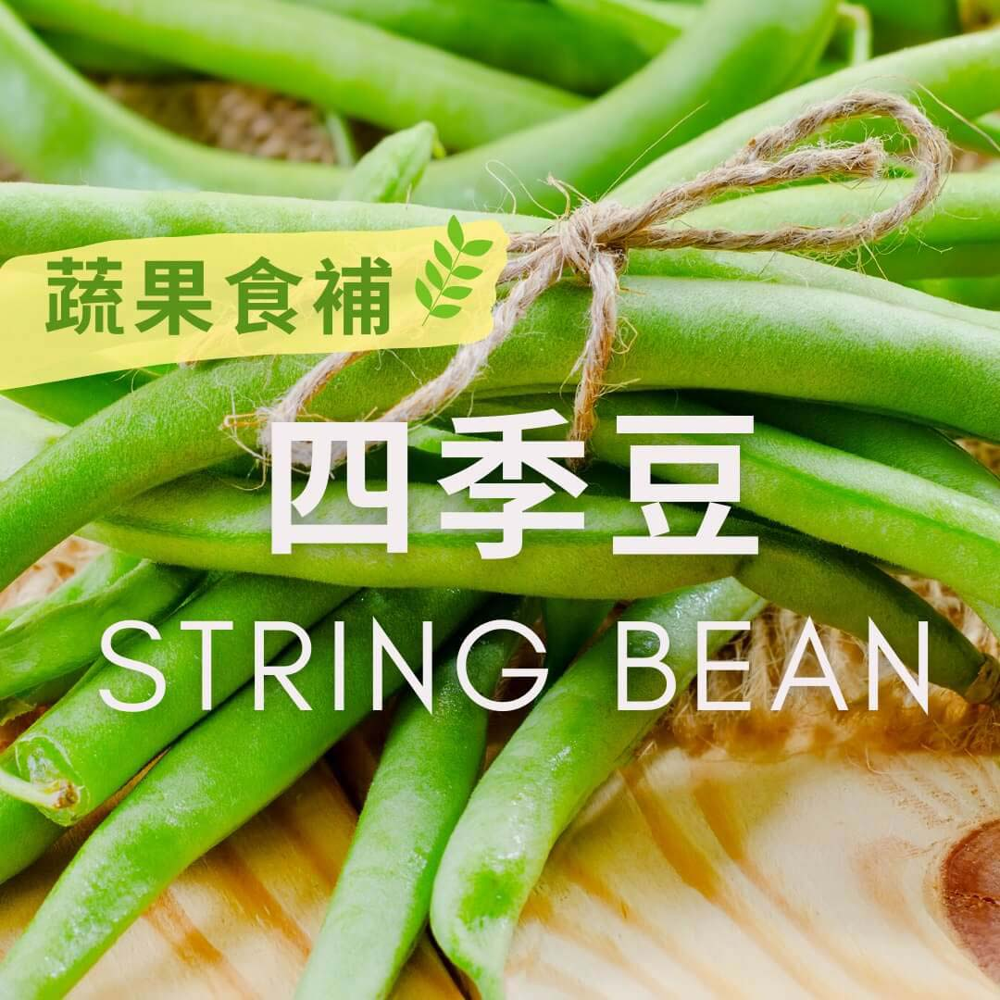

# 蔬果食補 -四季豆 (String Bean)

## 📋 基本資訊 / Recipe Overview
- **料理名稱**：蔬果食補 -四季豆 (String Bean)
- **原始標題**：【蔬果食補】-四季豆 (String Bean)
- **素食流派 / Diet**：全素 Vegan
- **來源平台 / Source**：[觀音山 · 素食料理簡單做](https://vegan.gys.org.tw/string-bean20201205/)

## 📖 食譜圖文詳情 (中英雙語對照)

又稱敏豆，一年四季都可以吃到，所以稱為四季豆，是常見的一種豆類，但是營養的分類是蔬菜類??，最有名的烹飪方式為​
✨乾煸四季豆✨。​
​
四季豆中的beta-穀固醇，在腸道中可阻礙身體吸收食物中的膽固醇，想要降低膽固醇?的人可以多吃四季豆；​
另外四季豆也含豐富的膳食纖維?，可以促進腸胃蠕動，改善便秘；葉綠素和多種類黃酮素，也可以預防大腸癌。​
⚠️生豆含有毒素，想要得到四季豆的多種好處，一定要將它煮熟才能食用喔‼️​
​
?選購及保存方式：​
首選豆莢光澤、有彈性、無皺摺的，豆仁均勻飽滿的最好?。​
四季豆可耐久放，若以紙張包好封在塑膠袋内，可放於冰箱存放約三個星期。​
?每年十一月至次年五月是盛產期，其他月分則為淡季。​
​
本文授權自
#觀音山營養師團隊
​
✨慈悲的 龍德上師成立「觀音山蔬食館」提倡健康素食、慈悲護生，以”觀音山素食料理簡單做”的理念，提供多款素食食譜，讓您一學就會！?​
​
​
?觀音山 素食料理簡單做 Follow us?
Facebook ｜好文按讚
http://www.facebook.com/GYSVegan​
Instagram ｜料理追蹤
http://www.instagram.com/gysvegan/​
Youtube ​ ​ ​ ｜加入訂閱
https://reurl.cc/q8VEqy​
Telegram ​ ｜頻道推薦
https://t.me/GYSVegan​
​
​
?歡迎轉載，請註明出處： ​ ​ 觀音山 素食料理簡單做 GYSVegan 素食環保愛地球，健康營養無負擔，慈悲護生一起來~?

---
*食譜歸檔時間：2026-08-20 · 來源：觀音山素食料理簡單做 (vegan.gys.org.tw)*