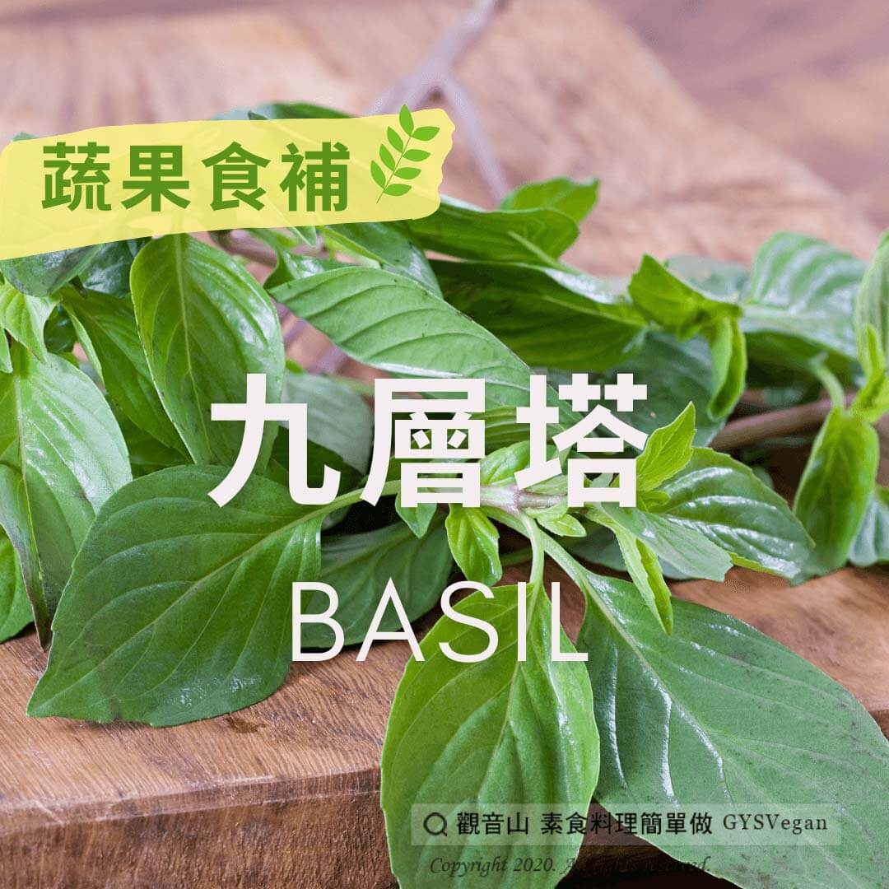

# 蔬果食補 九層塔

## 📋 基本資訊 / Recipe Overview
- **料理名稱**：蔬果食補 九層塔
- **原始標題**：【蔬果食補】九層塔
- **素食流派 / Diet**：全素 Vegan
- **來源平台 / Source**：[觀音山 · 素食料理簡單做](https://vegan.gys.org.tw/basil20201215/)

## 📖 食譜圖文詳情 (中英雙語對照)

九層塔為羅勒的一種，以前農村庭院很常栽種九層塔，因氣味特殊又稱「十里香」。​
九層塔有許多對人體有益的植化素，在料理上加入九層塔，無論是中式或西式都有畫龍點睛的效果，讓佳餚不同凡響，香氣風味更增勝。​
​
九層塔特殊的氣味，包含芳樟醇、丁香酚、檸檬烯，這些成分能有效地抑制細菌生長。​
吃生菜沙拉時，搭配上新鮮的九層塔，能增加風味又抑菌；另外九層塔有非常豐富的✨維生素A和維生素K，維生素A可以改善夜盲症的症狀、維生素K可以強健骨骼?，刺激骨鈣素的形成，想要強健骨骼的人也可以多吃九層塔。​
​
?選購和保存方式：​
選擇葉片翠綠、不枯萎，因為並不耐放，買回後最後放在保鮮袋中，並置於冰箱內冷藏。​
​
本文授權自觀音山營養師團隊​
​
✨慈悲的 龍德上師成立「觀音山蔬食館」提倡健康素食、慈悲護生，以”觀音山素食料理簡單做”的理念，提供多款素食食譜，讓您一學就會！?
​
​
?觀音山 素食料理簡單做? ​
Facebook ｜好文按讚
http://www.facebook.com/GYSVegan​
Instagram ｜料理追蹤
http://www.instagram.com/gysvegan/​
Youtube ​ ​ ​ ｜加入訂閱
https://reurl.cc/q8VEqy​
Telegram ​ ｜頻道推薦
https://t.me/GYSVegan
​
​
​
–​
? 歡迎轉載，請註明出處： ​ ​ 觀音山 素食料理簡單做 GYSVegan 素食環保愛地球，健康營養無負擔，慈悲護生一起來~?​

---
*食譜歸檔時間：2026-08-20 · 來源：觀音山素食料理簡單做 (vegan.gys.org.tw)*