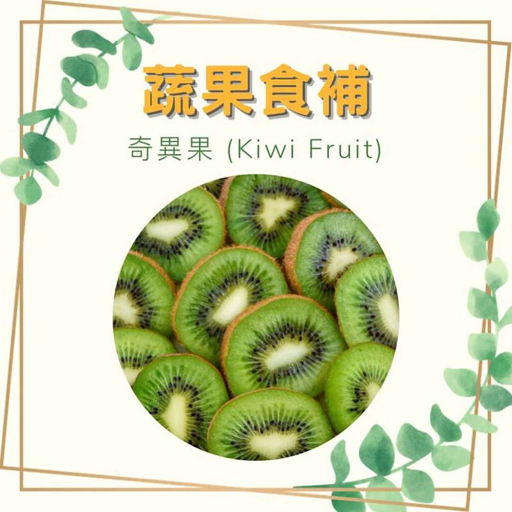

# 蔬果食補 奇異果 (Kiwi Fruit)

## 📋 基本資訊 / Recipe Overview
- **料理名稱**：蔬果食補 奇異果 (Kiwi Fruit)
- **原始標題**：【蔬果食補】奇異果 (Kiwi Fruit)
- **素食流派 / Diet**：全素 Vegan
- **來源平台 / Source**：[觀音山 · 素食料理簡單做](https://vegan.gys.org.tw/%e3%80%90%e8%94%ac%e6%9e%9c%e9%a3%9f%e8%a3%9c%e3%80%91%e5%a5%87%e7%95%b0%e6%9e%9c-kiwi-fruit%f0%9f%a5%9d/)

## 📖 食譜圖文詳情 (中英雙語對照)

產於中國又稱獼猴桃、猴桃或猴梨，後來在紐西蘭盛行起來，被稱為奇異果。​
奇異果?、芭樂和柳丁?都是維生素C含量高⬆️的水果。​
​
奇異果有含許多對視力?有幫助的成分，維生素A可預防夜盲症，其中豐富的膳食纖維可以降低癌症；奇異果維生素C對於氣管有很好的保護，對氣喘的現象有相當程度的改善。​
​
奇異果被歸為是「低腹敏」食物。有研究?指出，腸躁症患者連續四周每天食用2顆奇異果，可以舒緩脹氣，減少吃蛋白質引起的腹脹感。​
​
?選購及保存方式：​
果實飽滿，果皮多絨毛者，是品質比較好?的奇異果。輕壓蒂頭若已軟化即為馬上可以食用的。若果皮還硬，可於室溫催熟；果皮已軟放冰箱可保存兩週。​
每年的十月~十二月是盛產期。​
​
#本文授權自觀音山營養師團隊​
​
慈悲的 龍德上師成立「觀音山蔬食館」提倡健康素食、慈悲護生，以”觀音山素食料理簡單做”的理念，提供多款素食食譜，讓您一學就會！?​
​
​
?觀音山 素食料理簡單做 Follow us?​
Facebook ｜好文按讚
http://www.facebook.com/GYSVegan​
Instagram ｜料理追蹤
http://www.instagram.com/gysvegan/​
Youtube ​ ​ ​ ｜加入訂閱
https://reurl.cc/q8VEqy​
Telegram ​ ｜頻道推薦
https://t.me/GYSVegan​
​
​
? 歡迎轉載，請註明出處： ​ ​ 觀音山 素食料理簡單做 GYSVegan 素食環保愛地球，健康營養無負擔，慈悲護生一起來~?

---
*食譜歸檔時間：2026-08-20 · 來源：觀音山素食料理簡單做 (vegan.gys.org.tw)*