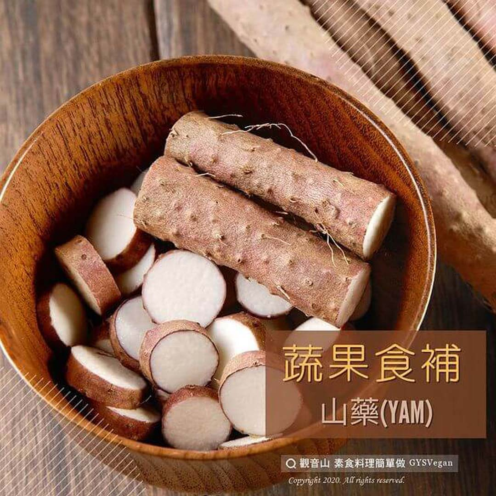

# 蔬果食補 山藥(Yam)

## 📋 基本資訊 / Recipe Overview
- **料理名稱**：蔬果食補 山藥(Yam)
- **原始標題**：【蔬果食補】山藥(Yam)
- **素食流派 / Diet**：全素 Vegan
- **來源平台 / Source**：[觀音山 · 素食料理簡單做](https://vegan.gys.org.tw/783-2/)

## 📖 食譜圖文詳情 (中英雙語對照)

山藥是我國古老的作物，又稱山薯，每年的十月到十二月是產季，相傳山藥具有滋補強壯、滋陰養腎的功效。山藥涼拌生食有如蛋白般的點滑，若熟食則質地松軟，入口即化??。​
​
​ ​山藥中的薯蕷皀苷元，和女性荷爾蒙的構造相似，多吃山藥可以改善更年期不適的症狀，且科學家?‍?發現薯蕷皀苷元也可以改善骨質的密度和強度?，可以避免骨質流失；另外山藥對於降低血糖、膽固醇、維持血壓穩定，都是很不錯的食材選擇。​
​
?選購和保存方式：​
​挑選表皮光滑、鬚根少?，沒有乾枯或腐爛的新鮮山藥?。未削皮的山藥可以包好放在陰涼通風處，可存放將近一個月。若已削皮切塊，應盡速食用，若無法食用完畢，可放保鮮袋封好存放冷凍庫保存。​
​
#本文授權自觀音山營養師團隊​
​
✨慈悲的 龍德上師成立「觀音山蔬食館」提倡健康素食、慈悲護生，以”觀音山素食料理簡單做”的理念，提供多款素食食譜，讓您一學就會！?​
​
​
?觀音山 素食料理簡單做 Follow us?​
Facebook ｜好文按讚
http://www.facebook.com/GYSVegan​
Instagram ｜料理追蹤
http://www.instagram.com/gysvegan/​
Youtube ​ ​ ​ ｜加入訂閱
https://reurl.cc/q8VEqy​
Telegram ​ ｜頻道推薦
https://t.me/GYSVegan​
​
​
?歡迎轉載，請註明出處： ​ ​ 觀音山 素食料理簡單做 GYSVegan 素食環保愛地球，健康營養無負擔，慈悲護生一起來~?

---
*食譜歸檔時間：2026-08-20 · 來源：觀音山素食料理簡單做 (vegan.gys.org.tw)*