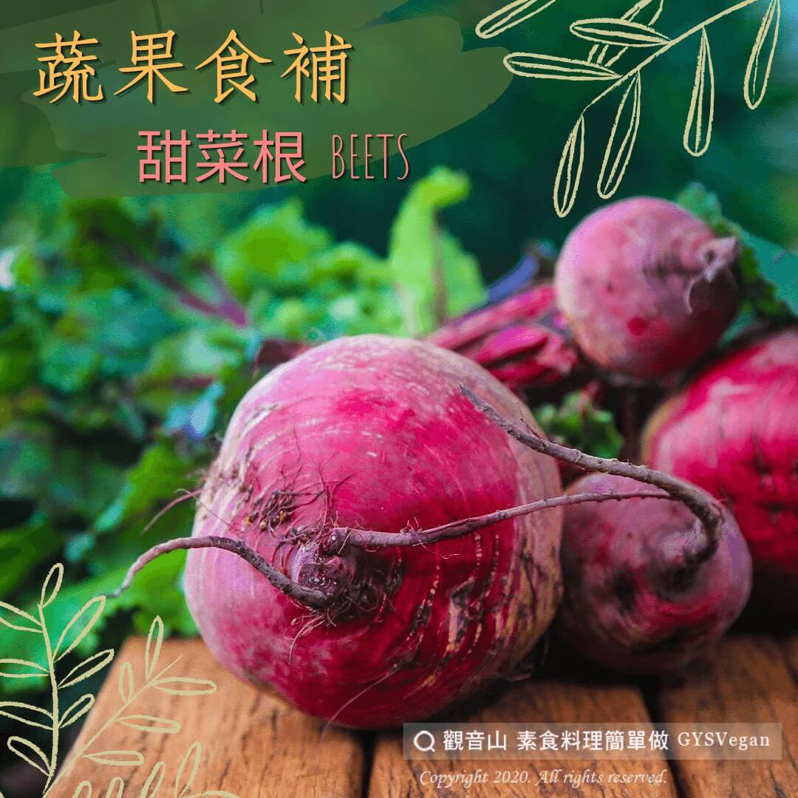

# 蔬果食補 甜菜根 (Beets)

## 📋 基本資訊 / Recipe Overview
- **料理名稱**：蔬果食補 甜菜根 (Beets)
- **原始標題**：【蔬果食補】甜菜根 (Beets)
- **素食流派 / Diet**：全素 Vegan
- **來源平台 / Source**：[觀音山 · 素食料理簡單做](https://vegan.gys.org.tw/%e3%80%90%e8%94%ac%e6%9e%9c%e9%a3%9f%e8%a3%9c%e3%80%91%e7%94%9c%e8%8f%9c%e6%a0%b9-beets/)

## 📖 食譜圖文詳情 (中英雙語對照)

據聞甜菜根是古希臘時代的祭祀聖品。紫紅色來自特有的天然色素甜菜素，若不小心沾染到汁液，可以用檸檬汁?洗淨。甜菜根也是很好的抗氧化劑，可以用來做沙拉?或打成果汁，加熱過的甜菜根會破壞甜菜素養分。​
​
​ ​ ​ ​ ​ 甜菜素能消除自由基，有許多研究發現甜菜根纖維可以提高肝臟中的抗氧化酵素和解毒酵素，提升?⬆️ 對抗癌症的能力；也有研究發現甜菜根可以降低?膽固醇，是能保護心血管❤️的食材。​
​
​ ​ ​ ​ ​ 懷孕期間孕婦要注意補充葉酸，葉酸可以避免孩子?神經管缺陷，甜菜根含有葉酸，孕婦可以食用天然的甜菜根來補充葉酸。吃太多甜菜根，尿液會出現淡紅色，此為正常現象，不需要太擔心。​
​
?選購和保存方式：​
​ ​ ​ ​ ​ 外皮不枯萎、沒有碰撞過的傷痕，太大的比較容易老，所以挑中小型的甜菜根尤佳，若表面開始有一些濕濕軟軟或斑點，表示不新鮮了，?避免選購。新鮮的甜菜根不用先洗過，直接放進冰箱可以保存兩到四週。​
​
#本文授權自觀音山營養師團隊​
​
✨慈悲的 龍德上師成立「觀音山蔬食館」提倡健康素食、慈悲護生，以”觀音山素食料理簡單做”的理念，提供多款素食食譜，讓您一學就會！?​
​
​
?觀音山 素食料理簡單做 Follow us?
Facebook ｜好文按讚
http://www.facebook.com/GYSVegan​
Instagram ｜料理追蹤
http://www.instagram.com/gysvegan/​
Youtube ｜加入訂閱
https://reurl.cc/q8VEqy​
Telegram ｜頻道推薦
https://t.me/GYSVegan​
​
​
—​
?歡迎轉載，請註明出處： 觀音山 素食料理簡單做 GYSVegan 素食環保愛地球，健康營養無負擔，慈悲護生一起來~?

---
*食譜歸檔時間：2026-08-20 · 來源：觀音山素食料理簡單做 (vegan.gys.org.tw)*