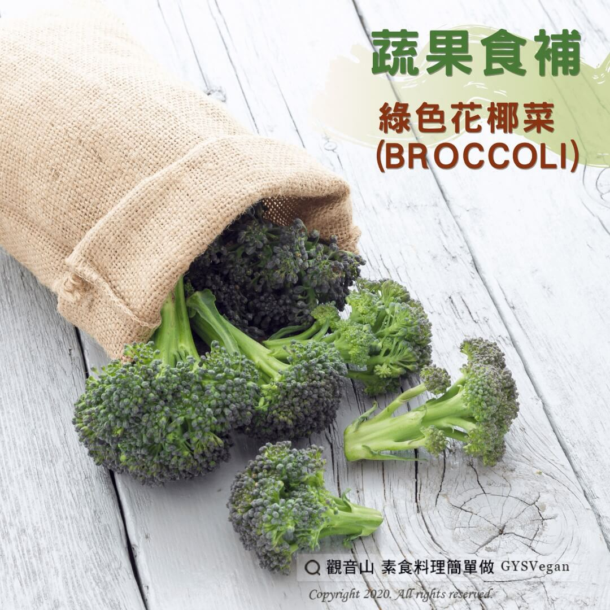

# 蔬果食補 綠色花椰菜 (Broccoli)

## 📋 基本資訊 / Recipe Overview
- **料理名稱**：蔬果食補 綠色花椰菜 (Broccoli)
- **原始標題**：【蔬果食補】綠色花椰菜 (Broccoli)
- **素食流派 / Diet**：全素 Vegan
- **來源平台 / Source**：[觀音山 · 素食料理簡單做](https://vegan.gys.org.tw/%e3%80%90%e8%94%ac%e6%9e%9c%e9%a3%9f%e8%a3%9c%e3%80%91%e7%b6%a0%e8%89%b2%e8%8a%b1%e6%a4%b0%e8%8f%9c-broccoli/)

## 📖 食譜圖文詳情 (中英雙語對照)

你今天吃綠色花椰菜了嗎?​
​
綠色花椰菜又稱為青花菜或美國花菜?，有許多令人驚豔?的營養成分。早期綠色花椰菜只有在義大利為主食蔬菜，之後才漸漸地傳入其他國家。​
​
綠色花椰菜算是蔬菜防癌戰士，能將一些致癌物和有害物質排除於體外?。常吃綠色花椰菜的人，得到大腸癌、肺癌、胃癌的機率較低。⬇️​
​
綠色花椰菜也是小朋友??及大人保護視力?的好食物；含有高量的葉黃素，可以抵擋陽光☀️對眼睛的傷害，能預防黄斑部病變及白內障。​
​
綠色花椰菜能阻擋不好的膽固醇，減少?動脈硬化，能保持心血管?的健康。綠色花椰菜也含有豐富的維生素C，能讓皮膚保持彈性、白皙，是一種很好的吃的保養品喔！​
​
?選購及保存要領​
越青翠越好，?不要選已泛黃的，莖部以不空心者為佳，用手秤秤有重量感覺的較好。綠色花椰菜不要久放，買回來後應盡快烹調，每年十二月至隔年五月盛產，其他月分為淡季。​
​
本文授權自 #觀音山營養師團隊​
​
慈悲的 龍德上師成立「觀音山蔬食館」提倡健康素食、慈悲護生，以”觀音山素食料理簡單做”的理念，提供多款素食食譜，讓您一學就會！?​
​
​
?觀音山 素食料理簡單做 Follow us?
Facebook ｜好文按讚
http://www.facebook.com/GYSVegan​
Instagram ｜料理追蹤
http://www.instagram.com/gysvegan/​
Youtube ​ ​ ​ ｜加入訂閱
https://reurl.cc/q8VEqy​
Telegram ​ ｜頻道推薦
https://t.me/GYSVegan​
​
​
? 歡迎轉載，請註明出處： ​ ​ 觀音山 素食料理簡單做 GYSVegan 素食環保愛地球，健康營養無負擔，慈悲護生一起來~?

---
*食譜歸檔時間：2026-08-20 · 來源：觀音山素食料理簡單做 (vegan.gys.org.tw)*