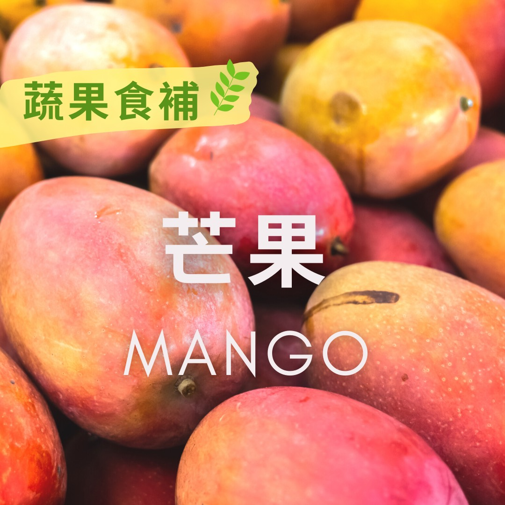

# 蔬果食補 芒果 (Mango)

## 📋 基本資訊 / Recipe Overview
- **料理名稱**：蔬果食補 芒果 (Mango)
- **原始標題**：【蔬果食補】芒果 (Mango)
- **素食流派 / Diet**：全素 Vegan
- **來源平台 / Source**：[觀音山 · 素食料理簡單做](https://vegan.gys.org.tw/mango20210628/)

## 📖 食譜圖文詳情 (中英雙語對照)

芒果原產於印度，最早於明朝引進台灣，近代時期有許多改良品種適合本土種植?，盛產期在5月到10月之間。以現在營養學觀點而言，芒果營養價值相當高，並含有許多優良的植化素，是抗癌的好水果。​
​
芒果風味獨特，深受大眾喜愛，有「熱帶果王」之譽，本身除了含有膳食纖維，能幫助腸胃蠕動，豐富的維生素A及類黃酮，如β-胡蘿蔔素、玉米黃素，對眼睛?有保健的作用，更有許多實證研究發現，食用芒果對許多癌症有預防的效果。​
​
由於芒果可能對於部分人會產生過敏性反應(如：有皮膚過敏問題的人)， 建議在食用時要注意，⚠不要吃過量，亦有研究 指出芒果外皮的成分「漆酚」易造成過敏，可將芒果皮剝乾淨後再食用。​
​
?選購和保存方式：​
應以外表無傷痕、黑斑為選購要點，果體飽滿、鮮豔、有彈性者為佳✅。保存應置於陰涼處防止壓傷，約可存放一週，已熟者，可放在冰箱保存。​
​
​
本文授權自 #觀音山營養師團隊
​
​
✨慈悲的 龍德上師成立「觀音山蔬食館」提倡健康素食、慈悲護生，以”觀音山素食料理簡單做”的理念，提供多款素食食譜，讓您一學就會！?​
? 觀音山 素食料理簡單做 Follow us​ ?
◎Facebook ｜好文按讚
https://www.facebook.com/GYSVegan
​
◎Instagram ｜料理追蹤
https://www.instagram.com/gysvegan/​
◎Youtube ​ ​ ​ ｜加入訂閱
https://reurl.cc/q8VEqy​
◎官方Blog ​ ​ ｜網站推薦
https://vegan.gys.org.tw/​
​
​
—​
? 歡迎轉載，請註明出處：觀音山 素食料理簡單做 GYSVegan 素食環保愛地球，健康營養無負擔，慈悲護生一起來~?

---
*食譜歸檔時間：2026-08-20 · 來源：觀音山素食料理簡單做 (vegan.gys.org.tw)*