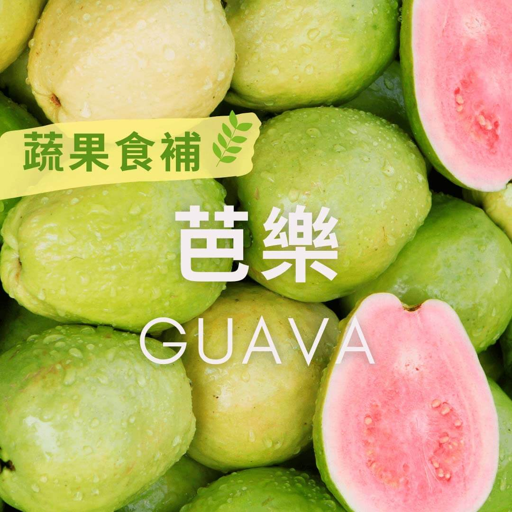

# 蔬果食補 芭樂(Guava)

## 📋 基本資訊 / Recipe Overview
- **料理名稱**：蔬果食補 芭樂(Guava)
- **原始標題**：【蔬果食補】芭樂(Guava)
- **素食流派 / Diet**：全素 Vegan
- **來源平台 / Source**：[觀音山 · 素食料理簡單做](https://vegan.gys.org.tw/guava20201228/)

## 📖 食譜圖文詳情 (中英雙語對照)

芭樂是我們常吃的水果之一，含有豐富的維生素C，同等重量的芭樂和橘子相比，芭樂的維生素C是橘子?的5倍，芭樂也有許多豐富的植化素，是很有保健功效的水果。
芭樂性平、味甘澀，可以預防或改善糖尿病(但不宜吃放太久的芭樂，GI值會升高)，芭樂熱量低含有豐富的維生素C，在所有水果中的抗氧化劑排名含量高，常吃能讓皮膚白皙且有彈性，是愛美的女性最好的選擇。
?選購及保存方式：
選擇果皮無腐爛，手秤起來有些份量的，軟硬度依個人喜好而定。
尚未成熟的芭樂很耐放，放在冰箱可至半個月，一年四季皆為產期。
本文授權自觀音山營養師團隊​
✨慈悲的 龍德上師成立「觀音山蔬食館」提倡健康素食、慈悲護生，以”觀音山素食料理簡單做”的理念，提供多款素食食譜，讓您一學就會！?
? 觀音山 素食料理簡單做 ?
Facebook ｜好文按讚
http://www.facebook.com/GYSVegan
​
Instagram ｜料理追蹤
http://www.instagram.com/gysvegan/
​
Youtube ｜加入訂閱
https://reurl.cc/q8VEqy
​
Telegram ｜頻道推薦
https://t.me/GYSVegan
—
? 歡迎轉載，請註明出處： 觀音山 素食料理簡單做GYSVegan按讚、留言設定搶先看!
素食環保愛地球，健康營養無負擔，慈悲護生一起來~?

---
*食譜歸檔時間：2026-08-20 · 來源：觀音山素食料理簡單做 (vegan.gys.org.tw)*