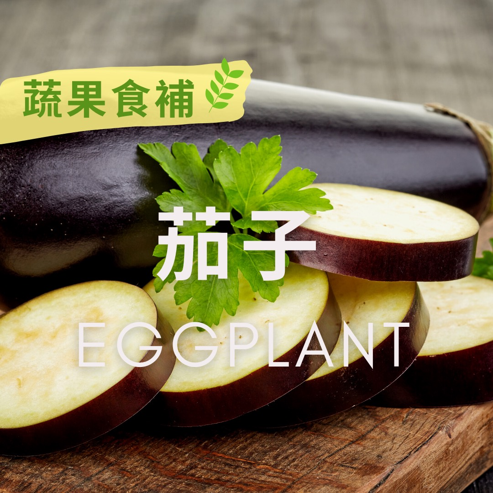

# 蔬果食補 茄子 (Eggplant)

## 📋 基本資訊 / Recipe Overview
- **料理名稱**：蔬果食補 茄子 (Eggplant)
- **原始標題**：【蔬果食補】茄子 (Eggplant)
- **素食流派 / Diet**：全素 Vegan
- **來源平台 / Source**：[觀音山 · 素食料理簡單做](https://vegan.gys.org.tw/eggplant20210524/)

## 📖 食譜圖文詳情 (中英雙語對照)

茄子的原產地在印度，古時有別名為落蘇、吊菜、矮瓜。在中醫觀點屬寒性食物❄，能清熱、止血、止痛、消腫等功效，對痛經、內痔便血、慢性胃炎及腎炎水腫等，也有顯著的調理作用。​
​​
茄子?料理方式相當多元，可以生食、熱炒、涼拌、醃製，當主菜或配菜使用，無論是配色或是口感都有很好的表現。​
​​
茄子又稱為「血管中的清道夫」，內含花青素，能增加⬆血管的強度和彈性，有些人身上很容易出現瘀血或紫斑，可以多吃茄子防止血管破裂。​
​​
花青素可以抗氧化、抗發炎，增強記憶力，多吃紫色茄子可以讓你的腦袋更年輕！茄子中的植化素，如：皂素可以減緩氣喘症狀、降低?膽固醇。​
​
?選購與保存方式：​
挑選外型平整光滑，表皮顏色亮麗有光澤✨、果肉有彈性，內部沒有種子的為佳。尚未切開或清洗的茄子包好可冷藏數天，保存時要避免擠壓。​
​​
若購買的茄子有包塑膠膜應盡快去除，才不會影響表皮的通氣性而降低新鮮度。每年的五到十二月是盛產季，其他時間為淡季。​
​​
本文授權自  觀音山營養師團隊​
​​
✨慈悲的 龍德上師成立「觀音山蔬食館」提倡健康素食、慈悲護生，以”觀音山素食料理簡單做”的理念，提供多款素食食譜，讓您一學就會！?
​
​
? 觀音山 素食料理簡單做 Follow us ?
◎Facebook ｜好文按讚
https://www.facebook.com/GYSVegan​
◎Instagram ｜料理追蹤
https://www.instagram.com/gysvegan/​
◎Youtube ​ ​ ​ ｜加入訂閱
https://reurl.cc/q8VEqy​
◎官方Blog ​ ​ ｜網站推薦
https://vegan.gys.org.tw/​
—​
? 歡迎轉載，請註明出處：觀音山 素食料理簡單做 GYSVegan 素食環保愛地球，健康營養無負擔，慈悲護生一起來~?

---
*食譜歸檔時間：2026-08-20 · 來源：觀音山素食料理簡單做 (vegan.gys.org.tw)*