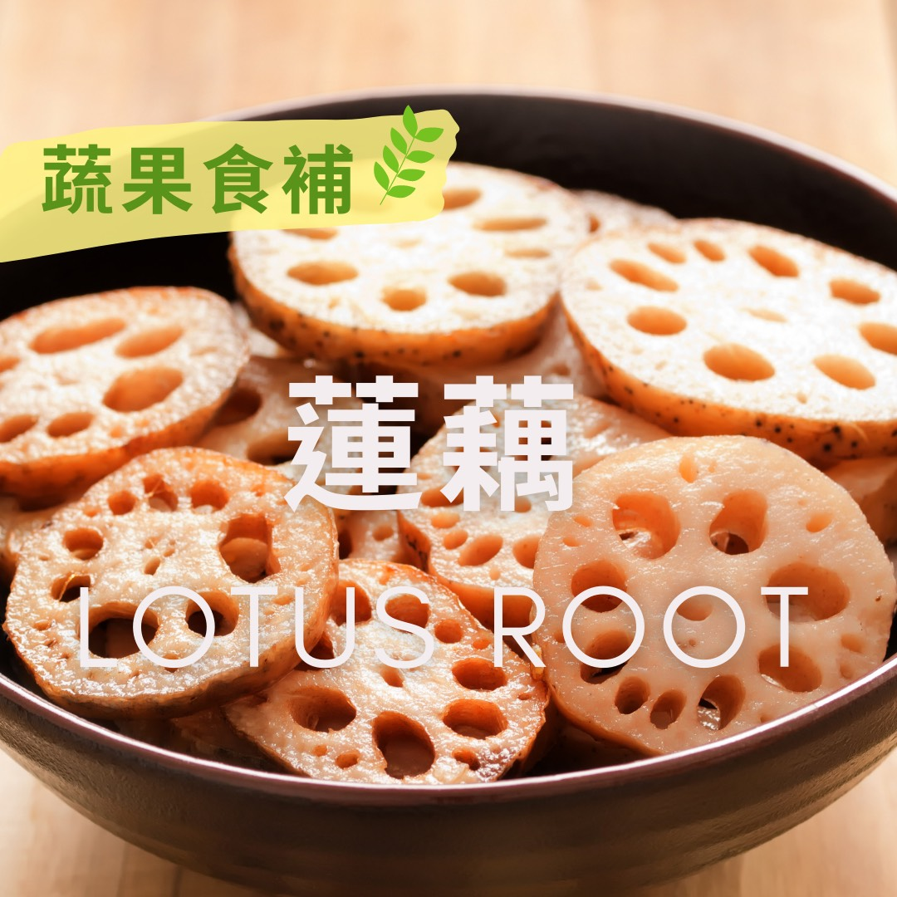

# 蔬果食補 蓮藕(Lotus root)

## 📋 基本資訊 / Recipe Overview
- **料理名稱**：蔬果食補 蓮藕(Lotus root)
- **原始標題**：【 蔬果食補】蓮藕(Lotus root)
- **素食流派 / Diet**：全素 Vegan
- **料理分類 / Category**：家常料理
- **來源平台 / Source**：[觀音山 · 素食料理簡單做](https://vegan.gys.org.tw/otus-root%e2%80%8b20210830/)

## 📖 食譜圖文詳情 (中英雙語對照)

蓮藕原產於印度，在《本草綱目》盛讚蓮藕為「靈根」，可知其營養價值豐富，甚至在清朝，被欽定為御膳貢品；新鮮蓮藕品嚐起來清脆爽口，不論是涼拌或燉煮，都是極佳的養生食材。​
​
因蓮藕有豐富的維他命C，就算煮熟也不易流失，可增強免疫力⬆️；滿滿地膳食纖維，除了刺激腸道蠕動，讓排便更順暢外，更可以促進體內廢物迅速排出，淨化五臟血液；富含鉀質和鈣質，能幫助血糖穩定、預防心血管疾病；此外，還含有維生素B、單寧酸、鐵、鋅等礦物質，是一種老少皆宜的好食材。​
​
在中醫的觀點上，蓮藕具有生津、止血化瘀、安神生智、健脾開胃的效果。功效雖多，腹瀉、手腳冰冷或脾胃虛弱的人，⚠️不宜食用過多生藕。​
​
?選購和保存方式：​
以飽滿厚實、表面無外傷、沒臭味、黃褐色為主，若選擇有切開的蓮藕，應以切面氣孔大為佳；未切開的蓮藕，置於乾燥陰涼處保存即可，已切開的蓮藕，因為切口容易變黑腐壞，須用保鮮膜包裹後再放入冰箱冷藏。​
​
本文授權自 觀音山營養師團隊
​
​
✨慈悲的 龍德上師成立「觀音山蔬食館」提倡健康素食、慈悲護生，以”觀音山素食料理簡單做”的理念，提供多款素食食譜，讓您一學就會！?​
​
​
★8月30日 大日如來節日：善惡業增長1億倍​
​
✨殊勝功德增長日✨​
觀音山邀請您於今日響應素食、廣修供養、戒殺護生、誦經修法、行持諸種善行，獲福無量。​
​
​​
​? 觀音山 素食料理簡單做 Follow us​ ?
◎Facebook ｜好文按讚
https://www.facebook.com/GYSVegan
​
◎Instagram ｜料理追蹤
https://www.instagram.com/gysvegan/​
◎Youtube ​ ​ ​ ｜加入訂閱
https://reurl.cc/q8VEqy​
◎官方Blog ​ ​ ｜網站推薦
https://vegan.gys.org.tw/​
​
​
—​
? 歡迎轉載，請註明出處：觀音山 素食料理簡單做 GYSVegan 素食環保愛地球，健康營養無負擔，慈悲護生一起來~?

---
*食譜歸檔時間：2026-08-20 · 來源：觀音山素食料理簡單做 (vegan.gys.org.tw)*