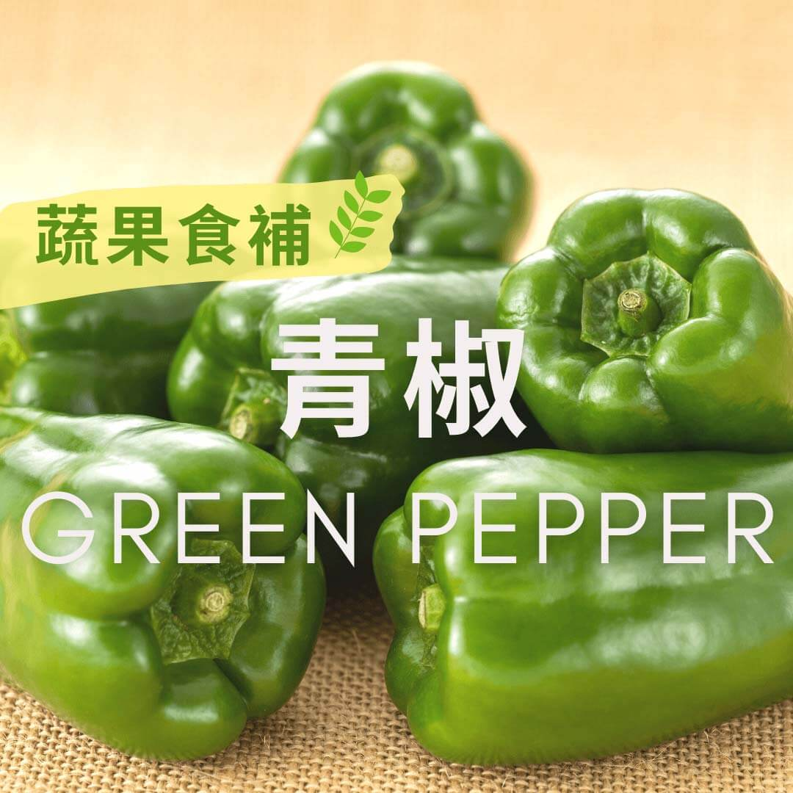

# 蔬果食補 青椒 (Green Pepper)

## 📋 基本資訊 / Recipe Overview
- **料理名稱**：蔬果食補 青椒 (Green Pepper)
- **原始標題**：【蔬果食補】青椒 (Green Pepper)
- **素食流派 / Diet**：全素 Vegan
- **來源平台 / Source**：[觀音山 · 素食料理簡單做](https://vegan.gys.org.tw/green-pepper20210105/)

## 📖 食譜圖文詳情 (中英雙語對照)

青椒又稱菜椒、甜椒，早期的甜椒有腥臭味，經過改良後增加甜度 ，除了綠色青椒，還改良出黃、紅、橘、紫等顏色甜椒，不但料理時很好用來配色，且具有保健功能。
青椒富含抗氧化劑，能清除 讓血管老化的自由基；含有豐富的維生素C ，能養顏美容，皮膚的膠原蛋白需要大量的維生素C，因此皮膚彈性、白皙可以多吃青椒和其它顏色的甜椒。
也有研究 證實青椒能有效改善類風濕關節炎、預防癌症。
?選購及保存方式：
選擇蒂頭無腐壞，果實光滑、顏色鮮艷者 ，沒有萎縮損傷的尤佳。可以放置陰涼處，包裹好存放冰箱約可一星期，每年的十二月到隔年五月是產期。
本文授權自觀音山營養師團隊​
✨慈悲的 龍德上師成立「觀音山蔬食館」提倡健康素食、慈悲護生，以”觀音山素食料理簡單做”的理念，提供多款素食食譜，讓您一學就會！?
? 觀音山 素食料理簡單做 ?
Facebook ｜好文按讚
http://www.facebook.com/GYSVegan
​
Instagram ｜料理追蹤
http://www.instagram.com/gysvegan/
​
Youtube ｜加入訂閱
https://reurl.cc/q8VEqy
​
Telegram ｜頻道推薦
https://t.me/GYSVegan
—
? 歡迎轉載，請註明出處： 觀音山 素食料理簡單做 GYSVegan 素食環保愛地球，健康營養無負擔，慈悲護生一起來~?

---
*食譜歸檔時間：2026-08-20 · 來源：觀音山素食料理簡單做 (vegan.gys.org.tw)*