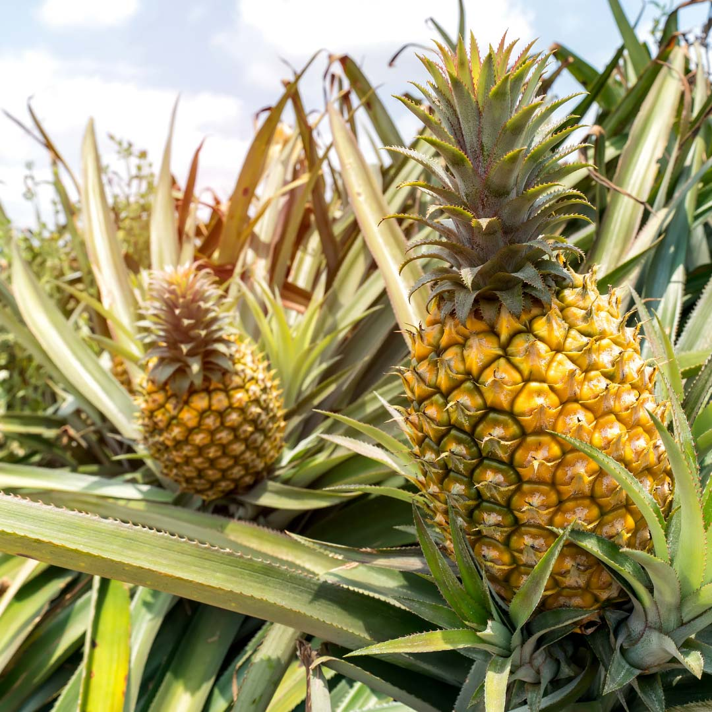

# 蔬果食補 鳳梨 (Pineapple)

## 📋 基本資訊 / Recipe Overview
- **料理名稱**：蔬果食補 鳳梨 (Pineapple)
- **原始標題**：【蔬果食補】鳳梨 (Pineapple)
- **素食流派 / Diet**：全素 Vegan
- **來源平台 / Source**：[觀音山 · 素食料理簡單做](https://vegan.gys.org.tw/pineapple20210405/)

## 📖 食譜圖文詳情 (中英雙語對照)

台灣一年四季都生產鳳梨?，各種品種的鳳梨輪番上陣，所以台灣被譽為鳳梨王國，不僅將鳳梨當成水果，將鳳梨入菜的料理也非常的多。​
​
鳳梨富含維生素B1、維生素C、鉀、鈣等，營養相當多元，最獨特的就是「鳳梨酵素」，可以增加人體免疫力、預防心臟病以及降低身體發炎。唯獨鳳梨糖分高，要注意不要過量❗️​
​
有許多人吃鳳梨時，怕有刮舌感，其實這是因為「鳳梨酵素」所導致，可以先抹上鹽巴來降低?鳳梨酵素的活性，就可以減少刮舌感了。​
​
?選購和保存方式：​
以果實結實飽滿，無裂縫，有重量感，果目明顯突起為佳；綠色鳳梨可以保存較多天，以頭葉朝下方式置於陰涼通風處。較黃的鳳梨?去除頭葉冰存，約3-5日內食用完畢，頭葉朝下的保存方式可以讓鳳梨甜度均勻。​
​
本文授權自 ​ 觀音山營養師團隊
​
✨慈悲的 龍德上師成立「觀音山蔬食館」提倡健康素食、慈悲護生，以”觀音山素食料理簡單做”的理念，提供多款素食食譜，讓您一學就會！?​
​
​
? 觀音山 素食料理簡單做 ?
◎Facebook ｜好文按讚
https://www.facebook.com/GYSVegan​
◎Instagram ｜料理追蹤
https://www.instagram.com/gysvegan/​
◎Youtube ​ ​ ​ ｜加入訂閱
https://reurl.cc/q8VEqy​
◎Telegram ​ ｜頻道推薦
https://t.me/GYSVegan
​
​
​
—​
? 歡迎轉載，請註明出處：觀音山 素食料理簡單做 GYSVegan 素食環保愛地球，健康營養無負擔，慈悲護生一起來~?

---
*食譜歸檔時間：2026-08-20 · 來源：觀音山素食料理簡單做 (vegan.gys.org.tw)*