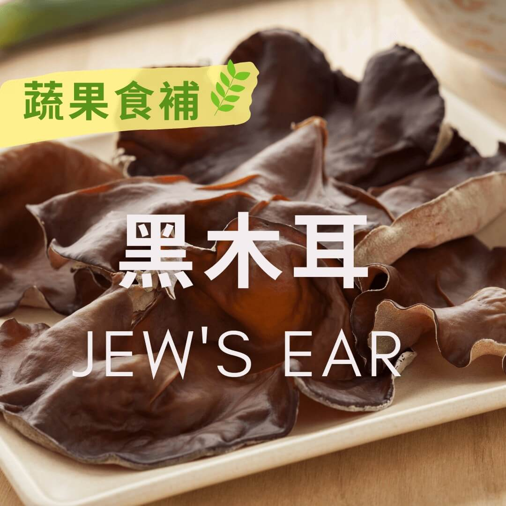

# 蔬果食補 黑木耳 (Jew’s Ear) - 素食料理簡單做

## 📋 基本資訊 / Recipe Overview
- **料理名稱**：蔬果食補 黑木耳 (Jew’s Ear) - 素食料理簡單做
- **原始標題**：【蔬果食補】黑木耳 (Jew’s Ear) - 素食料理簡單做
- **素食流派 / Diet**：全素 Vegan
- **來源平台 / Source**：[觀音山 · 素食料理簡單做](https://vegan.gys.org.tw/jews-ear20210127/)

## 📖 食譜圖文詳情 (中英雙語對照)

黑木耳富含膳食纖維和多醣體等活性成分，近年來養生風氣盛行，黑木耳又有「身體的清道夫」之稱。
黑木耳的蛋白質、維生素、含鐵量都比白木耳高⬆️，對素食者而言是補充營養不錯的選擇；台灣的黑木耳從摘種到採收，需要一個半月到兩個月，目前多使用太空包摘種於室內，故一年四季皆常見。
黑木耳的膳食纖維熱量低，進入腸道吸收水分後會迅速膨脹，對於想要控制體重的人，黑木耳會增加飽足感。含植物固醇，可降低血液中的壞膽固醇，有保護心血管的功能。
黑木耳的多醣體可以增強運動耐力⬆️，減少運動後的疲憊；對於想要強化免疫力和補充維生素D的人，黑木耳也是很好的食物選擇。
?選購及保存要領：
觀察外觀挑選形狀完整、顏色黑且光亮的；肥厚形體大，沒有怪味、霉味；新鮮的木耳有清香味，若選購乾木耳要挑乾燥無雜質的。
本文授權自 #觀音山營養師團隊
✨慈悲的 龍德上師成立「觀音山蔬食館」提倡健康素食、慈悲護生，以”觀音山素食料理簡單做”的理念，提供多款素食食譜，讓您一學就會！?
? 觀音山 素食料理簡單做 ?
Facebook ｜好文按讚
http://www.facebook.com/GYSVegan
​
Instagram ｜料理追蹤
http://www.instagram.com/gysvegan/
​
Youtube ｜加入訂閱
https://reurl.cc/q8VEqy
​
Telegram ｜頻道推薦
https://t.me/GYSVegan
—
? 歡迎轉載，請註明出處： 觀音山 素食料理簡單做 GYSVegan 素食環保愛地球，健康營養無負擔，慈悲護生一起來~?

---
*食譜歸檔時間：2026-08-20 · 來源：觀音山素食料理簡單做 (vegan.gys.org.tw)*