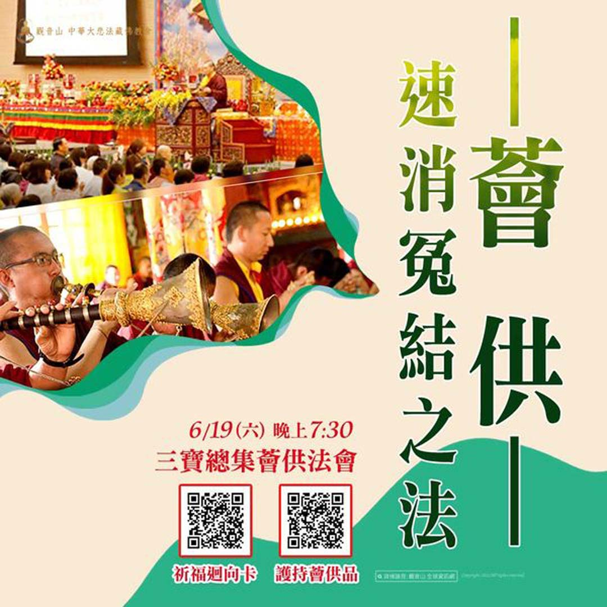

# 薈供──速消冤結之法

## 📋 基本資訊 / Recipe Overview
- **料理名稱**：薈供──速消冤結之法
- **原始標題**：薈供──速消冤結之法
- **素食流派 / Diet**：全素 Vegan
- **來源平台 / Source**：[觀音山 · 素食料理簡單做](https://vegan.gys.org.tw/confession20210304/)

## 📖 食譜圖文詳情 (中英雙語對照)

在這五濁惡世的黑暗時代中，保有一份清明的眼目，這是非常難得的福報。只有福德都豐厚的人，可以開顯智慧，了解善惡的取捨，而每一次的薈供修法，都是行者積聚廣大資糧最好的時機。​
​
薈供不僅僅能累積福德資糧，也能懺悔罪業，是密乘行者懺悔的一種殊勝方便，行者都要在薈供壇城中至誠地懺悔自身與戒律相違的過失，重獲清淨。​
​
慈悲 龍德上師開示：「在殊勝的薈供日，就是我們最好懺悔復戒的時候。」諸多密乘經典及其他眾多儀軌內皆提到：「若於三昧耶戒有破損，在薈供及灌頂時懺悔，是最殊勝。」所破戒的罪業會清淨。​
​
伊喜措嘉佛母說過：「任於上旬的初八、初十、十五或下旬二十五日作薈供一次，可斷三惡道的門。」如此，將墮入三惡道的人作一次薈供後，若沒有造新的惡業，曾毀壞根本支分三昧耶等戒律和十惡的業障都會消除，因此薈供不只是累積福德資糧，也能懺罪。​
​
同時薈供法會也是與冤親債主解冤釋結最好的機會，觀音山每月都會舉辦薈供法會，慈悲 龍德上師開示的佛法，令人智慧頓開，若冤親債主聽聞後，也覺得冤冤相報何時了，同意，以功德迴向的方式來化解，那麼就會淨除我們在生活、工作、健康上很多的災障。再加上清淨無間斷法流傳承的殊勝金剛乘獨步的薈供修法，功德當然是不可思議的殊勝。​
​
我們可以隨喜恭立「祈福迴向卡」將薈供的功德迴向給指定對象，或是登記「薈供品」供養三寶。無論是現世活著的人，還是已經往生者，都非常需要福報，每個月參加薈供法會能快速地累積福慧二資糧。​
​
最好的方式，是也能跟著「觀音山LIVE直播」的時間同步參加，自己親自參加功德更是殊勝。​
​
​
更多最新消息，請見「觀音山 全球資訊網」
►
http://www.fazang.org/index.php?ID=92
▍觀音山 中華大悲法藏佛教會
►全球資訊網：
http://fazang.org/
►吉祥洲LINE@：
https://line.me/ti/p/%40loc6698t
▍觀音山素食料理簡單做
►
https://vegan.gys.org.tw/

---
*食譜歸檔時間：2026-08-20 · 來源：觀音山素食料理簡單做 (vegan.gys.org.tw)*