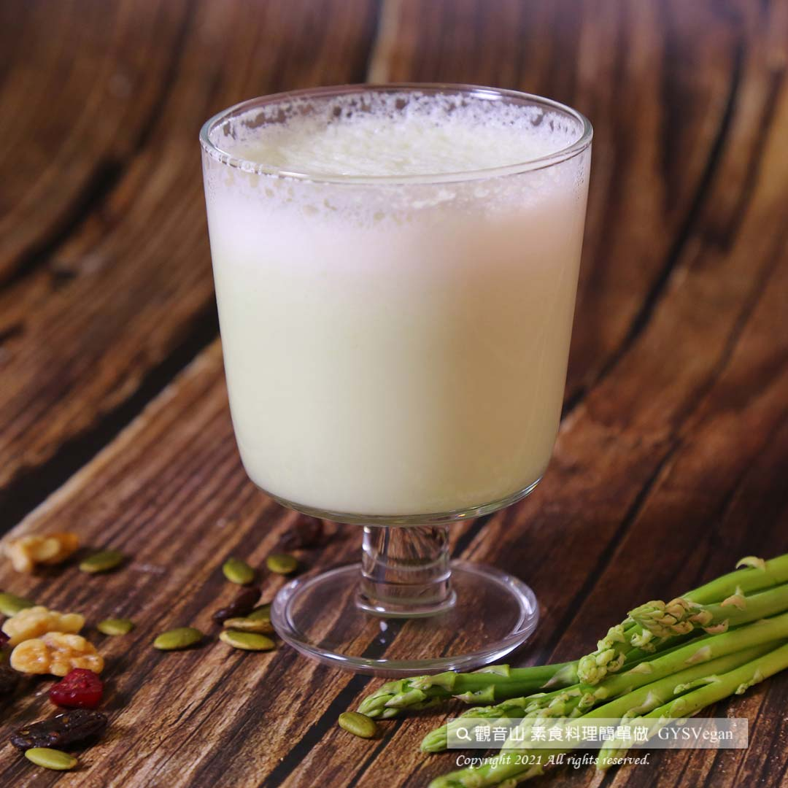

# 蘆筍蘋果植物奶

## 📋 基本資訊 / Recipe Overview
- **料理名稱**：蘆筍蘋果植物奶
- **原始標題**：蘆筍蘋果植物奶｜全素
- **素食流派 / Diet**：全素 Vegan
- **來源平台 / Source**：[觀音山 · 素食料理簡單做](https://vegan.gys.org.tw/asparagus20210903/)

## 📖 食譜圖文詳情 (中英雙語對照)

蘋果被稱為「全方位的健康水果」，在美國癌症學會推廣的30種抗癌蔬果中排名第一，加上「蔬菜之王」蘆筍，含有葉酸及多種營養素，能幫助胎兒成長、預防高血壓、改善倦怠、提升免疫力，搭配豆漿可同時補充植物性蛋白質，讓你健康降低膽固醇，快跟著觀音山主廚，一起素食料理簡單做吧！​
​
?食材及佐料〔Ingredients〕：(1人份)​
▪️蘆筍 ​ 3-5支​
▪️蘋果 1/2顆​
▪️豆漿 ​ 200C.C​
​
?烹飪步驟：​
【刀工/前處理】​
1.蘆筍去皮切段。​
2.蘋果去皮切片。​
​
【調理作法】​
1.將食材放入果汁機中，攪打均勻。​
2.把完成的飲品倒入杯中，即可享用。​
​
​
??本食譜提供：台中 觀音山蔬食館 主廚 淨雅​
​
​
✨慈悲的 龍德上師成立「觀音山蔬食館」提倡健康素食、慈悲護生，以”觀音山素食料理簡單做”的理念，提供多款素食食譜，讓您一學就會！?​
​
​
【recipe】​
​
? “An apple a day keeps the doctor away,” apples are chock-full of nutrition, ranking first on the list of AICR’s (American Institute for Cancer Research) 30 fruits that fight cancer study. Meanwhile, asparagus, the “king of vegetables”, contains high folic acid and a variety of nutrients, which helps in proper development of fetus and considered as a great pregnant diet. Moreover, it prevents high blood pressure and being fatigue and improve immunity. In this recipe, this healthy drink provides plant protein that keeps you healthy and reduce cholesterol. Quickly follow the chef of Guanyinshan, let’s make vegetarian dishes together! ​ ​
​
?Ingredients : （For 1 people）​
▪️Three to five asparagus ​
▪️Half an apple​
▪️Soy milk ​ 200C.C​
​
? Instructions: ​
【Cutting/PREP-Ahead】 ​
1. Peel the asparagus and cut into sections. 2. Peel the apple and slice it. ​ ​
​
【Directions】​
1. Place all the ingredients into a blender and pproces until smooth​
2. Pour the drink into the glass and enjoy.​
​
? 觀音山 素食料理簡單做 ?​
Facebook ｜好文按讚
http://www.facebook.com/GYSVegan​
Instagram ｜料理追蹤
http://www.instagram.com/gysvegan/​
Youtube ｜加入訂閱
https://reurl.cc/q8VEqy​
Telegram ｜頻道推薦
https://t.me/GYSVegan​
​
​
—​
? 歡迎轉載，請註明出處： 觀音山 素食料理簡單做 GYSVegan 素食環保愛地球，健康營養無負擔，慈悲護生一起來~?

---
*食譜歸檔時間：2026-08-20 · 來源：觀音山素食料理簡單做 (vegan.gys.org.tw)*