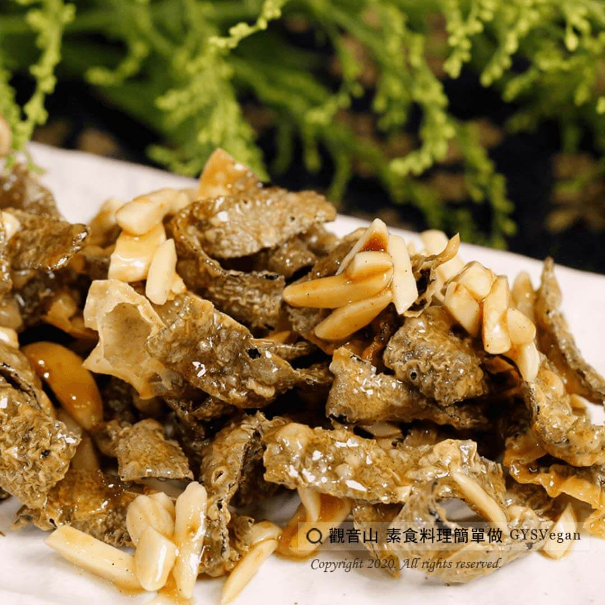

# 蜜糖杏仁小于乾

## 📋 基本資訊 / Recipe Overview
- **料理名稱**：蜜糖杏仁小于乾
- **原始標題**：蜜糖杏仁小于乾｜全素
- **素食流派 / Diet**：全素 Vegan
- **料理分類 / Category**：家常料理
- **來源平台 / Source**：[觀音山 · 素食料理簡單做](https://vegan.gys.org.tw/%e8%9c%9c%e7%b3%96%e6%9d%8f%e4%bb%81%e5%b0%8f%e4%ba%8e%e4%b9%be/)

## 📖 食譜圖文詳情 (中英雙語對照)

香濃蜂蜜蜜糖搭配濃郁杏仁角，酥脆的素小魚乾，讓人一口接著一口，越吃越涮嘴，休閒必備的可口零食。​
快跟著觀音山主廚，一起素食料理簡單做吧！​
​
?食材及佐料〔Ingredients〕：(3人份)​
▪素小魚乾 300克​
▪生杏仁角 200克​
▪蜂蜜100 ml​
▪橄欖油 50 ml​
​
?烹飪步驟：​
1.生杏仁角入平底鍋中，小火拌炒微焦黃，起鍋備用。​
2.將橄欖油倒入平底鍋，加入蜂蜜小火炒熱。​
3.放入素小魚乾、杏仁角，與蜂蜜小火拌炒，均勻即可。​
​
??本食譜提供：台中 #觀音山蔬食館 主廚 樂敏​
​
✨慈悲的 龍德上師成立「觀音山蔬食館」提倡健康素食、慈悲護生，以”觀音山素食料理簡單做”的理念，提供多款素食食譜，讓您一學就會！?​
​
​
?觀音山 素食料理簡單做 ​ Follow us?​
Facebook ｜好文按讚
http://www.facebook.com/GYSVegan
​
Instagram ｜料理追蹤
http://www.instagram.com/gysvegan/​
Youtube ​ ​ ​ ｜加入訂閱
https://reurl.cc/q8VEqy​
Telegram ​ ｜頻道推薦
https://t.me/GYSVegan
​
​
​
? 歡迎轉載，請註明出處： ​ ​ 觀音山 素食料理簡單做GYSVegan按讚、留言設定搶先看! 素食環保愛地球，健康營養無負擔，慈悲護生一起來~?

---
*食譜歸檔時間：2026-08-20 · 來源：觀音山素食料理簡單做 (vegan.gys.org.tw)*