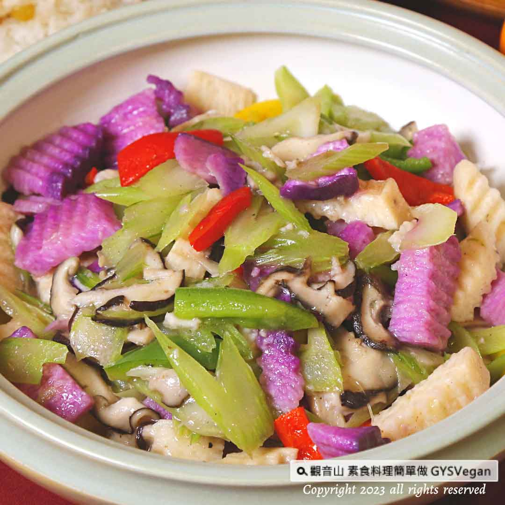

# 西芹彩蔬

## 📋 基本資訊 / Recipe Overview
- **料理名稱**：西芹彩蔬
- **原始標題**：家常料理｜西芹彩蔬｜全素
- **素食流派 / Diet**：全素 Vegan
- **來源平台 / Source**：[觀音山 · 素食料理簡單做](https://vegan.gys.org.tw/celery-and-vegetables20230317/)

## 📖 食譜圖文詳情 (中英雙語對照)

家常料理 ★西芹彩蔬★全素
香氣獨特的西芹，搭配多種彩色蔬菜拌炒，其中山藥扎實的口感與西芹的清脆鮮甜，令人回味，簡單的料理手法，卻總是最吸引眾人的目光，一道健康滿分的家庭料理，快跟著觀音山主廚，一起素食料理簡單做吧！
​ ​
🔲食材及佐料〔Ingredients〕：(5人份)
▪️西洋芹 ​ 1/2顆
▪️白 、紫山藥 ​ 各200克
▪️紅蘿蔔 ​ 70克
▪️太白粉、水、沙拉油、鹽、砂糖、白胡椒粉、香油 ​ 適量
​ ​
🔲烹飪步驟：
【刀工/前處理】
1.西洋芹洗淨去除粗纖維，切斜片備用。
2.山藥洗淨去皮，用波浪刀切片備用。
3.紅蘿蔔洗淨去皮，切薄片備用。
​
【調理作法】
1.油鍋加熱約180度C，將山藥放入過油約1分鐘，瀝油備用。
2.炒鍋加熱，放入西洋芹炒香，放入紅蘿蔔略炒，最後加入山藥拌炒。加入少許水、調味料:鹽、糖、白胡椒粉。
3.加入太白粉水(太白粉+水，1:1)勾薄芡，起鍋前淋上少許香油提味。
​
本食譜提供：台中觀音山蔬食館
​ ​ ​ ​
​
▌慈悲的龍德上師 成立「觀音山蔬食館」提倡健康素食、慈悲護生，以”觀音山素食料理簡單做”的理念，提供多款素食食譜，讓您一學就會！
​
​
★殊勝功德增長日
欣逢神變月，功德增長日，觀音山敬邀您把握殊勝難得的吉祥日，響應素食、廣修供養、戒殺護生、誦經修法、行持諸種善行，獲福無量。
​
​
觀音山相關連結
➠
https://www.fazang.org/link/
​ ​
​
▌觀音山近期活動
◆4月1日 三寶總集薈供法會
✦登記「除障祿位 / 超薦蓮位」
https://bit.ly/3HXmCO7
✦護持「薈供供品」供養三寶
https://bit.ly/3bHzJ8H
​ ​
​
【recipe】
​
The special Aroma of celery, arrange and stir-fry with various colorful vegetables. And the solid taste of yam with the crispness and sweetness of celery are an endless aftertaste. It is simple cooking but attracts the attention of the public. Hurry and follow the chef of Guanyinshan to make it together ​ Let’s make simple vegetarian dishes!
​ ​ ​
🔲 Ingredients and condiments [Ingredients]: (5 servings)
​ -1/2 Half of celery
​ -White and purple yam each 200g
​ -Carrot 70g
​ -Cornstarch, water, salad oil, salt, sugar, white pepper powder, sesame oil
​ ​ ​
​ 🔲Cooking steps:
​ 【Knife/Pretreatment】
​ 1. Wash the celery to remove the thick fiber, cut it into oblique slicing and set aside.
​ 2. Wash and peel the yam, slice it with a wave knife and set aside.
​ 3. Wash and peel the carrots, cut into thin slices and set aside.
​
​ [conditioning method]
​ 1. Heat the oil pan to about 180°C, put the yam into the oil for about 1 minute, drain the oil and set aside.
​ 2. Heat up the frying pan, add celery, and saute till fragrant, add carrot and stir fry for a while, finally add yam and stir fry. Add a small amount of water, seasoning: salt, sugar, white pepper powder.
​ 3. Add cornstarch water (cornstarch + water, 1:1) to make a thin layer, and add a little sesame oil to enhance the flavor before serving.
​
This recipe is provided by: Taichung Guanyinshan Vegetable Restaurant
​
​ ​
—
歡迎轉載，請註明出處： 觀音山素食料理簡單做 GYSVegan 素食環保愛地球，健康營養無負擔，慈悲護生一起來~

---
*食譜歸檔時間：2026-08-20 · 來源：觀音山素食料理簡單做 (vegan.gys.org.tw)*