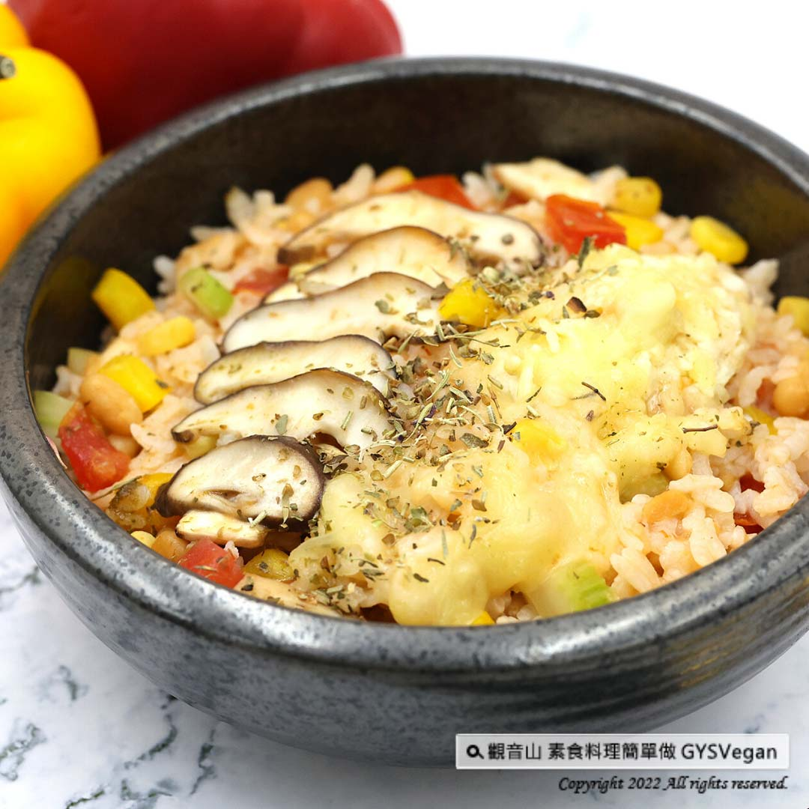

# 西西里焗豆燉飯

## 📋 基本資訊 / Recipe Overview
- **料理名稱**：西西里焗豆燉飯
- **原始標題**：異國蔬食｜西西里焗豆燉飯｜奶素
- **素食流派 / Diet**：奶素 Lacto-Vegetarian
- **料理分類 / Category**：主食種類 / 米麵主食 (Staple Food)
- **來源平台 / Source**：[觀音山 · 素食料理簡單做](https://vegan.gys.org.tw/sicilian-baked-bean-risotto-20220708/)

## 📖 食譜圖文詳情 (中英雙語對照)

現學異國料理-西西里焗豆燉飯，歐洲傳統美食焗豆，具有獨特的香氣，與多種新鮮食材拌炒，再加入白飯、起司絲煮成燉飯，綿密口感，每口都能嚐出異國風味，令人意猶未盡的好味道，快跟著觀音山主廚，一起素食料理簡單做吧！​
​
◎食材及佐料〔Ingredients〕：(3人份)​
▪️焗豆罐頭 ​ 1罐 ​
▪️西洋芹、黃椒 ​ 各30克 ​ ​ ​
▪️番茄、玉米粒 ​ 各50克 ​ ​ ​ ​ ​ ​ ​ ​ ​ ​ ​ ​ ​ ​ ​ ​ ​
▪️鮮香菇 ​ 2朵​
▪️白飯 ​ 300克​
▪️鹽、砂糖、起司絲、孜然粉、義式香草、油 ​ 適量 ​ ​ ​ ​ ​ ​ ​ ​ ​
​
◎
烹飪步驟：​
【刀工/前處理】​
1.西洋芹、黃椒、番茄切0.8公分丁。​
2.鮮香菇切片。​
​
【調理作法】​
1.將炒鍋加熱後倒入油，爆香香菇，再依序放入西洋芹、番茄、黃椒、玉米、焗豆略炒。​
2.倒入白飯拌勻，加入適量水(像稀飯的狀態)，小火煮至稠狀，加入起司絲，適量的調味料:鹽、砂糖、孜然粉、義式香草，拌勻即可享用。​
​
【特別說明】​
1.焗豆罐頭，可在大賣場或食品材料行購得。​
2.全素者可使用純素起司絲。​
​
本食譜提供：台中觀音山蔬食館​
​
慈悲的龍德上師 成立「觀音山蔬食館」提倡健康素食、慈悲護生，以”觀音山素食料理簡單做”的理念，提供多款素食食譜，讓您一學就會！
​
◎觀音山相關連結​
➠
https://www.fazang.org/link/​
​
​
​
【recipe】​
​
Time to learnl exotic cuisine-Sicilian baked bean risotto. Baked beans is a traditional European food with a unique aroma. In this recipe, we stir-fry a variety of fresh ingredients and add rice and cheese to cook into risotto. There is a dense and exotic taste in every bite. It’s unbelievable good flavors that would actually hooks you! let’s follow the chef of Guanyinshan, and make simple vegetarian dishes together! ​ ​ ​ ​ ​
​
◎Ingredients : （For 3 people）​
▪️A can of baked beans ​ ​
▪️Celery、Yellow pepper ​ 30g ​ ​ ​
▪️Tomato、Corn kernels ​ 50g ​ ​ ​ ​ ​ ​ ​ ​ ​ ​ ​ ​ ​ ​ ​ ​
▪️Two shiitake mushroom ​ ​
▪️Plain white rice ​ ​ 300g​
▪️Salt、Sugar 、Shredded cheese、Cumin powder、Italian herbs、Oil ​ , adequate amount ​
​
◎ Instructions:​
【Cutting/ PREP-Ahead】​
1. Cut celery, yellow pepper and tomato into 0.8 cm cubes.​
2. Slice fresh shiitake mushrooms. ​ ​
​
【Cooking Steps】​
1. Heat up the wok, pour in oil, saute the mushrooms until fragrant, then add in the parsley, tomato, yellow pepper, corn, and baked beans in order to fry for a while. ​
2. Pour in rice and mix well & add an appropriate amount of water (like porridge), to cook over low heat until thick. Add cheese and appropriate seasonings: salt, sugar, cumin powder, Italian vanilla, mix well to enjoy.​
​
【Special Notes】​
1. Canned baked beans is available in supermarket or baking supplies. ​
2. As for vegans, vegan cheese can be an alternative.​
​
This recipe is provided by: Taichung Guanyinshan Green Restaurant​
​​
​
​
—​
歡迎轉載，請註明出處：
觀音山 素食料理簡單做
GYSVegan 素食環保愛地球，健康營養無負擔，慈悲護生一起來~

---
*食譜歸檔時間：2026-08-20 · 來源：觀音山素食料理簡單做 (vegan.gys.org.tw)*