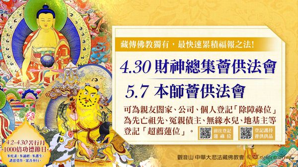

# 觀音山 2022年5月 本師、財神總集薈供法會

## 📋 基本資訊 / Recipe Overview
- **料理名稱**：觀音山 2022年5月 本師、財神總集薈供法會
- **原始標題**：觀音山 2022年5月 本師、財神總集薈供法會
- **素食流派 / Diet**：全素 Vegan
- **來源平台 / Source**：[觀音山 · 素食料理簡單做](https://vegan.gys.org.tw/%e8%a7%80%e9%9f%b3%e5%b1%b1-2022%e5%b9%b45%e6%9c%88-%e6%9c%ac%e5%b8%ab%e3%80%81%e8%b2%a1%e7%a5%9e%e7%b8%bd%e9%9b%86%e8%96%88%e4%be%9b%e6%b3%95%e6%9c%83/)

## 📖 食譜圖文詳情 (中英雙語對照)

⭐觀音山 2022年5月 本師、財神總集薈供法會​
◕登記「除障祿位、超薦蓮位」▸
https://bit.ly/3x63w3g​
◕護持「薈供供品」供養三寶▸
https://bit.ly/3J34sro​
(開放登記至5月7日晚上7:00)​
​
​
藏傳佛教非常重視薈供的法門，幾乎所有重要的本尊都有其各自的薈供法。例：本師 釋迦牟尼佛薈供、蓮師薈供、空行母薈供、勝樂金剛薈供、金剛瑜伽母薈供…等。​
​
​
觀音山將舉辦兩場殊勝的薈供法會：​
① 4月30日(六)晚上7:30 財神總集薈供法會​
② 5月7日(六) 晚上7:30 慶讚本師 釋迦牟尼佛聖誕 釋迦牟尼佛‧如珍寶加持總集薈供法會​
​
​
藏地修行的成就者曾云：「參加一次如法的薈供法會，所產生的功德與福德不亞於自己獨自修持三十年所獲得的功德與福德。」​
​
​
祖師開示薈供有以下功德：​
一、薈供可延長壽命、祛除壽障。​
二、可消除事業或人緣等等的障礙。​
三、當有人以誅法或符咒加害時，能回遮無礙。​
四、可回遮地基主或天龍八部的加害。​
五、作薈供等同供養一切諸佛菩薩。​
​
​
現代人生活繁忙，有多少時間可以好好修持薈供法觀音山每月舉辦一次薈供，若您每場都參加，一年可圓滿十二次薈供。如果想要圓滿千部薈供，最少需要八十四年的時間。由此看來，我們一生似乎沒辦法修滿千部；但若我們參加集體的薈供法會，藉由眾緣和合的力量，可以快速圓滿千部薈供的功德。​
​
​
敬邀您一起對本師 釋迦牟尼佛及財寶天王等諸佛菩薩作廣大供養，與佛結下甚深因緣，瞬間積聚廣大福慧資糧。法會圓滿後，薈供品由本會代表捐贈至觀音山 蔬食館、需要的單位或弱勢族群，推廣素食愛心公益，與十方大眾廣結善緣，令每一位護持者功德更為增勝。​
​
​
可為現世親友、公司行號、閤家、個人登記「除障祿位」；或為先亡祖先、冤親債主、無緣水兒、地基主等登記「超薦蓮位」；共同護持「薈供法會供品」供養三寶，響應愛心公益、素食推廣計劃，廣結善緣。​
​
​
更多最新消息，請見「觀音山 全球資訊網」​
►
https://www.fazang.org/info/events.php​
​
▍觀音山中華大悲法藏佛教會​
►全球資訊網：
http://fazang.org/​
​
►吉祥洲LINE@：
https://line.me/ti/p/%40loc6698t​
​
▍觀音山素食料理簡單做​
►
https://vegan.gys.org.tw/​
​
▍龍德上師法語甘露​
►
https://video.gys.org.tw/​
​
​
✨慈悲的龍德上師 成立「觀音山蔬食館」提倡健康素食、慈悲護生，以”觀音山素食料理簡單做”的理念，提供多款素食食譜，讓您一學就會！🥰​
​
​
🌱 觀音山 素食料理簡單做 🌱
◎Facebook ｜好文按讚​
http://www.facebook.com/GYSVegan​
​
◎lnstagram ｜料理追蹤​
http://www.instagram.com/gysvegan/​
​
◎Youtube ｜加入訂閱​
https://reurl.cc/q8VEqy​
​
◎Telegram ｜頻道推薦​
https://t.me/GYSVegan​
​
—​
👑歡迎轉載，請註明出處： 觀音山 素食料理簡單做 GYSVegan 素食環保愛地球，健康營養無負擔，慈悲護生一起來~😊

---
*食譜歸檔時間：2026-08-20 · 來源：觀音山素食料理簡單做 (vegan.gys.org.tw)*