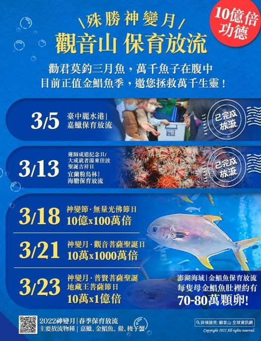

# 觀音山 2022神變月──春季保育放流

## 📋 基本資訊 / Recipe Overview
- **料理名稱**：觀音山 2022神變月──春季保育放流
- **原始標題**：觀音山 2022神變月──春季保育放流
- **素食流派 / Diet**：全素 Vegan
- **來源平台 / Source**：[觀音山 · 素食料理簡單做](https://vegan.gys.org.tw/spring-life-releasing20220318/)

## 📖 食譜圖文詳情 (中英雙語對照)

觀音山 2022神變月──春季保育放流​
​
放生，可消災免難 天地萬物眾生與我，在過去的輪迴中，皆曾互為冤家仇敵。故今朝放生，可解冤釋仇，消災免難，免除冤殺惡報。冬去春來萬物生長，春天是萬物復甦的季節，勸君莫釣三月魚，萬千魚子在腹中，目前正值 #金鯧魚季，每隻母金鯧魚肚裡約有70至80萬顆卵，邀您護持保育放流，在春季共同拯救萬千生靈！​
​
​
╍╍╍╍╍╍╍╍╍╍╍╍╍╍╍╍╍╍╍╍╍​
​
放流期程​
◉ 3/5(六) 神變月 臺中麗水港-嘉鱲保育放流​
◉ 3/13(六) 神變月/蓮師成道紀念日/大成就者湯東佳波聖誕吉祥日宜蘭粉鳥林-海膽保育放流​
◉ 3/18(五) 神變日(藏曆十五) 神變月中功德最殊勝增勝日澎湖海域-金鯧魚保育放流​
◉ 3/21(一) 神變月觀音菩薩聖誕 澎湖海域-金鯧魚保育放流​
◉ 3/23(三) 神變月普賢菩薩聖誕 澎湖海域-金鯧魚保育放流​
​
╍╍╍╍╍╍╍╍╍╍╍╍╍╍╍╍╍╍╍╍╍​
觀音山的保育放流特點​
一、遵守國家相關政策，經專業機構輔導，進行合法保育放流；同時確保生靈存活率。​
二、除保育放流外，與專業機構合作，共同守護海洋平衡，修復海洋生態系，為海洋生物建造一處幸福園地。​
三、為生靈授以皈依與佛法加持，令其深結佛緣，種下未來世得以學佛修行的種子，脫六道輪迴之苦。​
​
╍╍╍╍╍╍╍╍╍╍╍╍╍╍╍╍╍╍╍╍╍​
​
參加辦法​
​
共同護持「2022神變月──春季保育放流」​
搶救萬千生靈 >>
https://bit.ly/3InbEOQ
<<​
(開放登記至5/30晚上12點前截止)​
​
✨慈悲的龍德上師 成立「觀音山蔬食館」提倡健康素食、慈悲護生，以”觀音山素食料理簡單做”的理念，提供多款素食食譜，讓您一學就會！?​
​
母親節！一起搶救懷孕的海鱺媽媽​
https://www.fazang.org/liferelease/​
觀音山保育放流​
https://liferelease.gys.org.tw/​
​
「觀音山 社群樹」​
一鍵快速前往觀音山 各官方社群網站​
https://fazang.taplink.ws/​
​
​
? 觀音山 素食料理簡單做 ?​
◎Facebook ｜好文按讚​
https://www.facebook.com/GYSVegan​
​
◎Instagram ｜料理追蹤​
https://www.instagram.com/gysvegan/​
​
◎Youtube ​ ​ ​ ｜加入訂閱​
https://reurl.cc/q8VEqy​
​
◎官方Blog ​ ​ ｜網站推薦​
https://vegan.gys.org.tw/​
​
—​
?歡迎轉載，請註明出處： 觀音山 素食料理簡單做 GYSVegan 素食環保愛地球，健康營養無負擔，慈悲護生一起來~?

---
*食譜歸檔時間：2026-08-20 · 來源：觀音山素食料理簡單做 (vegan.gys.org.tw)*