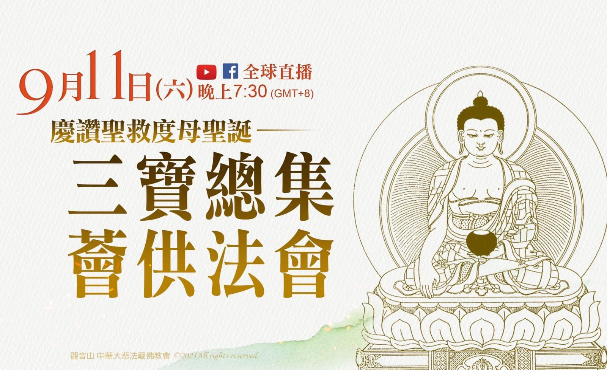

# 觀音山 9月11日三寶總集薈供法會 「除障祿位」、「超薦蓮位」、「護持薈供品」開放登記中

## 📋 基本資訊 / Recipe Overview
- **料理名稱**：觀音山 9月11日三寶總集薈供法會 「除障祿位」、「超薦蓮位」、「護持薈供品」開放登記中
- **原始標題**：觀音山 9月11日三寶總集薈供法會｜「除障祿位」、「超薦蓮位」、「護持薈供品」開放登記中
- **素食流派 / Diet**：全素 Vegan
- **來源平台 / Source**：[觀音山 · 素食料理簡單做](https://vegan.gys.org.tw/confession20210911/)

## 📖 食譜圖文詳情 (中英雙語對照)

恭請慈悲 龍德上師主法──三寶總集薈供法會
▍法會日期：2021年9月11日(六)
▍法會時間：晚上7:30－9:30 (GMT+8)◕登記「除障祿位」、「超薦蓮位」
https://bit.ly/3BtLnvb
◕護持「薈供供品」響應素食推廣計劃，廣結善緣
https://bit.ly/3sVNHbd
(登記至9月11日晚上7:00截止)
薈供為快速聚福之法，古德云：「參加一次如法的薈供法會，所產生的功德相當於自己獨立修持三十年而獲得的功德與福德。」而薈供亦是具足「息災、增益、懷愛、降伏」四種事業的殊勝修法，更是金剛乘行者懺悔酬補、維繫三昧耶戒的主要法門。藏傳佛教獨有．最快速累積福慧之法
恭請慈悲 龍德上師主法 率出家法師迴向一 祈請本尊加持新冠肺炎疫情平息，世界和平、國泰民安，社會光明和諧。薈供一功德利益
一、薈供可延長壽命、祛除壽障。
二、可消除事業或人緣等等的障礙。
三、當有人以誅法或符咒加害時，能回遮無礙。
四、可回遮地基主或天龍八部的加害。
五、作薈供等同供養一切諸佛菩薩。
觀音山法藏YouTube與官方Facebook同步直播
►
https://bit.ly/2BB175Z
可為現世親友、公司行號、閤家、個人登記「除障祿位」；或為先亡祖先、冤親債主、無緣水兒、地基主等登記「超薦蓮位」。
►
https://bit.ly/3BtLnvb
更多請見「觀音山 全球資訊網」
http://www.fazang.org/index.php?ID=92
—————————————
隨手修法施，功德無量！
—————————————
◎觀音山法藏YouTube頻道
goo.gl/w5Dni7
◎吉祥洲TG 立即訂閱文章
https://t.me/gysfazang
Share

---
*食譜歸檔時間：2026-08-20 · 來源：觀音山素食料理簡單做 (vegan.gys.org.tw)*