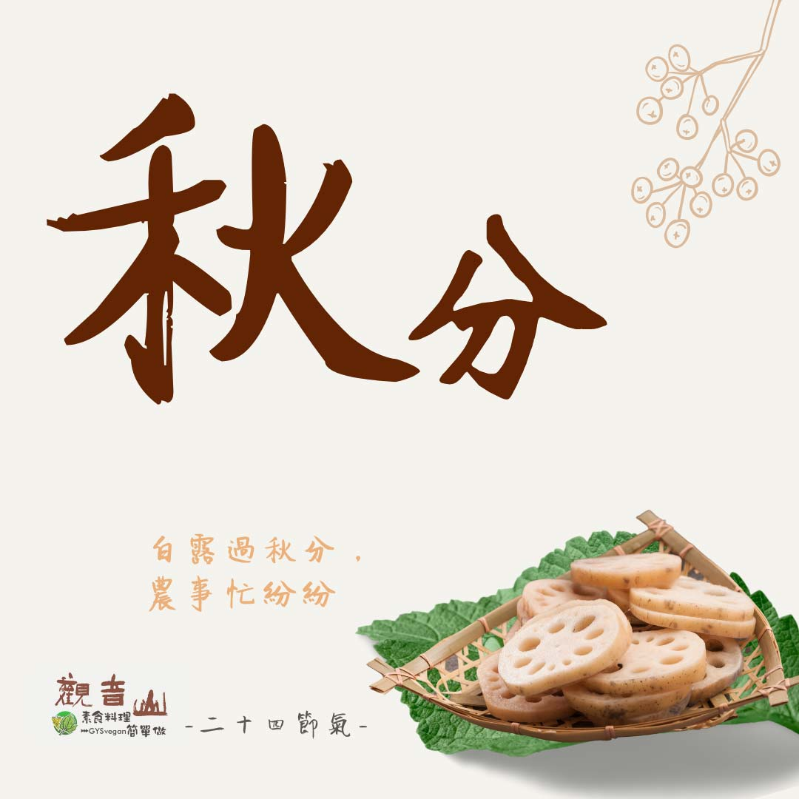

# 觀音山 ​ 二十四節氣 ​  秋分

## 📋 基本資訊 / Recipe Overview
- **料理名稱**：觀音山 ​ 二十四節氣 ​  秋分
- **原始標題**：觀音山 ​ 二十四節氣 ​  秋分
- **素食流派 / Diet**：全素 Vegan
- **來源平台 / Source**：[觀音山 · 素食料理簡單做](https://vegan.gys.org.tw/autumnal-equinox20210920/)

## 📖 食譜圖文詳情 (中英雙語對照)

｜白露過秋分，農事忙紛紛​
秋季的第四個節氣「秋分」，是今年的9月23日，俗諺：「秋日瞑日對分」，這一天 晝夜時間等長，往後白天越來越短⬇️，晝夜溫差加大，且空氣漸漸變得乾燥，也是農夫最殷切期盼的秋收季節。​
​
秋分前後恰是傳統重要節日「中秋節」，慶中秋的原意是慶祝秋天豐收與祭祀的活動，在歡喜團聚之際，應讓地球萬物共團圓，不應是人類團圓而生靈卻是離散；今年九月聯合國氣候變遷小組指出，人類造成的氣候變遷，面臨的將不只是極端天氣，而是多種氣候災難同時發生，讓我們以「綠色中秋」做起，蔬食飲食同時兼顧養生、護生、愛地球?。​
​
｜跟著節氣養生​
秋分節氣已是真正進入了秋季，中醫主張「燥」是秋天的主氣，所以秋分仍應以養肺潤燥為重點，在風多乾燥的秋季，調養方面以清潤、溫潤的食材為主，如木耳、核桃、百合、蓮子、蓮藕等，若能將其料理成粥品，更能多方面的調理身體。​
​
秋季另外一項養生重點就是要「動起來」，保持作息正常，多做伸展運動、快走、慢跑，讓全身的氣血活絡，增強肺部及呼吸道的鍛鍊，強化免疫力。​
​
｜跟著節氣這樣吃​
此節氣可以多吃白色食物來補脾入肺，如白木耳、山藥、百合、蓮子；除燥的食物有銀耳、蓮藕、蘋果?、葡萄?、甘蔗、石榴、柑橘?；也可多食用白蘿蔔、胡蘿蔔來幫助肺部的保養，並避免煎炸辛辣的食物，多攝取新鮮蔬果來補充人體的津液。​
​
​
觀音山素食料理簡單做​
推薦當季 秋分 節氣料理 食譜 ​
​
⭐ 百匯煲湯 ➡
https://reurl.cc/qgyo3D​
⭐ 菱角蓮子當歸湯 ➡
https://reurl.cc/XWop9M​
⭐ 涼拌素雞 ➡ ​
https://reurl.cc/kZmk39​
​
​
✨慈悲的 龍德上師成立「觀音山蔬食館」提倡健康素食、慈悲護生，以”觀音山素食料理簡單做”的理念，提供多款素食食譜，讓您一學就會！?
​
​
★9月20日 無量光佛節日：善惡業增長1百萬倍​
​
✨殊勝功德增長日✨​
觀音山邀請您於今日響應素食、廣修供養、戒殺護生、誦經修法、行持諸種善行，獲福無量。​
​
​
? 觀音山 素食料理簡單做 ​ Follow us ?​
​
Facebook ｜好文按讚 ➤
http://www.facebook.com/GYSVegan​
Instagram ｜料理追蹤 ➤
http://www.instagram.com/gysvegan/
​
Youtube ​ ​ ​ ｜加入訂閱 ➤
https://reurl.cc/q8VEqy​
官方Blog ​ ｜網站推薦 ➤
https://vegan.gys.org.tw/​
​
​
—​
?歡迎轉載，請註明出處： 觀音山素食料理簡單做 GYSVegan 素食環保愛地球，健康營養無負擔，慈悲護生一起來~?

---
*食譜歸檔時間：2026-08-20 · 來源：觀音山素食料理簡單做 (vegan.gys.org.tw)*