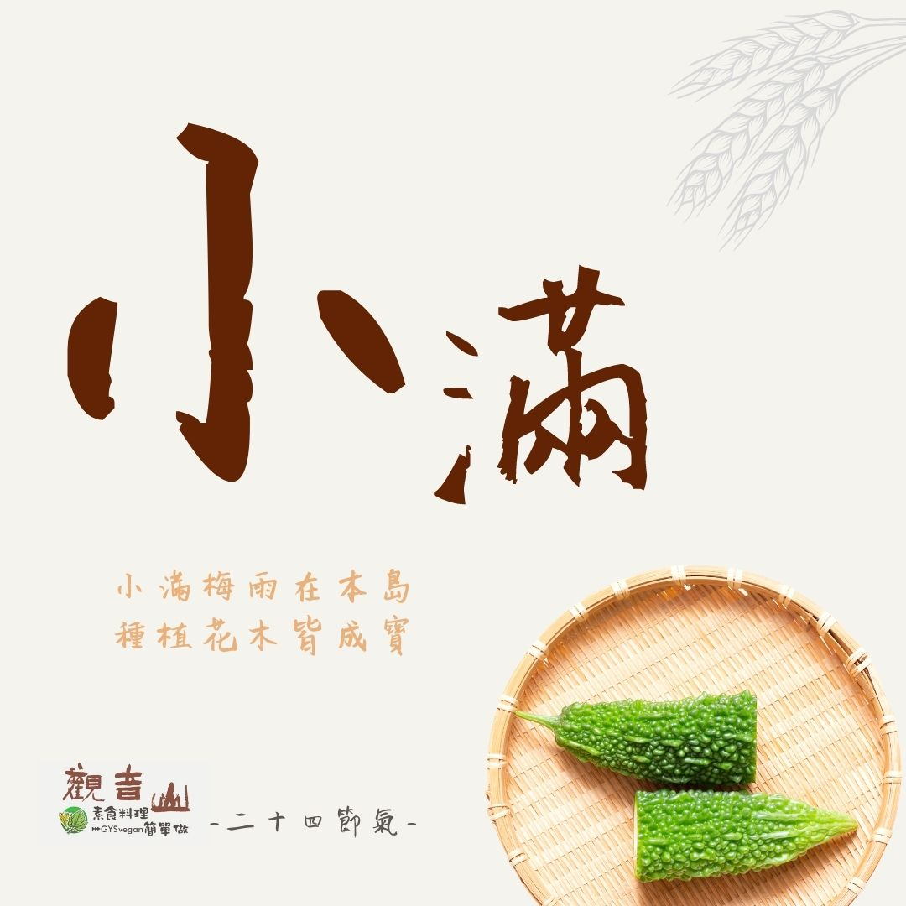

# 觀音山 二十四節氣    小滿​ ​

## 📋 基本資訊 / Recipe Overview
- **料理名稱**：觀音山 二十四節氣    小滿​ ​
- **原始標題**：觀音山 二十四節氣    小滿​ ​
- **素食流派 / Diet**：全素 Vegan
- **來源平台 / Source**：[觀音山 · 素食料理簡單做](https://vegan.gys.org.tw/xiaoman20210517/)

## 📖 食譜圖文詳情 (中英雙語對照)

​
｜小滿梅雨在本島，種植花木皆成寶 ​
今年的5月21日是二十四節氣中的「小滿」，《月令七十二候集解》：「四月中，小滿者，物至於此小得盈滿。」 指的就是作物的籽粒已經開始飽滿，但是尚未成熟，所以稱為小滿。​
​
​
小滿三候：「一候苦菜秀，二候靡草死，三候麥秋至。」二候靡草死，指喜陰的草類在☀️陽氣旺盛下無法生存，外在的環境此時會進行整理，拔除雜草，「內心」更是需要打理 ，改掉不好的習慣，建立良好的善行，正如佛法的教義，教導我們如何「淨化心靈」，使我們從世俗染著中走向清淨。​
​
​
｜跟著節氣養生​
5月下旬至小滿節氣，此時正值梅雨季節 ，天氣溼熱，應以清熱、健脾、祛濕的清淡飲食為原則， 避免辛辣、油膩、重口味的食物，才不會生濕助濕，造成濕疹、汗斑等皮膚病的加重，且切勿貪食冷飲，造成脾胃損傷。​
​
​
｜跟著節氣這樣吃​
此節氣暑熱夾雜濕氣 ，濕氣又被稱為萬病之源，故吃的方面需要特別注意，此時節適合多吃「苦味」的食物 ，如苦瓜、筍、大頭菜、秋葵，或屬性「甘涼」的食材，如絲瓜、冬瓜、綠豆、小黃瓜?，如此可達到「防熱去濕」、「健脾祛濕」。​
​
觀音山素食料理簡單做​
推薦當季   小滿節氣料理食譜 ​
​⭐️涼拌秋葵 ➡️
https://reurl.cc/a5QNx3​
​⭐️梅干苦瓜 ➡️
https://reurl.cc/Gd7bay​
​⭐️綠竹筍佐烏于子醬 ➡️
https://reurl.cc/2bXoN6​
​
​⭐️慈悲的 龍德上師成立「觀音山蔬食館」提倡健康素食、慈悲護生，以”觀音山素食料理簡單做”的理念，提供多款素食食譜，讓您一學就會！?
​
? 觀音山 素食料理簡單做 ​ Follow us ?
​
Facebook ｜好文按讚 ➤
http://www.facebook.com/GYSVegan​
Instagram ｜料理追蹤 ➤
http://www.instagram.com/gysvegan/​
Youtube ​ ​ ​ ｜加入訂閱 ➤
https://reurl.cc/q8VEqy​
官方Blog ​ ｜網站推薦 ➤
https://vegan.gys.org.tw/​
​
​
—​
? 歡迎轉載，請註明出處： # 觀音山素食料理簡單做 GYSVegan 素食環保愛地球，健康營養無負擔，慈悲護生一起來~?

---
*食譜歸檔時間：2026-08-20 · 來源：觀音山素食料理簡單做 (vegan.gys.org.tw)*