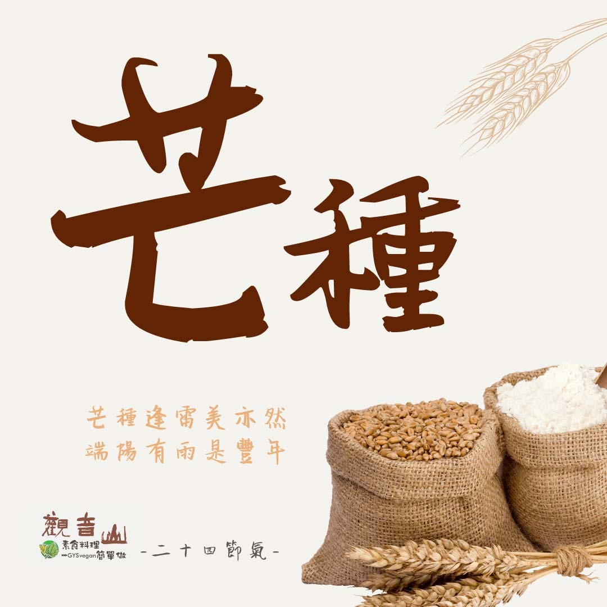

# 觀音山 二十四節氣   芒種​​ ​

## 📋 基本資訊 / Recipe Overview
- **料理名稱**：觀音山 二十四節氣   芒種​​ ​
- **原始標題**：觀音山 二十四節氣   芒種​​ ​
- **素食流派 / Diet**：全素 Vegan
- **來源平台 / Source**：[觀音山 · 素食料理簡單做](https://vegan.gys.org.tw/mango20210607/)

## 📖 食譜圖文詳情 (中英雙語對照)

｜芒種逢雷美亦然，端陽有雨是豐年
每年的6月5日到7日，是夏季的第三個節氣「芒種」，這時稻子吐穗結實的穀粒上長出細芒，所以稱為「芒種」。農諺：「芒種逢雷美亦然，端陽有雨是豐年」，在這炎熱的節氣，如果有大雷雨降臨⛈，就是作物豐收的好預兆。​
​
｜跟著節氣養生​
芒種將至，台灣將進入梅雨季節，此時天氣又濕又熱，應多補充水分及礦物質，可多食用當季水果，例如鳳梨?、番茄、西瓜?。夏季「暑易入心」，所以要加強心臟方面的保養，保持心情舒暢。​
​
｜跟著節氣這樣吃​
在飲食方面，以清淡為主，如元代醫家朱丹溪云：「少食肉食，多食谷菽菜果，自然沖和之味」，若能改變飲食習慣，以蔬食養身，更能事半功倍。​
​
此時節可多食用「祛濕補氣」的蔬果?、豆類，如莧菜、山藥、綠豆、薏仁、番茄?、小黃瓜?、苦瓜等，建議以涼拌、清蒸的方式烹調食材，更能品嘗到食物本身的鮮美。​
​
觀音山素食料理簡單做​
推薦當季  芒種節氣料理食譜 ​
​
⭐涼拌素雞​ ➡
https://reurl.cc/7rX4Zk​
​⭐梅干苦瓜​ ➡
https://reurl.cc/xGZNxN​
​⭐糖醋素于​ ➡
https://reurl.cc/ogL8Dl​
​
⭐️慈悲的 龍德上師成立「觀音山蔬食館」提倡健康素食、慈悲護生，以”觀音山素食料理簡單做”的理念，提供多款素食食譜，讓您一學就會！?
? 觀音山 素食料理簡單做 ​ Follow us ?​
​
Facebook ｜好文按讚 ➤
http://www.facebook.com/GYSVegan​
Instagram ｜料理追蹤 ➤
http://www.instagram.com/gysvegan/​
Youtube ​ ​ ​ ｜加入訂閱 ➤
https://reurl.cc/q8VEqy​
官方Blog ​ ｜網站推薦 ➤
https://vegan.gys.org.tw/​
​
​
—​
?  歡迎轉載，請註明出處： # 觀音山素食料理簡單做 GYSVegan 素食環保愛地球，健康營養無負擔，慈悲護生一起來~?

---
*食譜歸檔時間：2026-08-20 · 來源：觀音山素食料理簡單做 (vegan.gys.org.tw)*