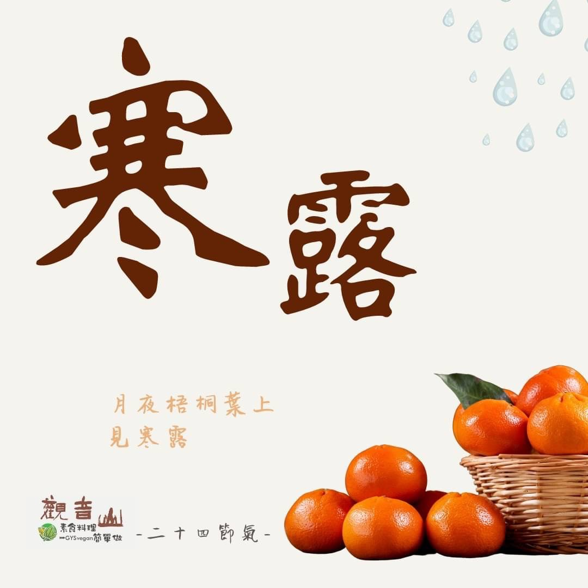

# 觀音山 二十四節氣  寒露

## 📋 基本資訊 / Recipe Overview
- **料理名稱**：觀音山 二十四節氣  寒露
- **原始標題**：觀音山 二十四節氣  寒露
- **素食流派 / Diet**：全素 Vegan
- **來源平台 / Source**：[觀音山 · 素食料理簡單做](https://vegan.gys.org.tw/cold-dew20211004/)

## 📖 食譜圖文詳情 (中英雙語對照)

｜月夜梧桐葉上見寒露 ​
寒露，二十四節氣中的第十七個節氣，是反應氣侯變化的一個節氣，代表著深秋的到來，天氣由涼爽慢慢轉為寒冷❄️，空氣也逐漸變得乾燥，須注意日夜溫差的變化以及秋燥的影響。​
​
寒露時節中有一個重要節日「重陽節」，是中國傳統四大祭祖的節日之一，除了慎終追遠之外，盡力以佛法甘露來提升往生親人的境界，並讓在世的親人學習佛法、布施行善，而為人子女應盡力為父母祈福，這樣的行持才有意義。​
​
｜跟著節氣養生​
古云「寒從足生」，中醫亦有「白露身不露，寒露腳不露」的智慧妙語，寒露節氣天氣轉冷，應注意老人、小孩腳部的保暖，並著重在肺、胃部的保養，可以多食用粥品來生津潤燥、養胃氣，秋季亦是適合運動養生的季節，適度的運動接觸大自然，讓人心曠神怡。​
​
｜跟著節氣這樣吃​
寒露時節以潤肺潤燥為前提，應多吃新鮮瓜果蔬菜?，如柿子、梨、柑橘?、香蕉?、番茄?、蓮藕、銀耳、海帶、紫菜、冬瓜、南瓜等，並盡量避免辛辣燒烤、冷飲、含鹽量高的食品，保持好身體內的水分，多食用當季蔬果以及原型食物就是最佳的秋季養生。​
​
​
觀音山素食料理簡單做​
推薦當季寒露 節氣料理 食譜 ​
​
⭐ 澎湖紫菜冬粉 ➡
https://reurl.cc/pxMgL4
​
⭐ 紅棗銀耳八寶粥 ➡
https://reurl.cc/r1RgLb​
⭐ 焗烤南瓜 ➡ ​
https://reurl.cc/0xXjEM​
​
​
✨慈悲的龍德上師 成立「觀音山蔬食館」提倡健康素食、慈悲護生，以”觀音山素食料理簡單做”的理念，提供多款素食食譜，讓您一學就會！?
​
​
? 觀音山 素食料理簡單做 Follow us ?​
◎Facebook ｜好文按讚
https://www.facebook.com/GYSVegan​
◎Instagram ｜料理追蹤
https://www.instagram.com/gysvegan/​
◎Youtube ​ ​ ​ ｜加入訂閱
https://reurl.cc/q8VEqy​
◎官方Blog ​ ​ ｜網站推薦
https://vegan.gys.org.tw/​
​
​
—​
?歡迎轉載，請註明出處：觀音山 素食料理簡單做 GYSVegan 素食環保愛地球，健康營養無負擔，慈悲護生一起來~?

---
*食譜歸檔時間：2026-08-20 · 來源：觀音山素食料理簡單做 (vegan.gys.org.tw)*