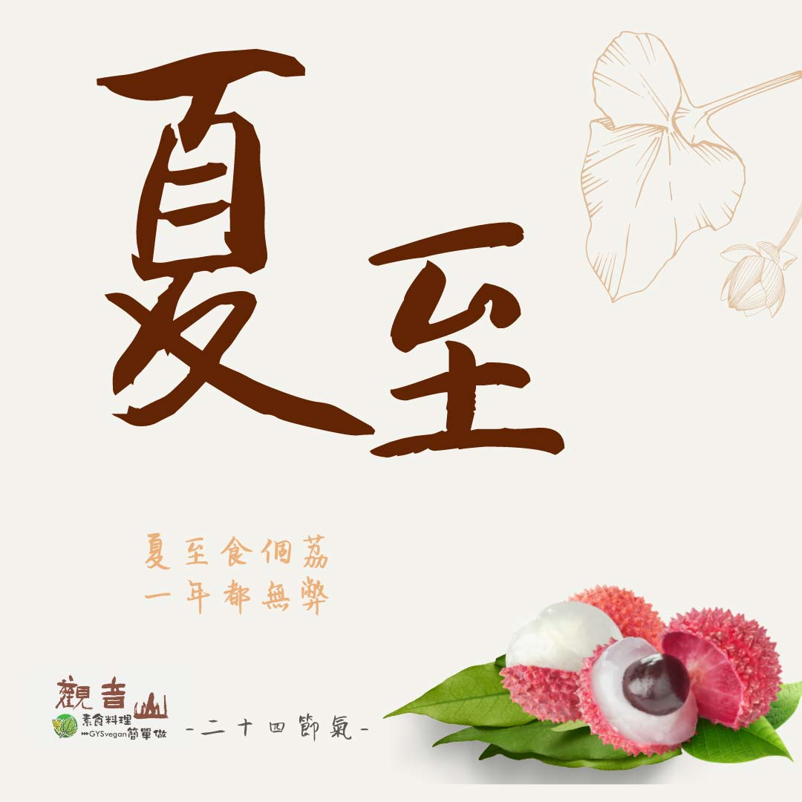

# 觀音山 二十四節氣 ​  夏至

## 📋 基本資訊 / Recipe Overview
- **料理名稱**：觀音山 二十四節氣 ​  夏至
- **原始標題**：觀音山 二十四節氣 ​  夏至
- **素食流派 / Diet**：全素 Vegan
- **來源平台 / Source**：[觀音山 · 素食料理簡單做](https://vegan.gys.org.tw/summer-solstice20210621/)

## 📖 食譜圖文詳情 (中英雙語對照)

｜夏至食個荔，一年都無弊​
二十四節氣中的「夏至」，在每年6月20到22之間，是☀白晝最長、  夜晚最短的一天，此後白天逐漸變短而夜晚愈長；夏至時節，萬物生長成熟茂盛，陽氣最為旺盛，且為颱風的旺季☔，要多注意天氣的變化。​
​
｜跟著節氣養生​
天氣炎熱☀，應多注意飲食衛生，預防腸胃傳染病，養生的重點在於「健脾養心」，可多吃帶有苦味的食物，如苦瓜、竹筍、芹菜等，能調和脾胃、清熱解暑、清心除煩。​
​
中醫提倡冬病夏治，適合療治虛寒性的疾病，達到驅風散寒，藉此調整自己的體質，改善不好的生活習慣，提升身體免疫力。​
​
｜跟著節氣這樣吃​
夏至天氣炎熱，可多吃水果、蔬菜，不僅可以補充流失的水份?，亦不會加重脾胃的負擔，水果有西瓜?、荔枝、鳳梨?、芒果?、葡萄? 等，其中荔枝更是有溫補脾陽之效，蔬菜則以瓜類為主，有苦瓜、絲瓜、竹筍、南瓜、茄子?、冬瓜可以選擇。​
​
​
觀音山素食料理簡單做​
推薦當季  夏至節氣料理 食譜 ​
​
⭐ 三杯綠竹筍​ ➡ ​
https://reurl.cc/xGExZz​
​⭐ 竹筍高麗菜捲​ ➡ ​
https://reurl.cc/ZGjar3​
​⭐ 豆瓣悶桂筍​ ➡ ​
https://reurl.cc/kZLN13​
⭐️慈悲的 龍德上師成立「觀音山蔬食館」提倡健康素食、慈悲護生，以”觀音山素食料理簡單做”的理念，提供多款素食食譜，讓您一學就會！?
? 觀音山 素食料理簡單做 ​ Follow us?
​
Facebook ｜好文按讚 ➤
http://www.facebook.com/GYSVegan​
Instagram ｜料理追蹤 ➤
http://www.instagram.com/gysvegan/​
Youtube ​ ​ ​ ｜加入訂閱 ➤
https://reurl.cc/q8VEqy​
官方Blog ​ ｜網站推薦 ➤
https://vegan.gys.org.tw/​
​
​
—​
? 歡迎轉載，請註明出處： # 觀音山素食料理簡單做 GYSVegan 素食環保愛地球，健康營養無負擔，慈悲護生一起來~?

---
*食譜歸檔時間：2026-08-20 · 來源：觀音山素食料理簡單做 (vegan.gys.org.tw)*