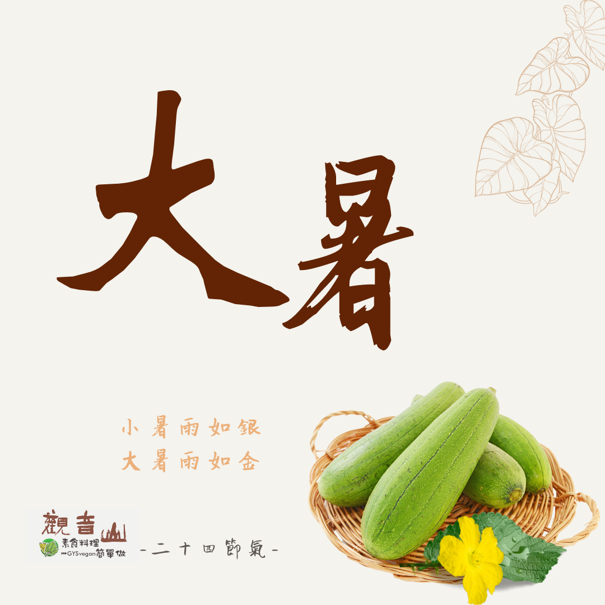

# 觀音山 二十四節氣 ​  大暑

## 📋 基本資訊 / Recipe Overview
- **料理名稱**：觀音山 二十四節氣 ​  大暑
- **原始標題**：觀音山 二十四節氣 ​  大暑
- **素食流派 / Diet**：全素 Vegan
- **來源平台 / Source**：[觀音山 · 素食料理簡單做](https://vegan.gys.org.tw/great-heat20210719/)

## 📖 食譜圖文詳情 (中英雙語對照)

｜小暑雨如銀，大暑雨如金​
今年的7月21日是二十四節氣中的大暑，是一年當中最熱的時刻☀，此時偶有雷陣雨出現⛈，對種植的作物而言，如「大暑雨如金」般珍貴；此時節應多注意炎熱、潮濕的天氣，避免中暑。​
​
｜跟著節氣養生​
大暑時節天氣悶熱，食物不易保存，常誘發腸胃相關的疾病，故應以「蔬食清淡飲食」為原則，不適合吃油膩的食物，會影響腸胃道的消化；俗諺「冬吃蘿蔔夏吃薑，不勞醫師開處方」，可在烹煮的食材多加入薑，去除體內的濕熱。
​
｜跟著節氣這樣吃​
酷夏以補充水分及預防中暑最重要，在飲食方面以「清熱解暑」為方向，可多吃的蔬菜有苦瓜、豆芽、黃瓜?、空心菜、菠菜、絲瓜，在水果方面有鳳梨?、西瓜、番茄?、荔枝、火龍果，還可為家人準備消暑飲品，銀耳蓮子湯、綠豆薏仁湯。​
​
​
觀音山素食料理簡單做​
推薦當季  大暑節氣料理 食譜 ​
​
​
⭐ 絲瓜燉飯 ➡
https://reurl.cc/XW9meR
​
⭐ 梅干苦瓜 ➡
https://reurl.cc/1Ylmjp​
⭐ 糖醋素于 ➡ ​
https://reurl.cc/zeONyp
​
​
​
★7月19日 「明淨月．蓮師薈供日」：善惡業增長1000萬x10萬倍​
​
✨殊勝功德增長日✨​
觀音山邀請您於今日響應素食、廣修供養、戒殺護生、誦經修法、行持諸種善行，獲福無量。
⭐️慈悲的 龍德上師成立「觀音山蔬食館」提倡健康素食、慈悲護生，以”觀音山素食料理簡單做”的理念，提供多款素食食譜，讓您一學就會！?
? 觀音山 素食料理簡單做 ​ Follow us?
​
Facebook ｜好文按讚 ➤
http://www.facebook.com/GYSVegan​
Instagram ｜料理追蹤 ➤
http://www.instagram.com/gysvegan/​
Youtube ​ ​ ​ ｜加入訂閱 ➤
https://reurl.cc/q8VEqy​
官方Blog ​ ｜網站推薦 ➤
https://vegan.gys.org.tw/​
​
​
—​
? 歡迎轉載，請註明出處： 觀音山素食料理簡單做 GYSVegan 素食環保愛地球，健康營養無負擔，慈悲護生一起來~?

---
*食譜歸檔時間：2026-08-20 · 來源：觀音山素食料理簡單做 (vegan.gys.org.tw)*