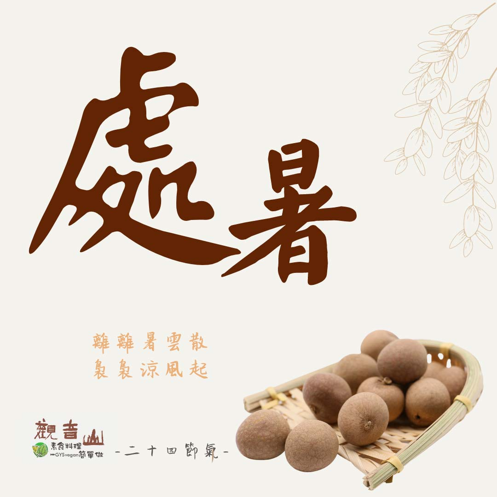

# 觀音山 二十四節氣 ​ ​  處暑​

## 📋 基本資訊 / Recipe Overview
- **料理名稱**：觀音山 二十四節氣 ​ ​  處暑​
- **原始標題**：觀音山 二十四節氣 ​ ​  處暑​
- **素食流派 / Diet**：全素 Vegan
- **來源平台 / Source**：[觀音山 · 素食料理簡單做](https://vegan.gys.org.tw/summer-heat%e2%80%8b20210823/)

## 📖 食譜圖文詳情 (中英雙語對照)

｜離離暑雲散，裊裊涼風起​
今年的8月23日是二十四節氣中的「處暑」，「處」有躲藏、終止之意，表示☀炎熱的夏天即將過去，此時節中，早晨及夜間的氣溫較低，但是白天的溫度依然很高，是溫度由炎熱趨向寒冷的過度節氣。​
​
｜跟著節氣養生。​
處暑時節氣候漸漸乾燥，呼吸道方面的疾病容易復發，這就是「秋燥」造成的不適，此時應避免 辛辣、煎炸等食物，才不會使症狀加劇，平時可多喝溫開水、豆漿、白蘿蔔、梨子等新鮮蔬果，對於秋燥的預防效果很好。季節交替，氣候多變，應適時添加衣物?，避免感冒，調整作息為「早睡早起」，配合養生食補，才能提升身體免疫力。​
​
｜跟著節氣這樣吃​
對於早晚溫差大，體力消耗大的初秋，應以清熱安神的食材搭配涼性多汁的蔬果，食材的運用有黃瓜?、山藥、冬瓜、百合、芋頭、茄子?、銀耳；水果有葡萄?、龍眼、梨、蘋果?、番茄?、柿子等，不但能滋陰潤燥，還能祛除濕氣增強免疫力。​
​
​
觀音山素食料理簡單做​
推薦當季  處暑 節氣料理 食譜 ​
​
⭐ 芋頭素三鮮 ➡
https://reurl.cc/O0NYj3​
⭐ 五味手撕茄子 ➡
https://reurl.cc/ZGgX8g​
⭐ 紅棗銀耳八寶粥 ➡ ​
https://reurl.cc/eE2Mdb​
​
​
✨慈悲的 龍德上師成立「觀音山蔬食館」提倡健康素食、慈悲護生，以”觀音山素食料理簡單做”的理念，提供多款素食食譜，讓您一學就會！?​
​
​
★8月25日 觀世音菩薩節日：善惡業增長1千萬倍​
​
✨殊勝功德增長日✨​
觀音山邀請您於8月25日 響應素食、廣修供養、戒殺護生、誦經修法、行持諸種善行，獲福無量。​
​
​
? 觀音山 素食料理簡單做 ​ Follow us ?
​
Facebook ｜好文按讚 ➤
http://www.facebook.com/GYSVegan​
Instagram ｜料理追蹤 ➤
http://www.instagram.com/gysvegan/​
Youtube ​ ​ ​ ｜加入訂閱 ➤
https://reurl.cc/q8VEqy​
官方Blog ​ ｜網站推薦 ➤
https://vegan.gys.org.tw/​
​
​
—​
? 歡迎轉載，請註明出處： # 觀音山素食料理簡單做 GYSVegan 素食環保愛地球，健康營養無負擔，慈悲護生一起來~?

---
*食譜歸檔時間：2026-08-20 · 來源：觀音山素食料理簡單做 (vegan.gys.org.tw)*