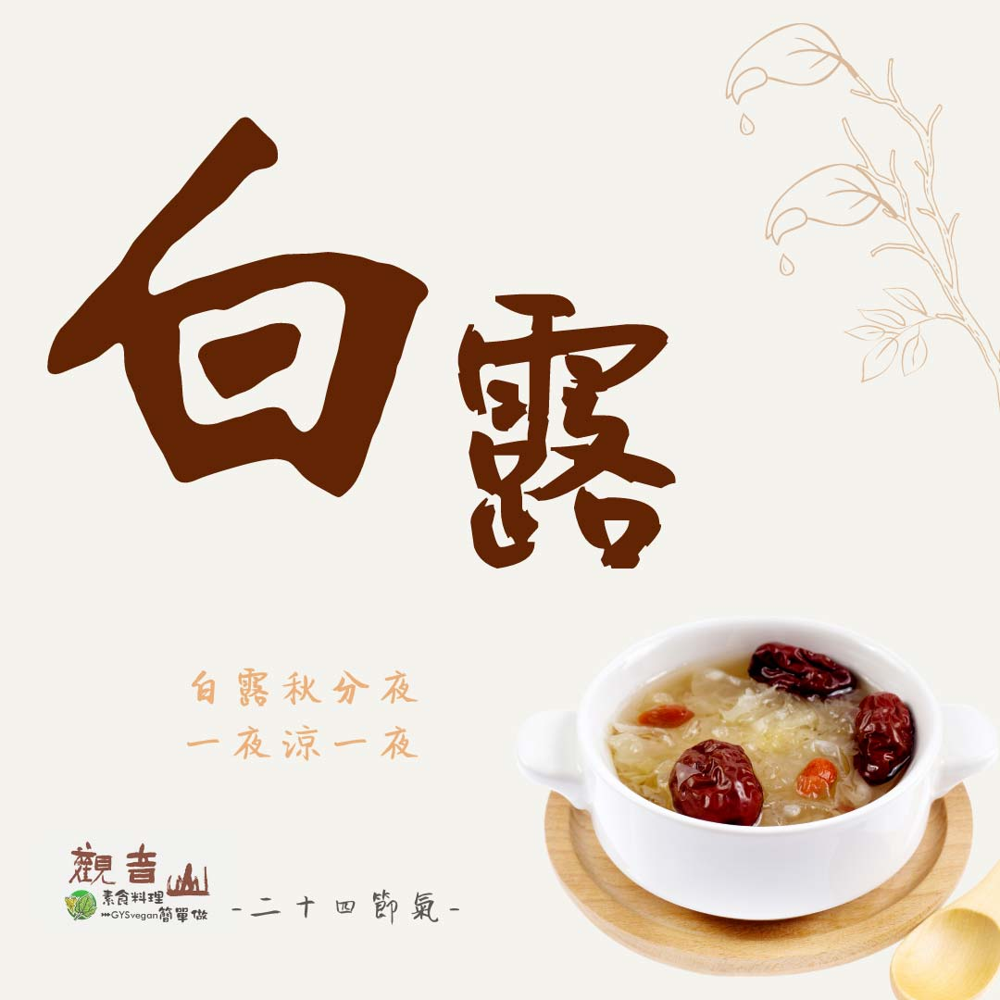

# 觀音山 二十四節氣 ​ ​ ​ 白露

## 📋 基本資訊 / Recipe Overview
- **料理名稱**：觀音山 二十四節氣 ​ ​ ​ 白露
- **原始標題**：觀音山 二十四節氣 ​ ​ ​ 白露
- **素食流派 / Diet**：全素 Vegan
- **來源平台 / Source**：[觀音山 · 素食料理簡單做](https://vegan.gys.org.tw/bailu20210906/)

## 📖 食譜圖文詳情 (中英雙語對照)

｜白露秋分夜，一夜涼一夜​
「白露」，是秋天的第三個節氣，於每年9月7-9日之間，此時天氣轉涼，白天陽光依然炎熱，入夜後氣溫下降很快，空氣中的水分形成秋露，是一年中晝夜溫差最大的一個節氣，應適時添加衣物，避免誘發呼吸道的疾病。​
​
「仲秋」之夜，闔家賞月「慶團圓」，每個人都希望與家人團聚，動物也不例外，讓我們以同理心看待，以「素烤」來取代烤肉，不僅健康又有意義。​
​
｜跟著節氣養生​
中醫主張秋天以養肺為重，特別是秋天空氣乾燥，常造成呼吸系統方面的困擾，到了冬天會更加嚴重，飲食調節上以易消化為主，避免生冷、辛辣的食物，並適度運動來強化抵抗力，保持規律的生活，讓身體得到保健。​
​
｜跟著節氣這樣吃​
此時節以「健脾潤燥」為主，可多食用白色食物，如白菜、高麗菜、白木耳、百合、杏仁、山藥、白蘿蔔、蓮子等，可緩解呼吸道不適的症狀，並多食用當季蔬菜?來獲取所需的維生素及礦物質；在慶祝中秋佳節的同時，也要⚠️注意不要飲食過量，造成身體的負擔。​
​
​
觀音山素食料理簡單做​
推薦當季 白露節氣料理 食譜 ​
​
​
⭐ 紅棗銀耳八寶粥 ➡
https://reurl.cc/1Y5ozQ​
⭐ 菱角蓮子當歸湯 ➡ ​
https://reurl.cc/6a6DjZ​
⭐ 百匯煲湯 ➡
https://reurl.cc/kZzLyx​
​
​
✨慈悲的 龍德上師成立「觀音山蔬食館」提倡健康素食、慈悲護生，以”觀音山素食料理簡單做”的理念，提供多款素食食譜，讓您一學就會！?​
​
​
★9月6日 釋迦牟尼佛節日：善惡業增長9億倍​
​
✨殊勝功德增長日✨​
觀音山邀請您於今日響應素食、廣修供養、戒殺護生、誦經修法、行持諸種善行，獲福無量。​
​
​
? 觀音山 素食料理簡單做 ​ Follow us ?​
​
Facebook ｜好文按讚 ➤
http://www.facebook.com/GYSVegan​
Instagram ｜料理追蹤 ➤
http://www.instagram.com/gysvegan/​
Youtube ​ ​ ​ ｜加入訂閱 ➤
https://reurl.cc/q8VEqy
​
官方Blog ​ ｜網站推薦 ➤
https://vegan.gys.org.tw/​
​
​
—​
? 歡迎轉載，請註明出處： #觀音山素食料理簡單做 GYSVegan 素食環保愛地球，健康營養無負擔，慈悲護生一起來~?

---
*食譜歸檔時間：2026-08-20 · 來源：觀音山素食料理簡單做 (vegan.gys.org.tw)*