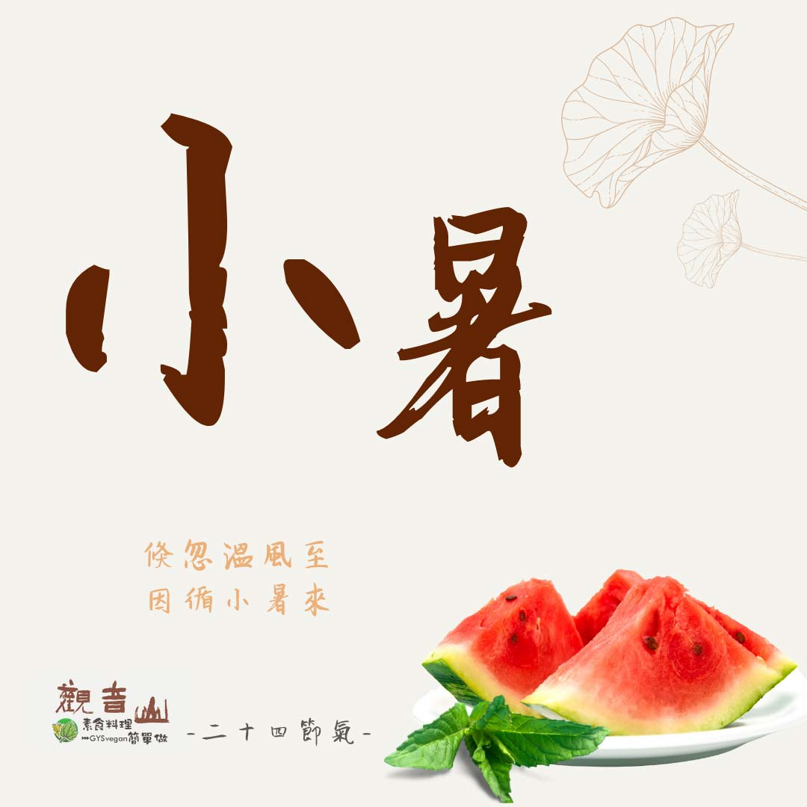

# 觀音山 二十四節氣 ​ 小暑​

## 📋 基本資訊 / Recipe Overview
- **料理名稱**：觀音山 二十四節氣 ​ 小暑​
- **原始標題**：觀音山 二十四節氣 ​ 小暑​
- **素食流派 / Diet**：全素 Vegan
- **來源平台 / Source**：[觀音山 · 素食料理簡單做](https://vegan.gys.org.tw/xiaoshu%e2%80%8b20210705/)

## 📖 食譜圖文詳情 (中英雙語對照)

｜倏忽溫風至，因循小暑來​
「小暑」是二十四節氣的第十一個節氣，暑是炎熱之意，有句話說：「小暑一過，一日熱三分。」意指天氣開始炎熱☀，但還不到最熱的時候。小暑節氣，樹木茂發向上，高溫多雨，萬物成長壯碩可期；依古人對物候的觀察經驗，應對夏季的高溫、颱風做好防備。​
​
｜跟著節氣養生​
小暑時節，人易心煩、疲倦乏力，導致脾胃失調影響消化，飲食方面以清淡易消化為原則，如稀飯、綠豆芽、苦瓜、綠豆等，亦可多攝取「黃色蔬果」達到養脾健胃的效果，包含南瓜、地瓜?、玉米?、山藥、黃豆、木瓜等。​
​
夏季消化道疾病好發，且食物容易腐壞，是引起腸胃道疾病的主因，所以在飲食習慣上要自我管理，改掉飲食不節制、飲食不潔以及偏食的不良習慣。​
​
｜跟著節氣這樣吃​
暑熱食慾不振，可多吃苦味、酸味的蔬果，以增進食慾、健脾利胃，推薦的食物有苦瓜、萵苣、牛蒡、蘿蔔葉、鳳梨?、芒果?、番茄、葡萄?等，而清熱解毒的食材如西瓜?、綠豆、薏仁、蓮藕也可適量食用。​
​
​
觀音山素食料理簡單做​
推薦當季小暑節氣料理 食譜 ​
​
⭐ 焗烤南瓜​ ➡
https://reurl.cc/Gmn84A​
​⭐ 芒果西米露​ ➡ ​
https://reurl.cc/rgEy91​
⭐ 番茄沙拉盅​ ➡ ​
https://reurl.cc/mLx8MV​
⭐️慈悲的 龍德上師成立「觀音山蔬食館」提倡健康素食、慈悲護生，以”觀音山素食料理簡單做”的理念，提供多款素食食譜，讓您一學就會！?
? 觀音山 素食料理簡單做 ​ Follow us?
Facebook ｜好文按讚 ➤
http://www.facebook.com/GYSVegan​
Instagram ｜料理追蹤 ➤
http://www.instagram.com/gysvegan/​
Youtube ​ ​ ​ ｜加入訂閱 ➤
https://reurl.cc/q8VEqy​
官方Blog ​ ｜網站推薦 ➤
https://vegan.gys.org.tw/​
​
​
—​
?歡迎轉載，請註明出處： # 觀音山素食料理簡單做 GYSVegan 素食環保愛地球，健康營養無負擔，慈悲護生一起來~?

---
*食譜歸檔時間：2026-08-20 · 來源：觀音山素食料理簡單做 (vegan.gys.org.tw)*