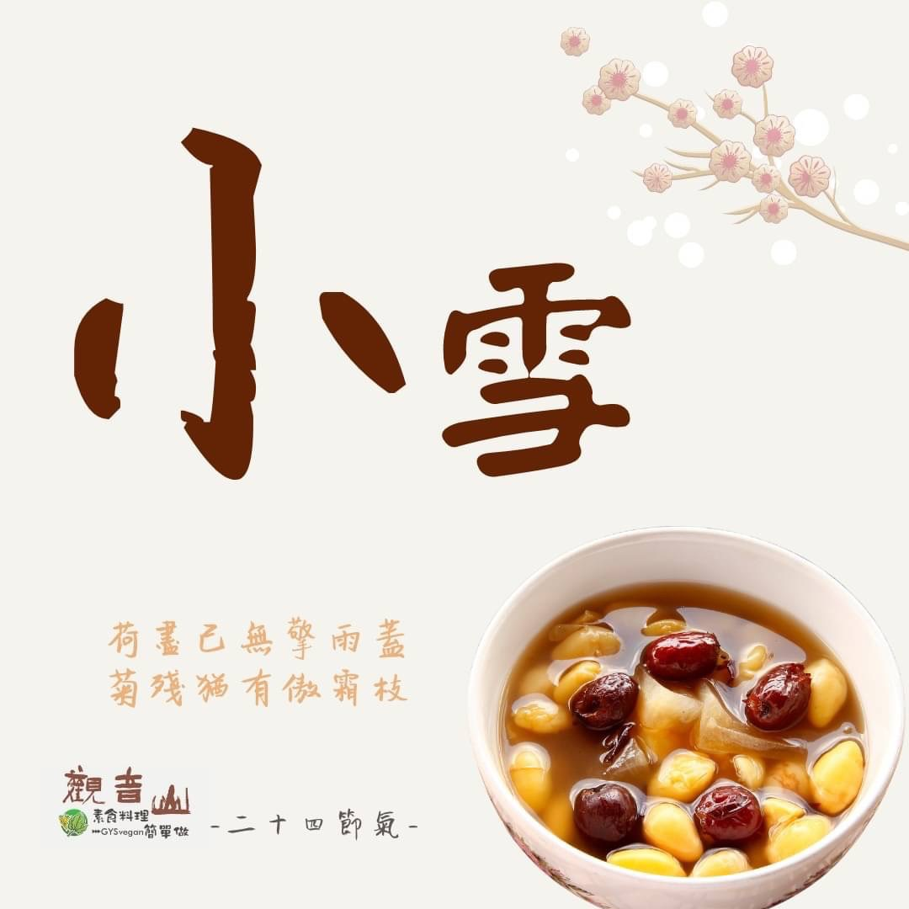

# 觀音山 二十四節氣 ​ 小雪​

## 📋 基本資訊 / Recipe Overview
- **料理名稱**：觀音山 二十四節氣 ​ 小雪​
- **原始標題**：觀音山 二十四節氣 ​ 小雪​
- **素食流派 / Diet**：全素 Vegan
- **來源平台 / Source**：[觀音山 · 素食料理簡單做](https://vegan.gys.org.tw/koyuki20211122/)

## 📖 食譜圖文詳情 (中英雙語對照)

觀音山 二十四節氣 小雪​
​
｜荷盡已無擎雨蓋，菊殘猶有傲霜枝​
今年國曆11/22日是二十四節氣中的「小雪」，是入冬❄️第二個節氣。古籍《群芳譜》：「小雪氣寒而將雪矣，地寒未甚而雪未大也。」體會到古人對大自然規律的智慧，以節氣變化來安排生活與農事；此時天氣進入初冬，氣溫已明顯下降、晝短夜長，應多注意身體的保暖。
​
｜跟著節氣養生​
以中醫的觀點，冬季是固養精氣的季節，《皇帝內經》：「春夏養陽，秋冬養陰」，對應人體就是「養腎」，可多食用黑色的食材，如黑豆、黑木耳、黑芝麻、黑糯米等等；除了食補以外，平時也可多做一些瑜珈、伸展操等緩和的運動，讓身體保持良好的循環♻️，提高免疫力和抗寒能力。​
​
｜跟著節氣這樣吃​
冬季是身體蓄積能量的最佳時節，此時食補吸收率高，可以多吃山藥、腰果、桂圓、紅棗、枸杞、核桃來溫補暖身，當令食材可選擇大白菜、芥藍菜、芥菜、白蘿蔔、黑木耳、深綠色蔬菜?、柳橙、橘子?，提供身體所需的營養素，需⚠️注意的是避免過鹹的料理，減少腎藏負擔；冬令進補「粥品」也是很好的選擇，不僅能保護腸胃也能暖身驅寒，讓你過一個溫暖的冬天。☀️​
​
​
觀音山素食料理簡單做​
推薦當季 小雪 節氣料理 食譜 ​
​
⭐ 素食補 肉骨茶湯​
➡
https://reurl.cc/73qmGD​
​
⭐ 雪梨銀耳露​
➡
https://reurl.cc/Rbom5x​
​
⭐ 素香羹​
➡
https://reurl.cc/pxRAGZ​
​
​
✨慈悲的龍德上師 成立「觀音山蔬食館」提倡健康素食、慈悲護生，以”觀音山素食料理簡單做”的理念，提供多款素食食譜，讓您一學就會！?
​
★10月7日~12月4日 ​ 佛陀天降月：善惡業增長10億倍​
​
✨殊勝功德增長日✨​
觀音山邀請您於10月7日~12月4日，響應素食、廣修供養、戒殺護生、誦經修法、行持諸種善行，獲福無量。​
​
​
? 觀音山 素食料理簡單做 ?​
◎Facebook ｜好文按讚​
http://www.facebook.com/GYSVegan​
​
◎lnstagram ｜料理追蹤​
http://www.instagram.com/gysvegan/​
​
◎Youtube ｜加入訂閱​
https://reurl.cc/q8VEqy​
​
◎Telegram ｜頻道推薦​
https://t.me/GYSVegan​
​
​
—​
?歡迎轉載，請註明出處：觀音山素食料理簡單做 GYSVegan 素食環保愛地球，健康營養無負擔，慈悲護生一起來~?

---
*食譜歸檔時間：2026-08-20 · 來源：觀音山素食料理簡單做 (vegan.gys.org.tw)*