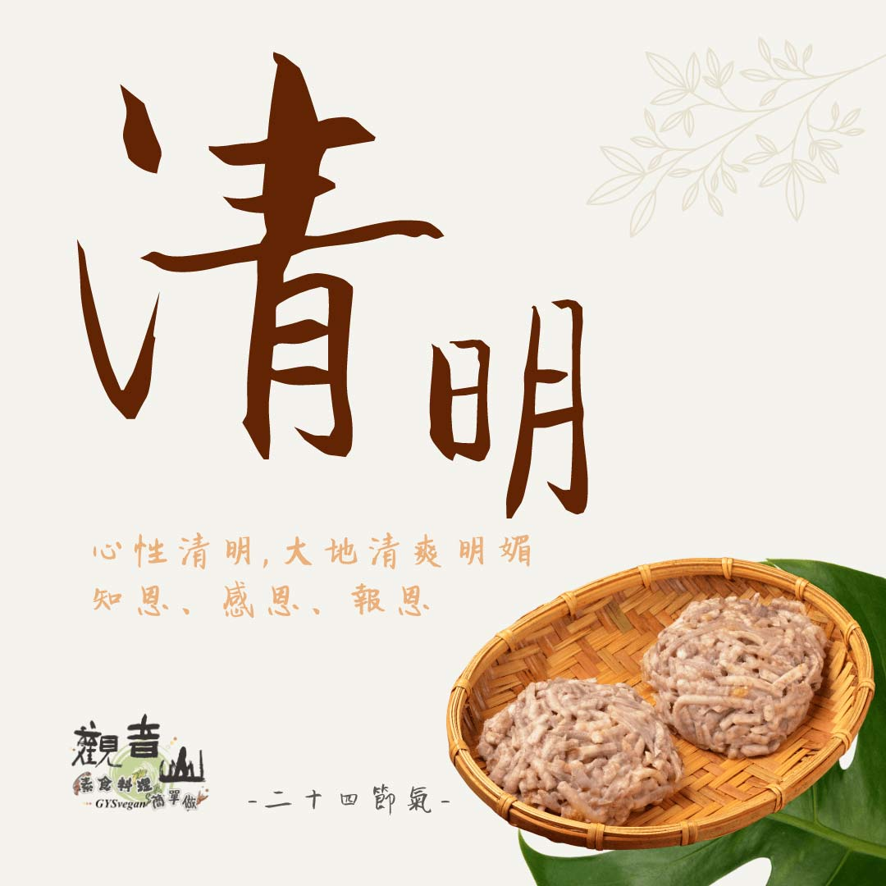

# 觀音山 二十四節氣 ​ 清明​

## 📋 基本資訊 / Recipe Overview
- **料理名稱**：觀音山 二十四節氣 ​ 清明​
- **原始標題**：觀音山 二十四節氣 ​ 清明​
- **素食流派 / Diet**：全素 Vegan
- **來源平台 / Source**：[觀音山 · 素食料理簡單做](https://vegan.gys.org.tw/qingming20210329/)

## 📖 食譜圖文詳情 (中英雙語對照)

｜心性清明 ​ 知恩、感恩、報恩​
今年的4月4日，是二十四節氣中的第五個節氣 ＃清明。​
此時萬物生長，氣候溫暖，花草樹木開始萌芽，欣欣向榮，大地呈現清爽明媚，因此稱為「清明」。​
​
此節氣最重要的活動就是「清明祭祖」，表達對先人的慎終追遠，是華人社會重要的一個節日；清明時節，以真誠心祭祖盡孝道，更應該思惟怎麼報效、追思祖德，如何紀念、感恩祖先，做一個有孝心、善念的人。​
​
｜跟著節氣養生​
清明時節，氣候多變，冷熱不定，應注意防寒保暖，並且白天開始變長，夜晚變短，適合調整作息來養肝，並避免熬夜，中醫認為「春與肝相應」，所以春季的養生保健應以養肝為主，肝的功能正常，氣血?就會通暢、和諧，體內各個臟腑的功能也會維持正常。​
​
｜跟著節氣這樣吃​
此節氣常忽冷忽熱，易復發疾病，⚠️應避免食用容易引起發炎、過敏的食物，像是油炸類、辣椒、加工食品，建議飲食以清補為主。​
​
可多吃當季的蔬菜，像是白菜、蘿蔔?、地瓜?、芋頭等，可以溫胃袪濕，亦可以多食用護肝養肺的蔬菜，如菠菜、山藥、薺菜，對身體有益。​
​
觀音山素食料理簡單做​
推薦當季 清明節氣料理食譜 ​
⭐️芋頭素三鮮 ➡️
https://youtu.be/kfNcIX0o7bs​
⭐️豆包地瓜煎餅 ➡️
https://youtu.be/zKVDYw3QSYQ​
⭐️涼拌煙燻豆包絲 ➡️
https://youtu.be/70VTrTKCK3s​
​
⭐️慈悲的 龍德上師成立「觀音山蔬食館」提倡健康素食、慈悲護生，以”觀音山素食料理簡單做”的理念，提供多款素食食譜，讓您一學就會！?
​
? 觀音山 素食料理簡單做 ​ ?​
Facebook ｜好文按讚 ➤
http://www.facebook.com/GYSVegan
​
Instagram ｜料理追蹤 ➤
http://www.instagram.com/gysvegan/​
Youtube ​ ​ ​ ｜加入訂閱 ➤
https://reurl.cc/q8VEqy​
Telegram ​ ｜頻道推薦 ➤
https://t.me/GYSVegan​
​
​
—​
? 歡迎轉載，請註明出處： ​ 觀音山 素食料理簡單做 GYSVegan按讚、留言設定搶先看! 素食環保愛地球，健康營養無負擔，慈悲護生一起來~?

---
*食譜歸檔時間：2026-08-20 · 來源：觀音山素食料理簡單做 (vegan.gys.org.tw)*